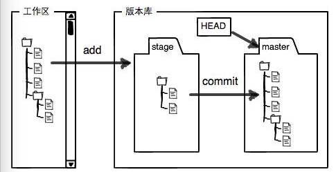

# GIt

### GIt名词解释

- 工作区（Working Directory）

  git init初始化后的目录就是工作区，在工作区之外使用除了git init之外的git命令是无效的。

- 版本库（Repository）

  工作区的.git就是版本库。

  > 版本库中包含了很多东西，其中最重要的就是stage暂存区（或者index），还有Git初始化之后自动创建的第一个主分支master，以及指向当前分支的一个指针HEAD。

  > git add指令将修改添加到暂存区，git commit就是把暂存区的所有内容提交到当前分支，commit之后清空工作区和暂存区的修改



- Git基本命令的使用

```bash
git config --global user.name username #设置全局用户名

git config --global user.email email #设置全局邮箱

git init#把当前目录变成Git可以管理的仓库

git status #查看当前工作树的状态

git diff <file>#用于比较指定文件在工作区和暂存区、分支的区别

git add <fileName.suffix> #将修改或添加的文件添加到暂存区，一次添加多个文件到暂存区时，用空格隔开

git commit #将暂存区的修改提交到默认分支,但是还要添加提交信息

git commit -m “messahe”#将暂存区的修改提交到默认分支，message就是本次提交的信息，提交之后，工作区所有修改被清理

git log #查看版本库状态

git log --pretty=oneline#每个版本只用一行语句描述，简洁明了

git reflog#记录每一次修改版本库的语句以及版本的commit id

git checkout -- <file>#放弃当前工作区中该文件的修改,实际上就是用最新版本库中的文件更新当前工作区的文件，所以效果上相当于放弃当前工作区中的修改
git checkout branchName#将当前工作区的文件同步为指定分支版本

git reset --hard commit_id #在指定commit id的版本之间穿梭
git reset HEAD <file>#把暂存区的修改撤销掉（unstage），重新放回工作区，git reset可以回退版本，也可以将暂存区的修改回退到工作区

git rm <file>#删除版本库中的文件

#创建SSH key
ssh-keygen -t rsa -C "youremail@example.com"

#将当前分支推送到远程仓库
git push

#创建一个分支指针newBranchName
git branch newBranchName#创建一个分支指针newBranchName

#创建分支
git branch <name>

#切换分支
git checkout <name>
git switch <name>

#创建和切换分支
git checkout -b <name>
git switch -c <name>

#合并指定分支到当前分支
git merge <name>

#删除分支
git branch -d <name>

#撤销commit
git reset --soft HEAD^

##单独合并其他分支的提交至当前分支
git cherry-pick <commit hashCode>
##若合并时有冲突  解决冲突之后 Git add 冲突的文件然后commit即可

##常用stash命令
##执行存储时，添加备注，方便查找，只有git stash 也要可以的，但查找时不方便识别。
git stash save "message"

##查看stash了哪些存储
git stash list

##显示做了哪些改动，默认show第一个存储,如果要显示其他存贮，后面加stash@{$num}，比如第二个 git stash show stash@{1}
git stash show

##应用某个存储,但不会把存储从存储列表中删除，默认使用第一个存储,即stash@{0}，如果要使用其他个，git stash apply stash@{$num} ， 比如第二个：git stash apply stash@{1} 
git stash apply

##命令恢复之前缓存的工作目录，将缓存堆栈中的对应stash删除，并将对应修改应用到当前的工作目录下,默认为第一个stash,即stash@{0}，如果要应用并删除其他stash，命令：git stash pop stash@{$num} ，比如应用并删除第二个：git stash pop stash@{1}
git stash pop

##丢弃stash@{$num}存储，从列表中删除这个存储
git stash drop stash@{$num}

##删除所有缓存的stash
git stash clear
```


> HEAD指向当前版本，HEAD^指向上一个版本，一个^代表向上一个版本，也可以用HEAD～100指上100个版本

> Unix的哲学就是：没有消息就是最好的消息，说明操作成功

