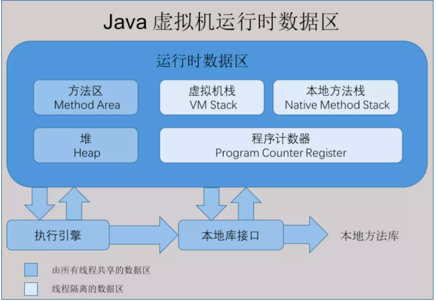
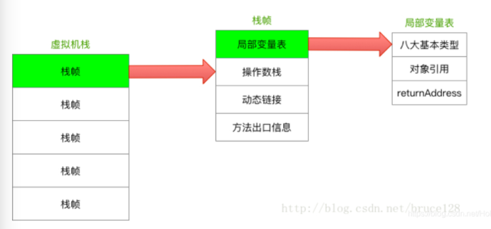
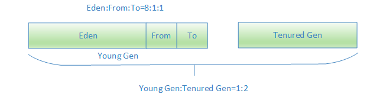
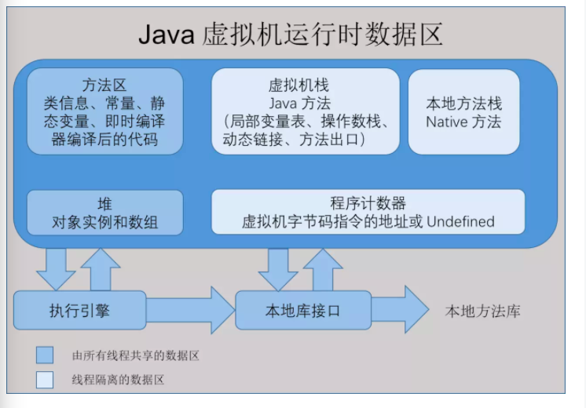

#  JVM

## Java内存区域和内存溢出异常

### 运行时数据区域

> jdk1.7内存模型



#### 程序计数器

> 内存空间小，线程私有。字节码解释器工作就是通过改变计数器的值来选取下一行执行指令的字节码命令，分支、循环、跳转、异常处理、线程恢复等基础功能都需要依赖计数器完成

如果线程正在执行一个java方法，这个计数器记录的是正在执行的虚拟机字节码指令的地址；如果正在执行的是Native方法（非java语言实现的方法），则程序计数器的值为Undefined。此内存区域是唯一一个在java虚拟机规范中没有规定任何OutOfMemoryError情况的区域。

#### java虚拟机栈

> 线程私有，生命周期和线程一致。描述的是java方法执行的内存模型：每个方法在执行时都会创建一个栈帧（Stack Frame）进入虚拟机栈，栈帧用于存储局部变量表、操作数栈，动态链接，方法出口等信息。每个方法从调用到执行结束，都对应着一个栈帧从虚拟机栈中入栈到出栈的过程。



局部变量表：存放了编译期间可知的各种基本类型（boolean、byte、char、short、int、float、long、double）、对象引用（reference类型）和returnAddress类型（指向了一条字节码指令的地址）

StackOverflowError：线程请求的栈深度大于虚拟机所允许的深度。

OutOfMemoryError：如果虚拟机可以动态扩展，而扩展时无法申请到足够的内存。

#### 本地方法栈

> 区别于虚拟机栈的是：java虚拟机为虚拟机执行java（字节码）服务，本地方法栈则为虚拟机用到的Native（本地）方法服务，也会有StackOverflowError和OutOfMemoryError

#### java堆

堆分为新生代（Young Gen）和老年代（Tenured Gen），比例默认1:2，新生代又分为Eden区、form区和To区，后两者为幸存者区（Survivor spaces）比例默认8:1:1



> 上图长度不代表大小比例

> 对于绝大多数应用来说，这块区域是JVM所管理内存中最大的一块，线程共享，主要是存放对象实例和数组。内部会划分出多个线程私有的分配缓冲区（Thread Local Allocation Buffer，TLAB）。可以位于物理上不连续的空间，但是逻辑上要连续

OutOfMemoryError：若堆中没有内存完成实例分配，并且堆也无法继续扩展时，抛出该异常。

#### 方法区

> 属于共享内存区，存储已被虚拟机加载的类信息、常量、静态变量、即时编译器编译后的代码等数据

java运行时数据区存储的数据类型



> 方法区和永久代的联系：永久代是sun公司的HotSpot虚拟机对方法区的实现，方法区的实现是不受虚拟机规范约束的。

#### 运行时常量池

在jdk1.7中是方法区的一部分，用于存放编译器生成的各种字符变量和符号引用

Class文件中的常量池（编译器生成的字面量和符号引用）会在类加载后被放入这个区域。

除了在编译期间生成的常量，还允许自动生成，例如String类的intern()。

#### Java内存中的常量池

- ##### 字符串常量池（String Constant pool）：

  - 内存位置：jdk6.0在方法区（Perm Gen区）即方法区；在jdk1.7中，字符串常量池被移到了堆中。

  - 是什么：在jdk6.0的HotSpot VM（sun公司的JVM）里实现String pool功能的是一个StringTable类，是一个hash表，默认长度为1009；这个StringTable在每个HotSpotVM的实例只有一份，被所有类共享。

  - 在JDK1.7中，StringTable的长度可以通过参数指定：

    > -XX:StringTableSize=6666

  - 字符串常量池存放的是什么？

    > 字符串常量池中的字符串只存在一份

    - 在JDK6.0以及之前的版本中，存放的都是字符串常量；
    - 在JDK7.0之后，由于String#intern（）发生了改变，因此StringTable中也可以存放堆中字符串对象的引用。

- class常量池（Class Constant Pool）：

  - 简介：每一个java类被编译后，生成一份class文件；class文件中除了包含类的版本、字段、方法、接口等描述信息外，还有一项信息就是常量池（constant pool table），用于存放编译器生成的各种字面量（Literal）和符号引用（Symbolic References）；
  - 每个class文件都有一个class常量池。

  > 字面量：1、文本字符串；2、八种基本类型的值；3、被声明为final的常量等。
  >
  > 符号引用包括：1、类和方法的权限定名；2、字段的名称和描述符；3、方法的名称和描述符

- 运行时常量池（Runtime Constant Pool）：

  - 运行时常量池在内存中，也就是class常量池被加载到内存之后的版本，不同之处是：它的字面量可以动态的添加（String#intern（）），符号引用可以被解析为直接引用
  - JVM在执行某个类时，必须经过加载、连接、初始化、而连接中又包括验证、准备、解析三个阶段。而当类加载到内存后，JVM会将class常量池中的内容放到运行时常量池中，因此，运行时常量池也是每个类都有一个。在解析阶段，会把符号引用替换为直接引用，解析的过程会去查询字符串常量池。，解析的过程会查询字符串常量池，保证运行时常量池所引用的字符串与字符串常量池是一致的。

#### 直接内存

在JDK1.4中新引入了NIO类，他可以使用Native函数库直接分配堆外内存，然后通过java堆里的DirectByteBuffer对象作为这块内存的引用进行操作。这样能在一些场景中显著的提高性能，因为避免了在堆内存和堆外内存来回拷贝数据。


## HotSpot虚拟机对象探秘

### 对象的创建

- 类加载检查

​	在程序中，对象的创建一般都是new关键字（反射、序列化等除外），当虚拟机遇到一条字节码new指令时，先检查这个指令的参数能否在常量池中定位到一个类的符号引用，并且检查这个符号引用代表的类是否已被加载、解析和初始化过，若没有，则先执行对应的类的加载过程。

- 分配内存

​	加载检查完成后，虚拟机为新生对象分配内存，所需的内存大小在类加载完成之后可以确定，分配内存实际上是在java堆中划分一块内存给对象使用，若堆中内存是绝对规整（一半是使用中的，一半是未使用的，中间放着一个指针作为分界点的指示器）的，则分配内存仅仅是指示器指针向未被使用内存方向移动一段与对象大小相等的距离，这种分配方式称为**指针碰撞（Bump the pointer）**。但如果堆中的空间是不连续的，则虚拟机会维护一个列表，记录哪块内存是可用的，分配时，在列表中找到一块足够给对象使用的内存空间，并更新列表的记录，这种分配方式称为**空闲列表（Free List）**，选择那种方式由堆内存空间是否连续决定，而堆内存是否连续又由虚拟机采用的垃圾收集器是否有空间压缩整理（Compact）能力决定，内存分配完成之后，虚拟机将分配得到的内存都初始化为0值（除了对象头）。

- 对对象进行必要的设置

  例如设置这个对象是哪一类的实例、如何才能找到类的元数据信息、对象的哈希码（一般是懒加载，等到调用Object::hashcode()时才计算）、对象的GC分代年龄信息等。这些信息存放在对象头中，此时，在虚拟机角度，一个新的对象已经创建完毕，但从程序的角度，对象的创建才刚刚开始（构造方法还没执行），完成了构造方法之后，对于程序来说，一个真正的对象才被创造出来。

### 对象的内存布局

​	在HotSpot虚拟机中，对象的布局可以划分为三个部分：**对象头（Header）、实例数据（Instance Data）、对齐空间（Padding）**。

**对象头**包括两类信息：

1. 用于存储对象自身的运行时数据，如哈希码、GC分代年龄、锁状态标志、线程持有的锁、偏向线程ID、偏向时间戳等，这部分数据在32位或64位的虚拟机（未开启指针压缩）中分别为32和64byte，官方称呼为“Mark Word”。
2. 类型指针：对象指向它的类型元数据的指针，一般通过这个指针来确定这个对象是哪个类的对象实例。 

**实例数据**是对象真正存储的有效信息：

​	即代码中定义的各种类型的字段内容（父类继承或者自身定义的字段），这部分的存储顺序会受到虚拟机参数（-XX:FieldAllocationStyle参数）和java源码中定义顺序的影响，HotSpot虚拟机定义的顺序为：longs/doubles、ints、shorts/chars、byte/boolean、oops（Ordinary Object Pointer），可以看到以上顺序，相同长度的类型总是分配到一起存放，在满足这个前提下，父类中定义的变量会出现在子类之前。若虚拟机的+XX:CompactFields参数的值为true，那么子类中较为狭窄的变量也允许插入父类变量的空隙之中，以节省一点点空间。

对齐空间：

​	不是必然存在的，仅仅起着占位符的作用，由于HotSpot虚拟机的自动内存管理系统要求对象起始地址必须是8字节的整数倍，所以任何对象的大小必须是8字节的整数倍，对象头已经是8字节的整数倍了，当实例数据不是8字节的整数倍时，要用对齐空间来填充。


### 对象的访问定位

​	Java程序通过栈上的reference数据来操作堆上具体的对象，reference只是《Java虚拟机规范》里指向对象的引用，因此如何找到对象是由虚拟机具体的实现而决定的，主流的访问方式有**使用句柄**和**直接指针**两种：

- 句柄访问：堆中可能划分一块内存作为句柄池，reference中存储的就是对象的句柄地址，而句柄中包含了对象实例数据和对象类型各自载体的地址信息。

- 直接指针：若使用直接指针，则对象的内存布局就必须考虑访问访问对象的类型相关信息，reference中存储的直接就是对象的地址

  这两种访问方式各有优劣，使用**句柄**的好处是reference中存储的是稳定的句柄地址，在对象移动时（垃圾收集移动对象是非常普遍的事）只会改变句柄中实例数据的指针，而reference本身不需要修改，使用**直接指针**的好处就是速度更快，节省了一次指针定位的时间开销，由于对象访问非常频繁，因此积少成多也是一项极为可观的执行成本，HotSpot主要使用**直接指针**方式进行对象的访问。

## OutOfMemoryError异常

​	虚拟机中，除了程序计数器之外，虚拟机内存和其他几个运行时区域都可能发生OOM。

### Java堆溢出

​	堆用于存储对象实例，只要不断创建对象，并且保证GC Roots到对象之间有可达路径来避免垃圾收集机制清除这些对象，那么随着对象数量的增加，总容量触及最大堆的容量限制后就会产生内存溢出异常。

以下为堆常用参数设置：

1. 堆最小值：-Xms，如-Xms20m
2. 堆最大值：-Xms，如-Xmx20m

> 将堆的最小值和最大值设置的一样可以避免堆自动扩展

-XX:HeapDumpOnOutOfMemoryError参数可以让虚拟机在出现内存溢出异常时Dump出当前内存堆转储快照以便事后分析。

#### 堆溢出处理流程：

​	先通过**内存映像分析工具**对Dump出来的堆转储内存快照进行分析。

​	首先确认内存中导致OOM的对象是否是必要的，若非必要，则发生了**内存泄漏**，可通过工具查看泄漏对象到GC Roots的引用链，找到泄漏对象是通过怎样的引用路径、与那些GC Roots关联，才导致垃圾收集器无法回收它们，根据泄漏对象的类型信息以及它到GC Roots引用链的信息，一般可以比较准确的定位到泄漏对象的创建位置，进而找出产生内存泄漏的代码的具体位置。

​	若对象都是必要的，即内存溢出，就应当检查java虚拟机的堆参数（-Xms，-Xms）设置，与机器的内存相比，看看是否还有向上调整的空间。再从代码上检查是否存在某些对象生命周期过长、持有时间过长、存储结构设计不合理等情况。

### 虚拟机栈和本地方法栈溢出

​	由于HotSpot虚拟机并不区分虚拟机栈和本地方法栈，因此，对于HotSpot来说，参数-Xoss（设置本地方法栈大小）虽然存在，但是没有效果，栈容量只能通过-Xss参数来设定。

​	《Java虚拟机规范》中描述了两种异常：

1. 如果线程请求的栈深度大于虚拟机所允许的最大深度，将抛出StackOverflowError异常。

2. 如果虚拟机的栈允许动态扩展，当扩展栈容量无法申请到足够的内存时，将抛出OutOfMemoryError异常。

   《Java虚拟机规范》明确允许Java虚拟机实现自行决定是否允许栈扩展，而HotSpot选择不允许扩展栈容量，所以除非在创建线程申请内存时就因为无法申请到足够的内存而产生OOM异常，否则在线程运行中是不会内存溢出导致抛出OOM异常的，只会因为栈容量不足放入新的栈帧而导致StackOverflowError异常。

#### 栈溢出处理流程

​	出现StackOverflowError异常时，会有明确的错误堆栈可供分析，相对容易找到问题所在。若使用HotSpot的默认参数，栈深度大多数情况下达到1000～2000是没问题的，但是如果创建过多线程导致的内存溢出，在不能更换64位虚拟机或减少线程数量的情况下，只能通过减少最大堆和减少栈容量来换取更多线程的创建。

> 为何减少最大堆和栈容量可以创建更多的线程？
>
> ​	操作系统分配给每个进程的内存是有限的，例如32位window的单个进程的最大内存是2G，虚拟机分配所得的内存减去最大堆和方法区，忽略掉程序计数器，剩下的内存就交给栈来分配，因为栈是线程私有的，每创建一个线程就会分配栈容量，不管有没有使用，这些栈内存就是分配出去了，线程数量一多就容易内存溢出，减小了堆内存，可以分配给栈的空间就越多，栈内存越小，每格线程分配得到的栈占用空间小之后就可以创建更多的线程了。


## 垃圾收集

垃圾收集主要是针对堆和方法区进行。程序计数器、虚拟机栈和本地方法栈属于线程私有，只存在于线程的生命周期中，线程结束后就消失，因此不需要对这三个区域进行垃圾收集。

### 判断一个对象是否可被回收

#### 引用计数算法

> 为对象添加一个引用计数器，当对象增加一个引用时计数器+1，引用失效时计数器-1。引用计数为0的对象可以被回收。

在两个对象出现循环引用的情况下，此时计数器永不为0，导致无法对它们进行回收，因为循环引用的存在，所以java虚拟机不适用引用计数法。

#### 可达性分析算法

以GC Roots为起始点进行搜索，可达的对象都是存活的，不可达的对象可被回收。

java虚拟机使用该算法来判断对象是否可被回收，GC Roots一般包含以下内容：

- 虚拟机栈中局部变量表中引用的对象
- 本地方法栈中JNI中引用的对象
- 方法区中类静态属性引用的对象
- 方法区中常量引用的对象

#### 方法区的回收

因为方法区主要存放永久代对象，而永久代对象的回收率比新生代低很多，所以在方法区上进行回收性价比不高。

主要是对常量池的回收和对类的卸载。

为了避免内存溢出，在大量使用反射和动态代理的场景都需要虚拟机具备类卸载功能。

类卸载的条件很多，需要满足以下三个条件，并且满足了条件也不一定会被卸载：

- 该类所有的实例都已经被回收，此时堆中不存在该类的任何实例。
- 加载该类的ClassLoader已经被回收
- 该类对应的Class对象没有在任何地方被引用，也就无法在任何地方通过反射访问该类方法。

### 引用类型

无论是通过引用计数算法还是可达性分析算法判断对象是否可被回收，都与引用有关。

java提供了四种强度不同的引用类型。

- #### 强引用


被强引用关联的对象不会被回收。

使用new一个对象的方式来创建一个强引用。

```java
Object obj = new Object();
```

- #### 软引用


被软引用关联对象只有在内存不够的情况下才会被回收。

使用SoftReference类来创建软引用。

```java
Object obj = new Object();
SoftReference<Object> sg = new SoftReference<Object>(obj);
obj = null;
```

- #### 弱引用


被弱引用的对象一定会被回收，也就是说它只能活到下一次GC发生之前。

使用WeakReference类来创建弱引用。

```java
Object obj = new Object();
WeakReference<Object> wr = new WeakReference<Object>(obj);
obj = null;
```

- #### 虚引用


又被称为幽灵引用或者幻影引用，一个对象是否有虚引用的存在，不会对其生存时间造成影响，也无法通过虚引用得到一个对象。

为一个对象设置虚引用唯一的目的是能在这个对象被回收时收到一个系统通知。

使用PhantomReference来创建一个虚引用

```java
Object obj = new Object();
PhantomReference<Object> pf = new PhantomReference<Object>(obj,null);
obj = null;
```

### 内存分配与回收策略

Minor GC和Full GC

- Minor GC：回收新生代，因为新生代对象存活时间很短，因此Minor GC会频繁的执行，速度一般较快。
- Full GC：回收老年代和新生代，老年代对象存活期较长，因此FUll GC很少执行，执行速度会比Minor GC慢很多。

#### 内存分配策略

##### 对象优先在Eden区分配

大多数情况下，对象在新生代Eden区上分配，当Eden区空间不够时，发起Minor GC。

##### 大对象直接进入老年代