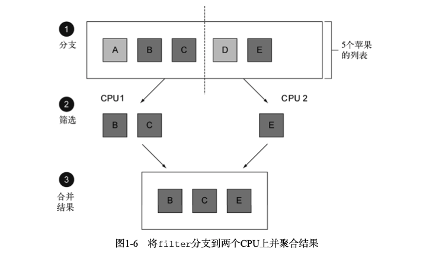
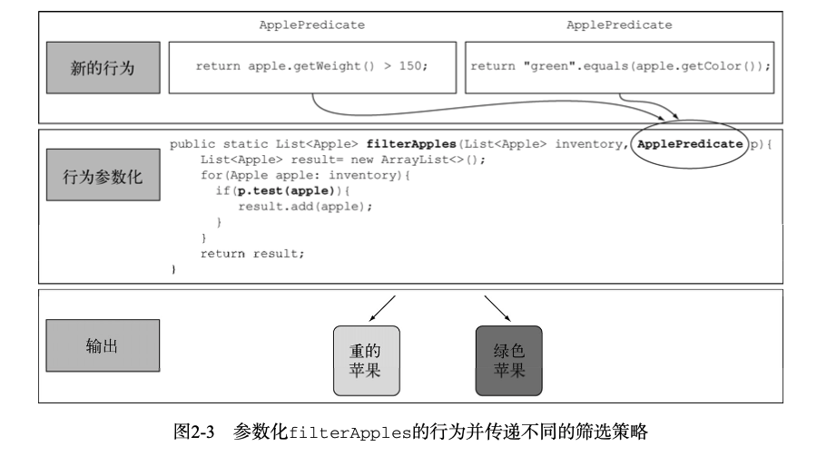
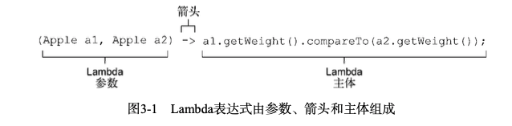
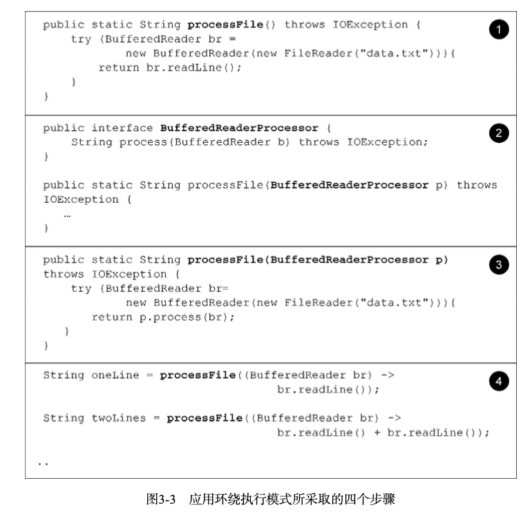
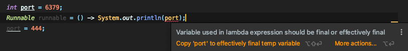
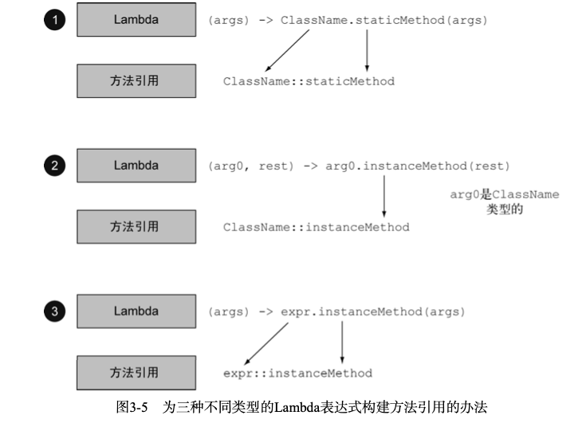
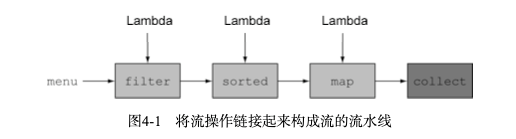
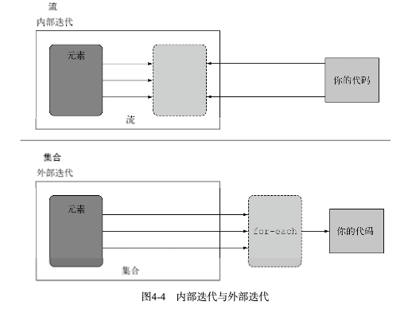
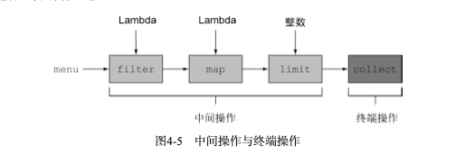
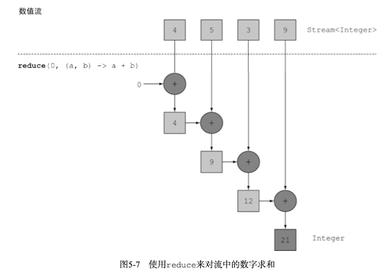

# Java8实战

## 函数式编程

​	把函数作为值来传递的程序，在java8之前，只有对象引用和基础类型值才能作为函数方法的入参，在Java8之后，可以使用Stream API来处理集合：将集合转化为stream，然后描述对集合的操作进行并行处理，之后再转化回集合，以下为利用Stream和lambda表达式顺序或并行的从一个列表里筛选比较重的苹果

```java
List<apple> collect = inventory.stream().filter(a -> a.getWeight() > 160).collect(Collectors.toList());
```



> ##### java中的并行与无共享可变状态
>
> ​	处理集合时，库会负责分块，把大的流分成几个小的流以便并行处理。流提供的几乎免费的并行只有在传递给filter之类的库方法的方法不会互动（如可变的共享对象）时才能工作

> ###### Java8为何要在接口中添加默认的实现
>
> ​	若要在一个接口中添加新的方法，那么实现这个的所有实现类都要去实现这个方法，若是有默认的实现，那么接口的实现类就无需再实现这个方法，有必要再去重写这个方法即可。如：List接口中，添加了sort方法的默认实现，调用Arrays.sort对对象进行排序，这样由接口提供默认实现而不是所有的实现类提供。

### 行为参数化

​	让方法接受多种行为作为参数，并在内部使用，来完成不同的行为。

​	如：让某个方法接受已特定的接口对象，并根据传入该接口的不同的实现类来在该方法中实现不同的行为

> ##### 行为参数化的好处
>
>  好处在于可以把迭代要筛选的集合的逻辑与对集合中每个元素应用的行为区分开来，这样可以重复的使用一个方法给它不同的行为来达到不同的目的。



### Lambda表达式

​	可以很简洁的标识一个行为或传递代码。

### Lambda

​	可以把lambda表达式看做匿名功能或者没有声明名称的方法，可以作为参数传递给一个方法。

​	它没有名称，但它有参数列表、函数主体、返回类型，可能还有一个可以抛出的异常列表。

- 匿名——不想普通方法那样有名称，写得少，想得多。
- 函数——Lambda函数不像方法那样属于某个特定的类，但和方法一样，Lambda有参数列表、函数主体、返回类型，可能还有一个可以抛出的异常列表。
- 传递——Lambda表达式可以作为参数传递给方法或存储在变量中。
- 简洁——无需像匿名类那样写很多模板代码。



> 根据主体来推断返回值类型

```java
(parameters) -> expression
//或(亲注意语句的花括号)
(parameters) -> {statements;}
//表达式无需花括号，语句需要
```

#### Lambda一些使用案例

| 使用案例              | Lambda示例                                                   |
| --------------------- | ------------------------------------------------------------ |
| 布尔表达式            | (List<String> list) -> list.isEmpty()                        |
| 创建对象              | () -> new Apple(10)                                          |
| 消费一个对象          | (Apple a) -> {System.out.println(a.getWeight();)}            |
| 从一个对象中选择/抽取 | (Stirng s) -> s.length()                                     |
| 组合两个值            | (int a, int b) -> a * b                                      |
| 比较两个对象          | (Apple a1, Apple a2) -> a1.getWeight().compareTo(a2.getWeight()) |

### 函数式接口

​	函数式接口就是仅仅定义一个抽象方法，如：

```java
public interface Predicate<T>{
  boolean test(T t);
}
```

> Java中其他的函数式接口，如Comparator和Runnable。
>
> Java8之后接口中可以有默认方法，但哪怕有很多默认方法，只要接口只定义了一个抽象方法，它就仍然是一个函数式接口。

#### 函数式接口

​	Lambda表达式允许你直接以内联的形式为函数式接口的抽象方法提供实现，并把整个表达式作为函数式接口的一个具体实现的实例，使用匿名内部类也可以完成同样的事情，只不过比较笨拙：需要提供一个实现，然后直接内联实例化。下面是一个例子：

```java
new Thread(() -> System.out.println("Hello world!")).start();
```

#### 函数描述符

​	函数式接口的抽象方法的签名基本上就是Lambda表达式的签名。例如，Runnable接口可以看做一个返回void的函数的签名，因为它只有一个run()方法。

#### 实践Lambda：环绕执行模式

​	如下列代码：读入一个文本文件，读取第一行并返回

```java
public static String processFile() throws IOException{
  try(BufferedReader br = new BufferedReader(new FileReader("data.txt"))){
    return br.readLine();
  }
}
```

​	但上述代码较难扩展，只能读取第一行，若想使这个方法可重用，进行对该文件的更多操作，则需要进行行为参数化，将你想要执行的操作传入该方法，此时需要一个函数式接口

```java
interface processFile{
  String process(BufferedReader bufferedReader) throw IOException;
}
```

​	接下来执行一个行为，即编写一个方法，类似于上述第一个模板方法，只不过参数是函数式接口，返回该接口中唯一函数的执行结果

```java
public static String processFileLambda() throws IOException{
  try(BufferedReader bufferedReader = new BufferedReader(new FileReader("data.txt"))) {
    return p.process(bufferedReader);
  }
}
```

​	然后再传递Lambda表达式来重用上述的processFileLambda方法

```java
public static void main(String[] args){
  //传递两个不同的lambda表达式来完成不同的操作
  System.out.println(fileProcessLambda(BufferedReader -> BufferedReader.readLine()));
  String s = fileProcessLambda(BufferedReader -> String.valueOf(BufferedReader.read()));
  System.out.println(s);
}
```



​	本节展示了如何利用函数式接口来传递Lambda，但还是要定义自己的接口。下一节展示java8中新添加的接口，可以重用它来传递多个不同的Lambda。

#### 使用函数式接口

​	函数式接口定义且仅定义了一个抽象方法，该抽象方法的签名可以描述Lambda表达式的签名，称为函数描述符。所以为了应用不同的Lambda表达式，需要一套能够描述常见函数描述符的函数式接口。

​	java8在java.util.function包下新引入了几个新的函数式接口。常用的有Predicate、Consumer和Function。

##### Predicate

​	java.util.function.Predicate<T>接口定义了一个名叫test的抽象方法，它接受泛型T对象，并返回一个boolean。

```java
@FunctionalInterface
public interface Predicate<T>{
  boolean test(T t);
}
```

##### 	Consumer

​	java.util.function.Consumer<T>定义了一个名叫accept的抽象方法，接受泛型且没有返回。若你需要访问类型T的对象，并对其进行某些操作，如创建一个forEach方法，接受List类型，并且对其中的所有元素执行操作

```java
@FunctionalInterface
public interface Consumer<T>{
  void accept(T t);
}

public static <T> void forEach(List<T> list,Consumer<T> c){
  for(T t: list){
    c.accept(t);
  }
}

public static void main(String[] args){
  forEach(Arrays.asList(1,2,3,4,5),Integer -> System.out.println(Integer));
}
```

##### Function

​	java.util.function.Function<T,R>接口定义了一个叫做apply的方法，它接受泛型T的对象，并返回一个泛型R的对象。若需要将输入对象的信息映射到输出，就可以使用这个接口，下列代码展示利用Function接口创建一个map方法，以将一个String列表映射到包含每个String长度的Integer列表。

```java
public interface Function<T,R>{
  R apply(T t);
}

public static <T,R> List<R> map(List<T> list,Function<T,R> f){
  List<R> result = new ArrayList<>();
  for(T s: list){
		result.add(f.apply(s));
  }
}

public static void main(String[] args){
  forEach(Arrays.asList(1,2,3,4,5),String -> String.length());
}
```

##### 原始类型特化

​	上面三个泛型函数式接口中，若使用到八种原始类型，则会进行自动装箱转化为对应的引用类型，这是由泛型内部的实现方式造成的。但是自动拆装箱会带来性能和内存上的消耗，因为装箱后的值需要更多的内存，并需要额外的内存搜索来获取被包裹的原始值。

​	java8为原始类型函数式接口引入了专门的版本，以便在输入和输出都是原始类型时避免自动装箱的操作。如：

```java
public interface IntPredicate{
  boolean test(int i);
}
```

​	一般来说，针对专门的输入参数类型的函数式接口的名称都要加上对应的原始类型前缀，比如DoublePredicate、IntPredicate、LongBinaryOperator、IntFunction等。Function接口还有针对输出参数类型的变种:ToIntfunction<T>、IntToDoubleFunction等。

Java8中常用的函数式接口

|    函数式接口     | 函数描述符    | 原始类型特化                                                 |
| :---------------: | ------------- | ------------------------------------------------------------ |
|   Predicate<T>    | T -> boolean  | Int~、Long~、Double~                                         |
|    Consumer<T>    | T -> void     | Int~、Long~、Double~                                         |
|   Function<T,R>   | T -> R        | Int~、IntToDouble~、IntToLong~、Long~、LongToDouble~、<br />LongToInt~、Double~、ToInt~、ToDouble~、ToLong~、 |
|    Supplier<T>    | () -> T       | Boolean~、Int~、Long~、Double~                               |
| UnaryOperater<T>  | T -> T        | Int~、Long~、Double~                                         |
| BinaryOperator<T> | (T,T) -> T    |                                                              |
|  BiConsumer<T,U>  | <T,U> -> void | ObjIntConsumer<T>, ObjLongConsumer<T>, ObjDoubleConsumer<T>  |
| BiFunction<T,U,R> | <T,U> -> R    | ToIntBiFunction<T,U>, ToLongBiFunction<T,U>, ToDoubleBiFunction<T,U> |

下表总结了一些使用案例、Lambda的例子，以及可以使用的函数式接口。

| 使用案例              | Lambda的例子                                                 | 对应的函数式接口                                             |
| --------------------- | ------------------------------------------------------------ | ------------------------------------------------------------ |
| 布尔表达式            | (List<String> list) -> list.isEmpty()                        | Predicate<List<String>>                                      |
| 创建对象              | () -> new Apple(10)                                          | Supplier<Apple>                                              |
| 消费一个对象          | Apple -> System.out.println(Apple.getWeight())               | Consumer<Apple>                                              |
| 从一个对象中提取/选择 | (String s) -> s.length()                                     | Function<String,Integer>或ToIntFunction<String>              |
| 合并两个值            | (int a,int b) -> a * b                                       | IntBinaryOperator                                            |
| 比较两个对象          | (Apple a1,Apple a2) -> a1.getWeight().compareTo(a2.getWeight()) | Comparator<Apple>或BiFunction<Apple,Apple,Integer>或ToIntBiFunction<Apple,Apple> |

> **异常、Lambda，还有函数式接口是怎么回事呢？**
>
> ​	PS：任何函数式接口都不允许抛出受检异常（checked exception）。如果需要Lambda表达式来抛出异常，有两种方法：
>
> - 定义一个自己的函数式接口，并声明受检异常
>
>   - java自带的一个函数式接口：BufferedReaderProcessor显式的声明了一个IOException：
>
>     ```java
>     @FunctionalInterface
>     public interface BufferedReaderProcessor{
>       String process(BufferedReader b) throws IOException;
>     }
>     BufferedReaderProcessor p = (BufferedReader br) -> br.readLine();
>     ```
>
>     
>
> - 把Lambda表达式包裹在一个try/catch块中:
>
>   ```java
>   Function<BufferedReader,String> f = (BufferedReader b) -> {
>     try{
>       return b.readLine();
>     }catch(IOException e){
>       throw new RuntimeException(e);
>     }
>   }
>   ```

### 类型检查、类型推断以及限制

​	Lambda表达式半身并不包含它在实现哪个函数式接口的信息。

#### 类型检查

​	Lambda的类型是从使用lambda的上下文推断出来的。上下文（比如，接受它传递的方法的参数，或接受它的值的局部变量）中Lambda表达式需要的类型称为目标类型。

​	对特定方法使用Lambda表达式时，可按照如下步骤进行类型检查：

1. 先找出该方法的声明。
2. 查看该方法接收Lambda表达式的参数列表是哪一个函数式接口。
3. 查看该函数式接口定义的方法。
4. 分析该方法的函数描述符，该特定方法的任何实际参数都必须匹配描述符的要求。

> **特殊的void兼容规则**
>
> ​	若一个Lambda的主体是一个语句表达式，他就和一个返回void的函数描述符兼容（当然参数列表也要兼容），如下两行都是合法的：
>
> ```java
> //Predicate返回一个boolean
> Predicate<String> p = s -> list.add(s);
> //Consumer返回一个void
> Consumer<String> c = s -> list.add(s);
> ```

#### 类型推断

​	java编译器会从上下文（目标类型）推断出用什么函数式接口来配合Lambda表达式，即它可以推断出适合Lambda的签名，这样在Lambda预发中可以省去标注参数类型，如下例子：

```java
//没有类型推断
List<Apple> greenApples = inventory.stream().filter(a -> "green".equals(a.getColor())).collect(Collector.toList());

//有类型推断
List<Apple> greenApples = inventory.stream().filter(Apple a -> "green".equals(a.getColor())).collect(Collector.toList());
```

#### 使用局部变量

​	Lambda也允许使用自由变量（即外层作用域中定义的变量），如下例子Lambda捕获了portNumber变量：

```java
int portNumber =1337;
Runnable r = () -> System.out.println(portNumber);
```

​	尽管Lambda可以没有限制的捕获实例变量和静态变量。但局部变量必须显式声明为final或事实上是final。即Lambda表达式只能捕获指派给他们的局部变量一次，若更改了被Lambda捕获的局部变量则不能通过编译：



> **为什么会对局部变量有上述限制？**
>
> 1. 实例变量和局部变量的上线有一个关键不同，实例变量存储在堆中，局部变量保存在栈上，由于Lambda是由另外的线程来运行的，若Lambda可以直接访问局部变量，而分配该局部变量的线程将局部变量回收之后再被Lambda运行线程进行访问，但是因为栈是线程私有，所以此时Lambda线程访问的是该变量的副本，若只是赋值一次就没有区别——因此有了这个限制。
> 2. 这一限制不鼓励你使用改变外部变量的典型命令式编程模式，这种模式很容易阻碍并行处理。

### 方法引用

​	方法引用可以让你重复的使用现有的方法定义，并像Lambda一样传递他们，使代码更易读和自然。如下例子：

```java
//没有使用方法引用
apples.sort(Apple a1,Apple a2) -> a1.getWeight().compareTo(a2.getWeight());
//使用方法引用和java.util.Comparator.comparing
apples.sort(comparing(Apple::getWeight));
```

#### 方法引用的优点 

​	方法引用可以被看做仅仅调用特定方法的Lambda的一种快捷写法。其基本思想是，如果一个Lambda代表的只是“直接调用这个方法”，那最好就是用名称来调用它而不是描述去如何调用它。事实上方法引用就是让你根据已有的方法实现来创建Lambda表达式。

| Lambda                                   | 等效的方法引用                  |
| ---------------------------------------- | ------------------------------- |
| (Apple a) -> a.getWeight()               | Apple::getWeight                |
| () -> Thread.currentThread().dumpStack() | Thread.currentThread::dumpStack |
| (str,i) -> srt.subString(i)              | String::subString               |
| (String s) -> System.out.println(s)      | System.out::println             |

> **使用方法**
>
> 目标引用放在分隔符::前，方法的名称放在后面，不需要括号。例如
> Apple::getWeight;就是Lambda (Apple a) -> a.getWetght()的缩写。
>
> **如何构建方法引用**
>
> ​	主要有三类
>
> 1. 指向静态方法的方法引用：Integer::parseInt(parseInt是静态方法)
>
> 2. 指向任意类型方法的方法引用：String:length(length是成员方法)
>
> 3. 指向现有对象的实例方法的引用：
>
>    ```java
>    Apple a = new Apple();
>    a::getWeight
>    ```
>
> 上述2、3中其情况可能有点晕，第二种是你在引用一个对象的方法，而这个对象本身是lambda的一个参数，第三种指的是你在lambda中调用一个已经存在的外部对象中的方法。
>
> 

#### 构造函数引用

​	对于一个现有的构造函数，你可以利用它的名字和关键字new来创建一个它的引用：ClassName::new。它的功能与指向静态方法的引用类似。


## 函数式数据处理

​	流是Java API的新成员，它允许你以声明性方式处理集合，可以看作是高级迭代器，流还可以透明地进行并行处理。例如：

```java
List<String> names = menu.stream()
  .filter(d -> d.getWeight() < 100)
  .sorted(comparing(Dishes::getCalories))
  .map(Dish::getName)
  .collect(toList());
```

> 上述代码的优势是显而易见的：
>
> - 声明性方式写的，描述要完成的工作（根据重量过滤、根据卡路里排序，提取菜名变成list，而不是实现一个操作（利用循环和if等条件语句控制流程）。
> - 可以把几个基础的操作链接起来实现复杂的数据处理流水线。

​	因为filter、sorted、map和collect等操作是与具体线程无关的高层次构建，所以它们的内部实现可以是单线程的，也可能透明充分利用你的多核架构。 



​	Stream的API很强大，有很多模式，如筛选、切片、查找、匹配、映射和归约。

### 流简介

​	Java8中的新集合支持stream方法，会返回一个流，还有其他的方法可以得到流，如利用数值范围或从I/O资源生成流元素。

#### 定义

​	流是从支持数据处理操作的源生成的元素序列。

- 元素序列——像集合一样，流也提供了一个接口，可以访问特定元素类型的一组有序值。因为集合是数据结构，所以它的主要目的就是以特定的时间/空间复杂度存储和访问元素。但流的目的在于计算。
- 源——流会使用一个提供数据的源，如集合、数组或输入/输出资源。若从有序集合中生成流时会保留原有的顺序。
- 数据处理操作——流的处理功能类似于数据库的操作，以及函数式编程语言中的常用操作。如filter、map、reduce、find、match、sort等，流操作可以顺序也可以并行执行。

此外，流操作还有两个重要的特点：

- 流水线——很多流操作本身会返回一个流，这样多个操作可以连接起来，形成一个大的流水线。
- 内部迭代——与使用迭代器显式迭代的集合不同，流的迭代操作是在背后进行的。

```java
List<String> names = menu.stream()
  .filter(d -> d.getWeight() < 100)
  .sorted(comparing(Dishes::getCalories))
  .map(Dish::getName)
  .collect(toList());
```

> 上述操作中，除了collect之外，所有的这些操作都会返回一个流，这样就可以接成一条流水线，最后collect操作开始处理流水线并返回结果。在调用collect之前，没有任何结果产生，即，链中的方法在排队等待，直到调用collect。

#### 流的操作

- filter——接受Lambda，从流中排除某些元素。
- map——接受一个Lambda，将元素转换成其他形式或提取信息。
- limit——截断流，使其元素不超过给定的数量。
- collect——将流转化为其他形式。

### 流与集合

​	集合是一个内存中的数据结构,它包含数据结构中目前所有的值——集合中的每个元素都得先算出来才能添加到集合中，可以操作集合中的元素，但是集合中的每个元素都在内存中。

​	流则是在概念上固定的数据结构（不能操作元素即添加和删除），其元素是按需计算的，类似于一个延迟创建的集合：只有在消费者要求的时候才会计算值。

#### 只能遍历一次

​	与迭代器类似，流只能遍历一次。遍历完之后这个流就被消费掉了，可以从原始数据源中再获取一个流再遍历一遍

#### 内部迭代和外部迭代



> **java 8引入流的理由**
>
> ​	集合的遍历是外部迭代，使用foreach和迭代器进行显式的循环，循环的操作和顺序完全是由代码来控制，编译器就很难对该循环进行优化。
>
> ​	stream库的内部迭代可以选择一种适合你硬件的数据表示和并行表现。

### 流操作

​	java.util.stream.Stream中的Stream定义了许多操作，可分为两大类：

- filter、map和limit可以连成一条流水线。
- collect触发流水线执行并关闭它。

> 可以连起来的操作叫中间操作，关闭流的操作称为终端操作



#### 中间操作

​	会返回另一个流。可连成一条流水线，而且除非流水线上触发一个终端操作，否则中间操作不会执行任何处理——因为中间操作一般都连起来在终端操作一次性全部处理。

#### 终端操作

​	从流的流水线生成结果，其结果是任何不是流的值，如List、Integer甚至void。如下例子：

```java
menu.stream().forEach(System.out::println);
```

> forEach是一个范湖void的中间操作，对源数据中的每一个元素应用一个Lambda。此时每一个元素都是该lambda的参数。

#### 使用流

​	使用流一般包括三个步骤：

- 一个数据源来执行一个查询。
- 一个中间操作链，形成一条流水线。
- 一个终端操作，执行流水线并生成结果。

> 流的流水线背后的理念类似于构建器模式。在构建器模式中有一个调用链用来设置一套配置，然后调用build方法。

以下列出一些常用的中间和终端操作：

| 操作     | 类型 | 返回类型  | 操作参数      | 函数描述符   |
| -------- | ---- | --------- | ------------- | ------------ |
| filter   | 中间 | Stream<T> | Predicate<T>  | T -> boolean |
| map      | 中间 | Stream<R> | Function<T,R> | T -> R       |
| limit    | 中间 | Stream<T> |               |              |
| sorted   | 中间 | Stream<T> | Comparator<T> | (T,T) -> int |
| distinct | 中间 | Stream<T> |               |              |

| 操作    | 类型 | 目的                                                   |
| ------- | ---- | ------------------------------------------------------ |
| forEach | 终端 | 消费流中的每一个元素并对其应用Lambda，这一操作返回void |
| count   | 终端 | 返回流中元素的个数，这一操作返回long                   |
| collect | 终端 | 把流归约成一个集合，比如List、Map甚至是Integer。       |

## 使用流

> 本章内容
>
> - 筛选、切片和匹配
> - 查找、匹配和归约
> - 使用数值范围等数值流
> - 从多个源创建流
> - 无限流
>
> 本章将介绍Stream API支持的许多操作。如筛选、切片、映射、查找、匹配和归约。还会介绍一些特殊的流：数值流、来自文件和数组等多种来源的流和无限流。

### 筛选和切片

​	用谓词筛选出各不相同的元素，忽略流中的头几个元素，或将流截断至指定长度。

#### 谓词筛选

​	filter方法接受一个谓词（返回boolean的函数）作为参数，并返回一个包括所有符合谓词的元素的流。

```java
//筛选大苹果
List<Apple> list = apple.stream().filter(Apple::isBig).collect(toList());
```

#### 筛选各异的元素

​	流还支持一个叫做distinct的方法，他会返回一个元素各异（根据流所生成元素的hashcode和equals方法实现）的流。

```java
//输出numbers中所有不重复的元素
numbers.stream().distinct().forEach(System.out::println);
```

#### 截短流

​	limit(n)会返回一个不超过给定长度的流。所需的长度作为参数传递给limit。如果流是有序的，则最多会返回前n个元素。

```java
numbers.stream().limit(3).collect(toList());
```

#### 跳过元素

​	skip(n)方法返回一个扔掉了前面n个元素的流。如果流中元素不足n个则返回一个空流。

### 映射

​	一个非常常见的数据处理方式就是从某些对象中选择信息，如SQL中可以从表中选择一列。Stream API也通过map和flatMap方法提供了类似的工具。

#### 对流中每个元素应用函数

​	流支持map方法，它会接受一个函数作为参数，这个函数会应用到每一个元素上，并将其映射成一个新的元素。

```java
//将Apple类映射成String类型
List<String> name = apples.stream().map(Apple::getName).collect(toList());
```

#### 流的扁平化

​	flatMap方法可以将一个流中的每一个元素都转化为一个流然后连接起来成为一个流。如一个流中的元素是数组对象，那么flatMap方法可以将该流中所有数组拆分成流再组合成新的流。

> **给定两个数字列表，如何返回这两个列表的笛卡尔积**
>
> ```java
> List<Integer> numbers1 = Arrays.asList(1,2,3);
> List<Integer> numbers1 = Arrays.asList(4,5);
> List<int[]> pairs = numbers1.stream()
>   .flatMap(i -> numbers2.stream()
>           .map(j -> new int[]{i,j})).collect(toList());
> ```

### 查找和匹配

​	查找一般是根据数据集中的某些元素是否匹配一个给定的属性。Stream API通过allMatch、anyMatch、noneMatch、findFirst和findAny方法提供了查找功能。

#### 检查谓词是否至少匹配一个元素

​	anyMatch可以用来检查流中是否有一个元素能匹配给定的谓词。

```java
if(apples.stream().anyMatch(Apple::isBig)){
  System.out.println("apples have big apple");
}
```

​	anyMatch方法返回一个boolean，因此是一个终端操作。

#### 检查谓词是否匹配所有元素

​	allMatch方法会检查流中所有元素是否都能匹配给定的谓词。使用方法类似anyMatch。

​	noneMatch与allMatch相对，可以确保流中没有任何元素与给定的谓词匹配。

#### 查找元素

​	findAny方法将返回当前流中的任意元素。它可以与其他操作结合使用。如：

```java
Optional<Apple> apple = apples.stream().filter(Apple::isBig).findAny();
```

> **Optional<T>**
>
> ​	是一个容器类，代表一个值存在或不存在。上述代码中，findAny可能什么元素都没有找到，用Optional<T>来接收就可以不用返回null，从而避免了和null检查相关的bug。
>
> ​	Optional里有几种可以迫使你显式的检查值是否存在或处理值不存在的情形。
>
> - isPresent()将在Optional包含值时返回true，反之返回false。
> - ifPresent(Consumer<T> block)会在值存在的时候执行给定的代码块。
> - T get() 会在值存在是返回值，否则抛出NoSuchElement异常。
> - T orElse(T other) 会在值存在是返回值，否则返回一个默认值。

#### 查找第一个元素

​	有些流有一个出现顺序来指定流中元素出现的逻辑顺序。对于这种流，可以搭配某些操作来找到符合条件的第一个元素。如：

```java
Optional<Integer> first = numbers.stream().filter(i -> i % 3 == 0).findFirst(); 
```

### 归约

​	归约是指将一个流中的元素组合起来，使用reduce操作来表达复杂的查询。如计算菜单中的总卡路里、或菜单中卡路里最高的菜是哪一个。此类查询需要将流中所有元素反复结合起来得到一个值。这样的查询可以被归类为归约操作。类似于sql中的聚合函数。

#### 元素求和

```java
int sum = numbers.stream().reduce(0,(a,b) -> a + b);
```

​	reduce接受两个参数：

- 一个初始值
- 一个BinaryOperator<T>来将两个元素结合起来产生一个新值，这里用的是Lambda (a,b) -> a + b。

下图展示了reduce操作如何作用于一个数字流求和：



#### 最大值和最小值

​	使用reduce计算数值流中的最大值和最小值。

```java
Optional<Integer> max = numbers.stream().reduce(Integer::max);
Optional<Integer> max = numbers.stream().reduce(Integer::min);
```

> **流操作：无状态和有状态**
>
> - filter或map等操作会从输入流中获取每一个元素，并在输出流中得到0或1个结果。这些操作一般都是无状态的：没有内部状态（假设用户提供的lambda或方法引用没有内部可变状态）。
>
> - 但reduce、sum、max等操作需要内部状态来累计结果。但有时只是一个Integer或Long。不管流中有多少元素要处理，内部状态都是有界的。
>
> - 相反的是，sort或distinct等操作在流中排序和删除重复项时都需要知道先前的历史。例如distinct操作要求没迭代一个元素都要判断与之前的元素是否重复，要将之前的元素都放入缓冲区才能进行，这一操作的内部存储的要求是无限的。
>
> 2、3点被称为有状态操作。

### 实操

​	见本机/Users/yangxiansheng/IdeaProjects/Java8/src/com/learn/stream/use/Main.java

### 数值流

​	流中使用的基础类型一般都是对应的包装类，进行操作会有隐含的拆装箱成本

### 创建流

​	之前都是从集合中获取流。本节介绍如何值序列、数组、文件来创建流，甚至由生成函数来创建无限流。

#### 由值创建流

​	可以使用Stream.of，通过显式值创建一个流。它可以接受任意数量的参数。

```java
Stream<String> stream = Stream.of("Java 8","Lambdas","Action");

//获取空流
Stream<String> empty = Stream.empty();
```

#### 由数组创建流

​	可以使用Arrays.stream从数组创建一个流。它接受一个数组作为参数。

```java
int[] numbers = {1,2,3,4,5}
int sum = Arrays.stream(numbers).sum();
```

#### 由文件生成流

​	java.nio.file.Files中的很多静态方法都会返回一个流。如Files.lines，返回一个由指定文件中的各行构成的字符串流。

```java
Files
  .lines(Paths.get("/Users/yangxiansheng/Desktop/application.properties"), Charset.defaultCharset())
  .forEach(System.out::println);
```

#### 由函数生成流：创建无限流

​	Stream API提供了两个静态方法来从函数生成流：Stream.Iterate和Stream.generate。这两个操作可以创建无限流：不像从固定集合中创建具有固定大小的流，会根据给定的函数按需创建值，因此可以无穷无尽的计算下去。如：迭代

```java
Stream.iterate(0,n -> n + 2).limit(10).forEach(System.out::println);
```

```java
//打印斐波那契数列
Stream.iterate(new int[]{0,1},a -> new int[] {a[1],a[0]+a[1]})
  .limit(20)
  .map(t -> t[0])
  .forEach(System.out::println);
```

#### 生成

​	与iterate方法类似，generate方法也可以按需生成一个无限流。但generate不是依次对每个新生成的值应用函数的。他接受一个Supplier<T>类型的Lambda提供新的值。


## 用流收集数据

- 用Collectors类创建和使用收集器
- 将数据流归约为一个值
- 汇总
- 数组分组和分区
- 定义自己的收集器

### 收集器简介

​	collect方法接受一个Collector(收集器)的实现，而之前用过的toList()方法是暗号顺序给每一个元素生成一个列表。groupingBy方法是生成一个Map，键是传入的Lambda值，值则是流中的元素列表。

#### 高级归约

​	收集器可以简洁而灵活的定义collect用来生成结果集合的标准。如对流调用collect方法将对流中的元素触发一个归约操作（由Collector来参数化）。

#### 预定义收集器

​	Collector中的工厂方法预定义了很多预定义的收集器。它们主要提供了三种功能：

- 将流元素归约和汇总为一个值
- 元素分组
- 元素分区

### 归约和汇总

​	需要把流中所有的项目合并成一个结果时就可以用。这个结果可以是任何类型，可以复杂如代表一棵树的多级映射，或简单如一个整数。

- 计数:counting()

  ```java
  long count = items.stream().collect(Collectors.counting());
  ```

- 查找流中最大值和最小值

  可以使用两个收集器maxBy和minBy来计算最大小值。这两个收集器接收一个Comparator参数来比较流中的元素。可以创建一个Comparator来进行传参：

  ```java
  Comparator<person> personComparator = 
    Comparator.comparingInt(person::getAge);
  //Optional是为了防止people为空
  Optional<person> maxAge = people.stream().collect(maxBy(personComparator));
  ```

  > Optional
  >
  > ​	java 8引入了Optional，它是一个容器，可以包含值或不包含值。

- 求和：

  - 汇总

  Collectors类专门提供了一个汇总方法：Collectors.summingInt。它可以接受一个把对象映射为求和所需int的函数，并返回一个收集器；该收集器在传递给collect方法之后即执行我们需要的汇总操作。如：

  ```java
  //遍历流时将person对象映射成年龄int并累加到一个累加器（初始值为0）
  int total = items.stream().collect(summingInt(person::gerAge));
  ```

  还有诸如summingDouble、summingLong等方法

  - 平均：Collectors.averageInt、Collectors.averageDouble、Collectors.averageLong

  - 还有一种工厂方法一次性返回数值流中计算值，如个数、总和、平均值和最大值等：summarizingInt，该工厂方法提供的收集器会返回一个IntSummaryStatistics类，类中有各种方法来获取上述计算出的值。

    

#### 连接字符串

​	joining工厂方法返回的收集器会把对流中每个对象应用一个toString()方法得到的所有字符串连接成一个字符串，如：

```java
String names = item.stream().map(item::getName).collect(Collectors.joining());
//还有一个重载版本接受一个字符串的连接符
String names = item.stream().map(item::getName).collect(Collectors.joining("、"));
```

> joining在内部使用了StringBuilder来连接字符串。

#### 广义上的归约汇总

​	事实上所有已讨论的收集器都是reducing工厂方法定义的归约过程的特殊情况而已。Collectors.reducing方法是这些共产该方法的一般化，都可以使用reducing方法来实现，如：

```java
String names = people.stream()
  .collect(Collectors.reducing(new String(), Person::getName,(s1,s2) -> s1.concat(s2)));
```

> reducing有多个参数版本：单参数、双参数、三参数
>
> 
>
> 三参数版本
>
> 1. 归约操作的起始值，也就是流中没有元素时返回的值。
> 2. 转换函数，将流中元素转换为其他类型。
> 3. BinaryOperator，将两个项目累积成一个同类型的值。
>
> 单参数版本：三参数的特殊版本
>
> 1. 只有一个BinaryOPerator操作，将两个项目累积成一个同类型的值。
>
>    把流中第一个元素作为初始值，转换函数是一个恒等函数，即不转换（输出就是输入）。
>
>    reducing操作会返回一个Optional<>对象来避免对空流进行归约返回null导致空指针异常。

> ```java
> public interface BinaryOperator<T> extends BiFunction<T,T,T> 
> //意味着BinaryOperator要接受两个同类型参数，并且返回一个该类型结果。
> ```


### 分组

```java
Map<Dish.Type,List<Dish>> dishesByType = menu.stream().collect(groupingBy(Dish::getType));
```

​	上述例子中给groupingBy方法传递了一个Function，提取了流中每个元素的type属性。这个Function叫做分类函数。因为它用来把流中的元素分为不同的组。分组操作的结果是一个Map，分组函数的返回值是键，值是元素列表。

​	若是想要自定义分组规则函数，可以写逻辑Lambda表达式来表示，如下：

```java
Map<String, List<Dish>> level = menu.stream
  .collect(groupingBy(dish -> {
    if(dish.getCalories() <= 400){
      return "DIET";
    }else if(dish.getCalories() <= 700){
      return "NORMAL";
    }else{
      return "FAT"; 
    }
  }));
```

#### 多级分组

​	groupingBy收集器有双参数版本，除了接受普通的分组函数之外，还可以接受collector类型的第二个参数，可以把内层groupingBy传递给外层groupBy，并定义一个为流中项目分类的二级标准，如下所示

```java
Map<String,Map<String,Dish>>   map =  menu.stream().collect(groupingBy(Dish::getType,groupingBy(Dish::getName)));
```

#### 按子组收集数据

​	双参数版本的groupingBy第二个参数传入的收集器可以是任何类型，而不一定是另一个groupingBy，传入的收集器实际上是对第一次分组之后的每个流进行收集。

```java
Map<String, Optional<Person>> collect = people.stream().collect(Collectors.groupingBy(Person::getName, Collectors.maxBy(Comparator.comparingInt(Person::getAge))));
```

上述收集结果中Map的value值是Optional包裹的值，可以使用Collectors.collectingAndThen这个工厂方法返回的收集器指定值的类型。

```java
Map<String, Person> collect = people.stream().collect(Collectors.groupingBy(Person::getName, Collectors.collectingAndThen(Collectors.maxBy(Comparator.comparingInt(Person::getAge)), Optional::get)));
```

> 这个工厂方法接收两个参数——要转换的收集器以及转换函数，并返回另一个收集器，这个收集器相当于旧收集器的包装，collect操作的最后一部就是将返回值用转换函数做一个映射，上述例子中就是用Optional::get将Optional类型转成Optional包裹的类型。
>


# 构建流

​	可以从值序列、数组、文件来创建流，甚至由生成函数来创建无限流。

#### 由值创建流

​	使用静态方法Stream.of，可以通过显式值来创建一个流。它接受任意数量的参数。如下：

```java
Stream<String> stream = Stream.of("java","8","lambda");
Stream<String> empty = Stream.empty();
```

#### 由数组创建流

​	使用静态方法Arrays.stream从数据创建一个流。他接受一个数组作为参数。如下：

```java
int[] numbers = {2,3,4,5,6};
int sum = Arrays.stream(numbers).sum();
```

#### 由文件生成流

​	java中用于处理文件等I/O操作的NIO（非阻塞I/O）已更新，以便于利用Stream API。

​	java.nio.file.Files中很多静态方法都会返回一个流，如Files.lines，他会返回一个由指定文件中的各行构成的字符串流。

```java
//查看一个文件中有多少个不同的单词
long uniqueWords = 0;
try{
  Stream<String> lines = Files.lines(Paths.get("data.txt",Charset.defaultCharset())){
    uniqueWords = lines.flatMap(line -> Arrays.stream(line.split(" ")))
      .distinct()
      .count();
  }catch(IOException e){
    
  }
}
```

​	使用Files.lines得到一个流，其中的元素是文件中的每一行，然后对流中每个元素用空格进行拆分并且将其扁平化为一个流，最后去重并计数。

#### 由函数生成无限流

​	Stream API提供了两个静态方法来从函数生成流：Stream.iterate和Stream.generate。这两个操作可以创建无限流：由iterate和generate生成的流会用给定的函数创建值，因此可以无限的计算下去。一般来说，应该对这种无限流使用limit(n)来限制避免无限计算。

1. 迭代

   ```java
   Stream.iterate(0,n -> n+2)
     .limit(10)
     .forEach(System.out::println);
   ```

   ​	iterate方法接受一个初始值和一个依次应用在每个新值上的Lambda（UnaryOperator<T>类型）。

   ```java
   //用iterate产生斐波那契数列
   Stream.iterate(new int[] {0,1},t -> new int[] {t[1],t[0]+t[1]})
     .limit(20);
   ```

2. 生成

   与iterate类似，但generate不是依次对每个新生成的值应用函数的。它接受一个Supplier<T>类型的Lambda提供新的值，如：

   ```java
   Stream.generate(Math::random)
     .limit(5)
     .forEach(System.out::println);
   ```

   这段代码生成一个流，元素为5个0到1之间的随机双精度数。Math.random静态方法被用作新值生成器。

   > ​	生成的供应源（Math.random）是无状态的：它不会在任何地方记录任何值，以备以后计算使用。但也可以使用有状态的供应源，存储状态并在生成下一个值时使用。
   >
   > ​	但要注意的是在并行代码中使用有状态的供应源是不安全的。


