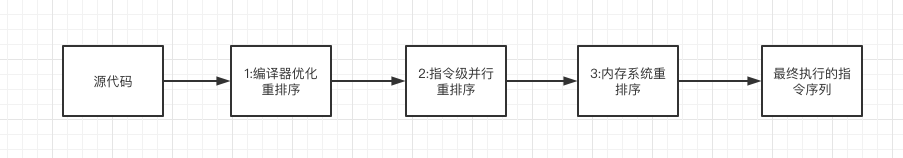
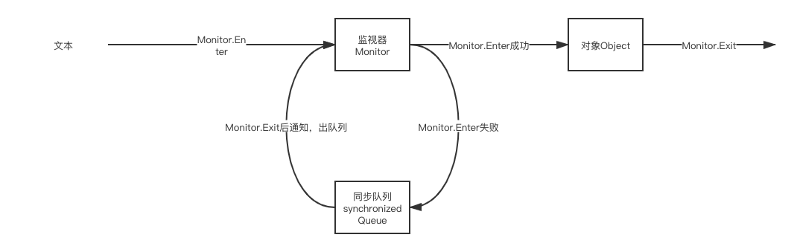
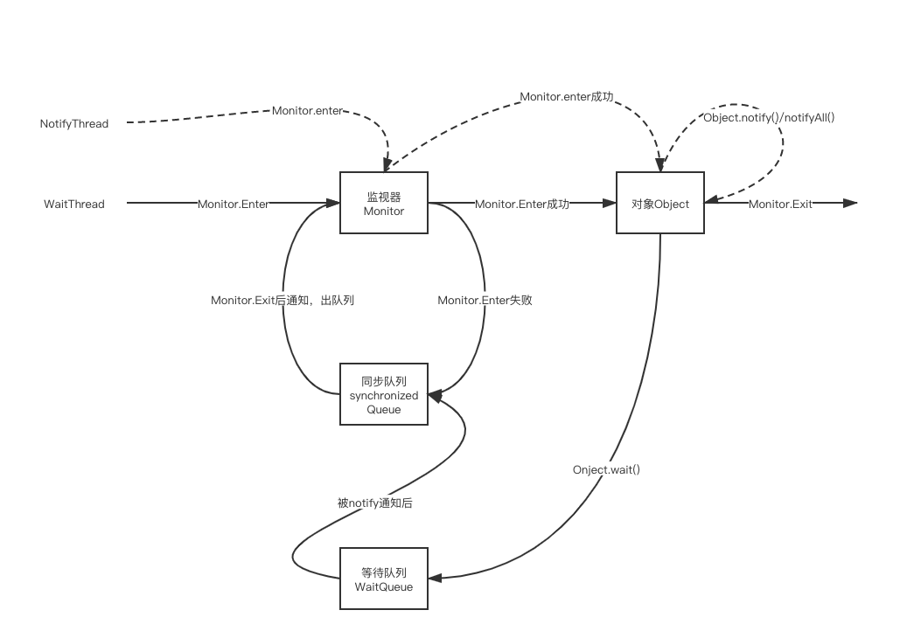
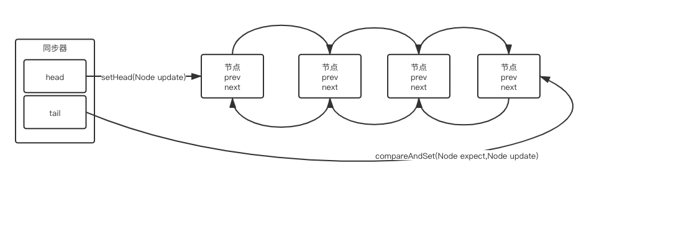
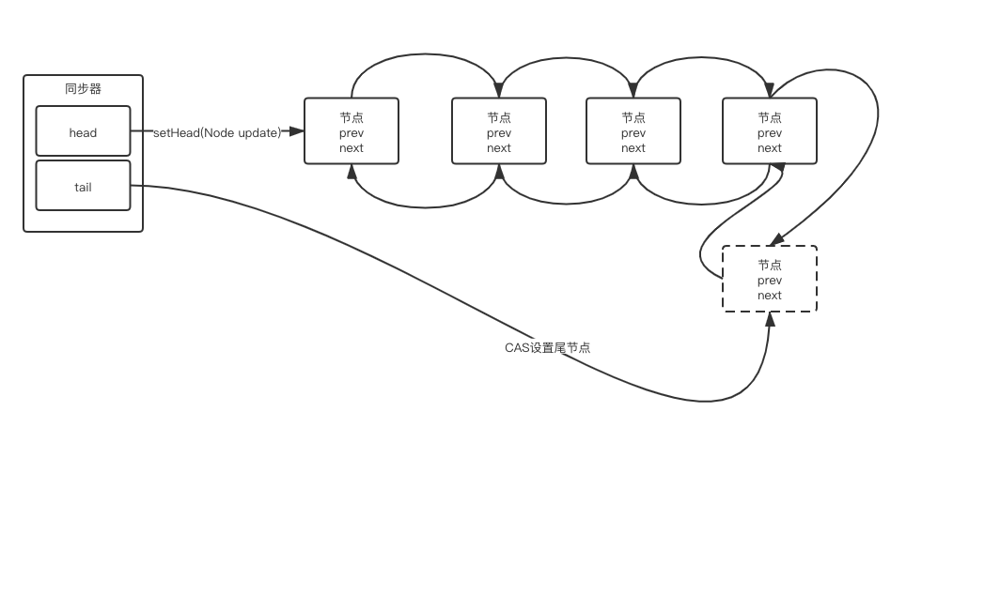
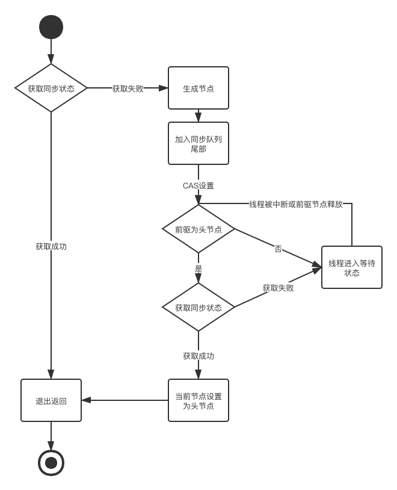
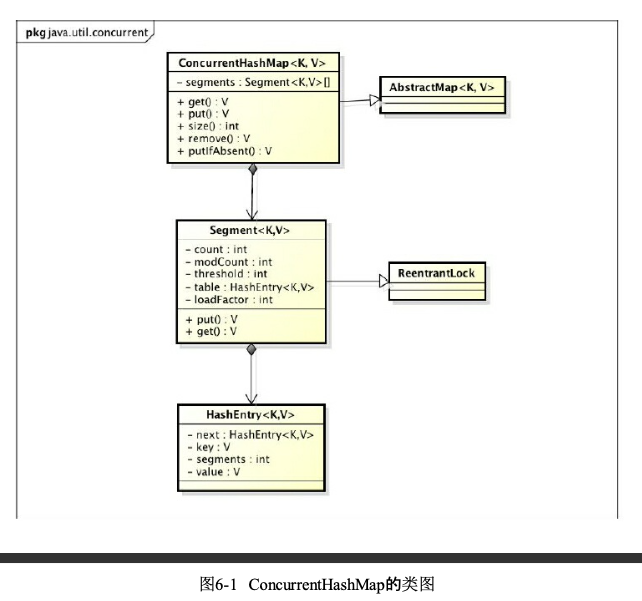
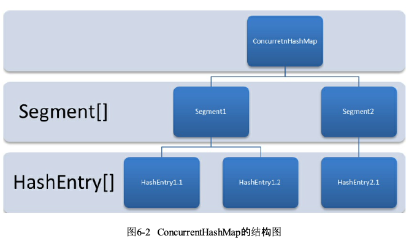

# 第一章 并发编程

### 多线程基础

​	计算机中一个任务称为一个进程，某些进程内还需要同时执行多个任务。

​	进程和线程的关系：一个进程可以包含一个或多个线程，但至少会有一个线程。

​	操作系统调度的最小任务单位是线程。

### 并发编程的优缺点

优点：

1. 充分利用多核CPU的计算能力以及超线程技术

2. 方便进行业务拆分，提升系统并发能力和性能，加快客户端的响应时间

   > 有些业务天生就适合并发编程，如遍历一张图片的所有像素、网上购物时拆分业务任务以提高响应速度。面对复杂业务模型，并行程序会比串行更适应业务需求

3. 可以使程序模块化、异步化、简单化

缺点：

1. 频繁的上下文切换
2. 线程安全
3. 死锁

### ContextSwitch上下文切换

​	多线程的上下文切换就是指当前线程的执行情况（包括pc指令寄存器、寄存器等等）保存起来，然后加载另外一个线程的数据，执行另一个线程的运算，这会有一定的性能开销。

超线程：一个ALU对应多个PC|Register，所谓四核八线程

### 如何减少上下文切换

​	减少上下文切换有**无锁并发编程、CAS算法、使用最少线程和使用协程**。

- 无锁并发编程：多线程竞争锁时，会引起上下文切换，所以多线程处理数据时，可以用一些方法来避免使用锁，如将数据的Id按照Hash算法取模分段，不同的线程处理不同段的数据。
- CAS算法：CompareAndSwap比较并交换，Java的Atomic包使用CAS算法来更新数据而不需要加锁。
- 使用最少线程。避免创建不需要的线程，比如任务很少，但是创建了很多线程来处理，这会造成大量线程都处于等待状态。
- 协程：在单线程里实现多任务的调度，并在单线程里维持多个任务之间的切换。

### 死锁

​	指两个或两个以上的线程在执行过程中，由于竞争资源或者彼此通信而造成的一种阻塞现象，若无外力作用，它们都无法推进下去，此时就产生了死锁。

#### 死锁的产生条件

1. 互斥条件：线程对所分配的资源进行排他性使用，即在一段时间内某个资源只能由一个线程占用，若此时还有其他的线程请求该资源，则请求线程只能等待使用线程释放资源。
2. 不剥夺条件：线程所获得的资源在未使用完毕之前不能被剥夺，只能在使用完后自己释放。
3. 请求和保持条件：指进程已经保持至少一个资源，但又提出了新的资源请求，而该资源已被其他线程占有，此时请求线程阻塞，但又不释放自己已经获得的资源。
4. 循环等待条件：存在一种线程资源的循环等待链，链中每一个线程已获得的资源同时被下一个线程所请求。即存在一个处于等待状态的线程集合{p1,p2...pn},其中Pi等待的资源被P（i+1）占有，Pn等待的资源被P0占有。

#### 如何避免死锁

1. 避免一个线程同时获取多个锁。
2. 避免一个线程在同一个锁内占用多个资源，尽量保证每个锁只占用一个资源。
3. 尝试使用定时锁，使用lock.tryLock(timeout)来替代内部锁机制。
4. 对于数据库锁，加锁和解锁必须在同一个数据库连接里，否则会出现解锁失败的情况。


# 第二章 Java并发机制的底层实现原理

​	java代码编译之后会变成java字节码，字节码被类加载器加载到JVM里，JVM执行字节码，最终要转化成汇编指令在CPU上执行，Java中所使用的并发机制依赖于JVM的实现和CPU的指令。

### volatile的应用

​	java并发编程中Synchronized和Volatile都很重要，Volatile是轻量级的Synchronized，它在多处理器开发中保证了共享变量的“可见性”。可见性是指当一个线程修改一个共享变量时，其他线程可以读到这个修改的值，若Volatile使用恰当会比synchronized的使用和执行成本更低，因为它不会引起线程上下文切换和调度。

- 线程可见性

  在java中对volatile修饰的变量进行写（修改）操作时，编译执行的汇编码会在写操作之后多出一行以**lock**为前缀的代码，Lock前缀的指令在多核处理器下会引发两件事情：

  1. 将当前处理器缓存行的数据写回系统内存。

  2. 这个写回操作会使其他CPU里缓存了该内存地址的数据无效。

     > 多处理器下，为了保证每个处理器的缓存是一致有效的，就会实现**缓存一致性协议**（MESI），每个处理器通过嗅探在总线上传播的数据来检查自己缓存的值是不是过期了，当处理器发现自己缓存行对应的内存地址被修改，就会将自己的缓存行设置为**无效状态**，要修改这个数据时，会重新从系统内存中把该数据读取到处理器缓存中。

  通过上述步骤可以保证多核处理器之间的数据可见性

- 阻止指令重排序

  在执行程序时，为了提高性能，编译器和处理器通常会对指令做重排序，重排序有三种：

  1. 编译器优化的重排序：编译器在不改变单线程语义的前提下，可以重新安排语句的执行顺序
  2. 指令级并行的重排序：现代处理器采用了指令级并行技术（Instruction-Level-Parallelism，ILP）来将多条指令重叠执行。如果不存在数据依赖性，处理器可以改变对应机器指令的执行顺序。
  3. 内存系统的重排序：由于内存系统使用缓存和读写缓冲区，这使得加载和存储操作看起来像是乱序执行。

  

这些重排序可能会导致内存可见性问题，对于编译器，JMM的编译器重排序规则会阻止特定类型的编译器重排序（不是阻止所有的编译器重排序）。对于指令级重排序JMM的处理器重排序规则会要求JAVA编译器生成指令序列时，插入特定类型的内存屏障（Memory Barriers）指令，通过内存屏障指令来禁止特定类型的处理器重排序。

​	JMM属于语言级别的内存模型，它确保不同编译器和不同处理器平台上通过禁止特定类型的编译器和处理器重排序，提供一致的内存可见性保证。

#### Volatile的使用优化

​	//有空再补充，主要是通过填充缓存行，除了需要修改volatile修饰的变量的CPU的缓存中  。使得其他CPU不会因为局部性原理而读取到该变量，因此也不需要强制让其他CPU的缓存失效，又重新读取到该变量，造成性能浪费。


### Synchronized的实现原理与应用

​	在并发编程中，Synchronized一直是元老级角色，很多人把它称之为重量级锁，但是随着JDK1.6之后的优化，有些情况下Synchronized就不那么重了。JDK1.6为了减少获得锁和释放锁带来的性能消耗而引入了偏向锁和轻量级锁，以及锁的存储结构改变和锁的升级。

#### Synchronized实现同步的基础

​	java 中每个对象都可以作为锁，具体有以下三种形式：

- 对用普通的同步方法，锁是当前实例对象。

- 对于静态同步方法，锁是当前类的Class对象。

- 对于同步方法块，锁是Synchronized括号里的对象。

  当一个线程试图访问同步代码块时，要先获取锁，退出或抛出异常时释放锁。锁到底在哪呢？锁里面有什么信息呢？

  **Synchronized**在JVM的实现原理：JVM基于进入和退出Monitor（监视器）对象来实现方法同步和代码块同步，但两者的具体实现方式不同。代码块同步是使用monitor**enter**和monitor**exit**指令（字节码指令）实现的，而方法同步是使用另外一种方式实现的，细节在JVM中并没有详细说明。但是，方法的同步同样可以用这两个指令来实现。

  > monitorenter指令是在编译后插入到同步代码块的开始位置，而monitorexit是插入到代码块的结束处和异常处，JVM要保证每个monitorenter必须都有对应的monitorexit与之配对，**任何对象都有一个monitor（在对象头中）与之关联**，当一个monitor被持有之后，它将处于锁定状态。线程执行到monitorenter指令时，将会尝试获得对象所对应的monitor的所有权，即尝试获得对象的锁。

  **synchronized用的锁是存在对象头里的**。如果对象是数组类型，则虚拟机用3个字宽（虚拟机的位数，如32位、64位）存储对象头，如果是非数组类型，则用2字宽存储对象头。

#### 对象头内容

| 长度     | 内容                   | 说明                                             |
| -------- | ---------------------- | ------------------------------------------------ |
| 32/64bit | MarkWord               | 存储对象的hashCode、GC分代年龄、锁等信息         |
| 32/64bit | Class Matedata Address | 存储到对象类型数据的指针                         |
| 32/64bit | Array length           | 数组的长度（如果当前对象是数组对象，反之则没有） |

### 锁的升级和对比

​	JDK1.6为了减少获得锁和释放锁带来的性能消耗而引入了偏向锁和轻量级锁，以及锁的存储结构改变和锁的升级，在JDK1.6中，锁一共有4种状态，级别从高到低依次是：无锁状态、偏向锁状态、轻量级锁状态和重量级锁状态，这几个状态会随着竞争情况升级。锁可以升级但是不可以降级，意味着偏向锁升级成轻量级锁之后不能降级为偏向锁。这种锁升级却不能降级的策略，目的是为了提高获得锁和释放锁的效率。

#### 偏向锁

HotSpot的作者发现，大多数情况下，锁不仅不存在多线程竞争，而且总是有同一个线程多次获得，为了让线程获得锁的代价更低而引入了偏向锁。

偏向锁定义：当一个线程访问同步块并获取锁时，会在对象头和栈帧中的锁记录里存储锁偏向的线程ID，以后该线程在进入和退出同步块时不需要进行CAS操作来加锁和解锁，只需要简单的测试一下对象头中的MarkWord里是否存储着指向当前线程的偏向锁。如果测试成功，表示线程已经获得了锁。如果测试失败，则再测试一下MarkWord中的偏向锁标记是否设置为1，若还不是偏向锁，则使用CAS竞争锁，若已经是偏向锁了（即该对象锁偏向了别的线程），则当前线程使用CAS修改锁（使用CAS将对象头的偏向锁指向当前线程）。

1. 偏向锁的撤销

偏向锁使用了一种等到竞争开始出现才释放锁的机制，所以当其他线程尝试竞争偏向锁时，持有偏向锁的线程才释放锁。偏向锁的撤销，需要等待到全局安全点（这个时间点上没有正在执行的字节码）。它首先会暂停拥有偏向锁的线程，然后检查持有偏向锁的线程是否还活着，，如果线程不处于活动状态，则将对象锁设置为无锁状态；如果线程仍然活着，拥有偏向锁的栈会被执行，遍历偏向对象的锁记录，占中的锁记录和对象头中的MarkWord要么重新偏向于其他线程，要么恢复到无锁状态活着标记对象不适合作为偏向锁，最后唤醒暂停的线程

2. 关闭偏向锁

偏向锁在java 6和java 7中是默认开启的，但是它在应用程序启动几秒之后才会激活，如有必要可以使用JVM参数来关闭延迟：-XX:BiasedLockingStartuoDelay=0。如果确定应用程序里所有的锁通常属于竞争状态，可以通过JVM参数关闭偏向锁：-XX:-UseBiasedLocking=false,那么程序默认会进入轻量级锁状态。

#### 轻量级锁

1. 轻量级锁加锁

   轻量级锁在执行同步块之前，JVM会在当前线程的栈帧之中创建用于存储锁记录的空间，并将对象头中的MarkWord复制到锁记录中，官方称为Displaced Mark Word。然后线程尝试使用CAS将对象头中的Mark Word替换为指向锁记录的指针，若成功，则当前线程获得锁，若失败，表示其他线程竞争锁，当前线程尝试使用自旋来获取锁。

2. 轻量级锁解锁

   轻量级锁解锁时，会使用CAS操作将Displaced Mark Word替换会对象头，如果成功，则表示没有竞争发生，若失败，表示当前锁存在竞争，锁就会膨胀为重量级锁。

​        因为自旋会消耗CPU，为了避免无用的自旋（如获得锁的线程被阻塞了，无法继续线程任务），一旦锁升级为重量级锁，就不会恢复到轻量级锁状态。当锁处于重量级锁时，其他线程试图获取锁都会进入阻塞状态，当持有锁的线程释放锁之后就会唤醒这些因为试图获取锁而进入阻塞状态的线程们进行新一轮的夺锁之争。

#### 锁的优缺点对比

| 锁       | 优点                                                         | 缺点                                                    | 适用场景                               |
| -------- | ------------------------------------------------------------ | ------------------------------------------------------- | -------------------------------------- |
| 偏向锁   | 加锁和解锁不需要额外的消耗，和执行非同步方法相比仅存在几纳秒的差距 | 如果线程间存在锁竞争，会带来额外的锁撤销的消耗          | 适用于只有一个线程访问同步块代码的场景 |
| 轻量级锁 | 竞争的线程不会阻塞，提高了程序的响应速度                     | 在竞争锁时始终得不到锁的线程会自旋消耗额外的CPU执行时间 | 追求响应时间，同步块执行速度非常快     |
| 重量级锁 | 线程竞争不使用自旋，直接阻塞，不会消耗CPU                    | 线程阻塞，响应时间缓慢                                  | 追求吞吐量，同步块执行时间较长         |

### 原子操作的实现原理

1. 原子操作

​	指不可中断活着分割的一次或一系列操作。

2. 多处理器中如何实现原子操作？

   CPU在操作基本内存时可以保证原子性（即当一个处理器读取一个字节时，其他处理器不能访问这个字节的内存地址），目前的CPU保证单处理器对同一个缓存行里进行16/32/64位的操作是原子的，但是复杂的内存操作处理器不能自动保证原子性，如跨总线宽度、跨多个缓存行和跨页表的访问。但是，处理器提供**总线锁定**和**缓存锁定**两个机制来保证复杂操作内存的原子性。

   1. 总线锁定

      若多个处理器同时对共享变量进行读改写操作（i++），操作完成之后可能会出现结果和预期不一致，通过锁总线来解决这个问题。

      总线锁是指使用处理器提供的一个LOCK#信号，当一个处理器在总线上输出此信号时，其他处理器的请求会被阻塞住，那么该处理器就可以独占内存，所以总线锁定的开销比较大。

   2. 缓存锁定

      频繁使用的内存会缓存在CPU的高速缓存中，单个处理器的原子操作可以直接在自己的高速缓存中进行，通过缓存锁定来实现复杂的原子性操作。

      缓存锁定是指内存区域被缓存在处理器的高速缓存中，并且在Lock期间被锁定，那么当它写回内存时不声明LOCK#锁总线，而是直接操作内存，因为缓存一致性协议的存在，这个写回操作会使其他处理器的高速缓存该内存区域的缓存无效，其他CPU再想操作该内存就必须重新从主内存中读取，以此来保证复杂操作的原子性。

      > 但是有两种情况处理器不会使用缓存行锁定：
      >
      > - 当操作的数据不能缓存在处理器内部（数据量超过了处理器的缓存大小等），或操作的数据跨多个缓存行时，处理器会使用总线锁定。
      > - 有些处理器不支持缓存锁定。

   3. java如何实现原子操作？

      可以通过锁和循环CAS的方式来实现原子操作。

      - CAS：JVM使用的CAS就是使用了处理器提供的CMPXCHG指令实现的。自旋CAS的基本实现思路就是循环进行CAS操作直到成功为止。

        **CAS实现原子操作的三大问题**

        1. ABA问题。
        2. 循环时间长开销大，如果自旋CAS长时间不成功，会给CPU带来非常大的执行开销
        3. 只能保证一个共享变量的原子操作

      - 锁：锁机制保证了只有获得锁的线程才能够操作锁定的内存区域。JVM实现了很多种锁机制，有偏向锁、轻量级锁和互斥锁。除了偏向锁，其他锁都用了自旋CAS来实现，即一个线程进入同步块时通过自旋CAS来获取锁，释放的时候也是通过自旋CAS来释放锁（获取和释放锁就是通过自旋CAS操作对象头中Mark Word中存储锁信息的内存数据）。

# 第三章 java内存模型

​	在java中，所有实例域、静态域和数组元素都存储在堆内存中，堆内存在线程之间共享。

#### 内存模型的抽象结构	

​	java线程之间的通信由java内存模型（JMM）控制，JMM决定了一个线程对共享变量的写入何时对另外的线程可见。 从抽象的角度看，JMM定义了线程和主内存之间的**抽象关系**：线程之间的共享变量存储在主内存（Main Memory），每个线程有自己的私有的本地内存（Local Memory），本地内存存储了该线程已读/写共享变量的副本，本地内存是一个抽象概念，包含了缓存、写缓冲区、寄存器及其他的硬件和编译优化。

​	由上述可知，线程之间想要通信，必须经历以下两个步骤：

1. 线程A把本地缓存A更新后的值刷新到主存中。
2. 线程B到主存中读取线程A更新后的共享变量。

> 从整体来看，这两个步骤实际上是线程A给线程B发送消息，而且这个通信过程必须经过主存。JMM通过控制主内存域每个线程的本地内存至今的交互，来为java程序提供内存可见性保证。

#### 从源代码到指令序列的重排序

​	重排序种类：

1. 编译器优化的重排序

   编译器在不改变单线程程序语义的前提下，重新安排语句的执行顺序。

2. 指令级并行的重排序

3. 内存系统的重排序


# 第四章 java并发编程基础

### 线程简介

​	操作系统在运行一个程序时，会为它创建一个进程。启动一个java程序就会创建一个java进程。操作系统调度的最小单元是线程，也叫轻量级进程，在一个进程里可以创建多个线程，每个线程都拥有各自的计数器、栈和局部变量等属性，并且能够访问共享的内存变量。

#### 为什么要使用多线程

1. 更多的处理器核心，现在的CPU核心数量越来越多，超线程技术的使用越来越广泛，多线程技术可以让程序的执行分配到多个核心上一起执行，效率更高，若是单纯的单线程程序，则多余的核心无法被利用到。

2. 更快的响应时间

   有时一个较为复杂的业务逻辑可以使用多线程技术将业务中一致性不强的操作分配给不同的线程处理（也可以使用消息队列），使用户的请求尽可能快的完成，缩短了响应时间，提高了用户体验。

3. 更好的编程模型

   Java为多线程提供了良好、考究并且一致的编程模型。

#### 线程的状态

​	java线程在运行的生命周期中有6中不同的状态，在某一时刻一个线程只能处于一种状态。

| 状态名称     | 说明                                                         |
| ------------ | ------------------------------------------------------------ |
| NEW          | 初始状态，线程被构建，但是还没调用start方法。                |
| RUNNABLE     | 运行状态，Java线程将操作系统中的就绪和运行两种状态笼统的称为“运行中” |
| BOLCKED      | 阻塞状态，表示线程阻塞于锁                                   |
| WAITING      | 等待状态，表示线程进入等待状态，进入该状态表示当前线程需要其他线程作出特定的动作（通知或中断） |
| TIME_WAITING | 超时等待状态，该状态不同于WAITING，它是可以在指定的时间自行返回的。 |
| TERMINATED   | 终止状态，表示当前线程已经执行完毕。                         |

#### Daemon线程（守护线程）

​	是一种支持型线程，主要被用作程序中后台调度以及支持性工作，这意味着，当一个JVM不存在非Daemon线程时，JVM会退出（因为已经没有任务要执行了），线程可以被设置为Daemon线程。

> 构建Daemon线程时，不能依靠finally块中的代码来确保执行关闭或清理资源的逻辑，因为Daemon线程的finally块不一定会被执行。

### 启动和终止线程

​	调用线程的start方法开启一个线程，执行完run方法之后线程结束。

#### 构造线程

​	首先要构造线程对象，线程对象在构造的时候可以设置线程的属性，如所在的线程组、线程优先级、是否是Daemon线程等等。

#### 启动线程

​	线程对象初始化完成后，调用start方法可以开启线程。线程start方法的含义是：当前线程（parent线程）同步告知虚拟机，只要线程规划器空闲，应立即启动被调用start方法的线程。

> 启动一个线程之前，最好给线程设置名字，这样在进行问题排查的时候，可以给开发人员提示，因此自定义线程最好设置一个名称。

#### 理解中断

​	中断可以理解为线程中的一个标识位，它表示这个线程是否被其他线程中断过，相当于其他线程跟当前线程打了个招呼，其他线程可以通过调用该线程的interrupted方法对其进行中断操作。

​	线程可以通过isInterrupted方法来判断是否被其他线程中断而作出响应。

#### 如何安全的终止线程

​	一般线程在执行完run方法中的任务之后就会自动结束，若线程一直运行，则run方法中一定有一个以上的无限循环，一直在重复的做着某项任务，可以在无限循环的条件中判断线程是否被中断而跳出循环结束任务，或者使用一个boolean类型的标记位来控制是否需要停止或取消任务。

### 线程间的通信

#### volatile和synchronized关键字

​	每个执行的线程都可以拥有一份共享内存中的对象的拷贝，就像CPU中的高速缓存一样，这样做的目的是为了加速程序的运行，所以一个线程看到的变量不一定是最新的。

​	volatile关键字可以用来修饰字段（成员变量），告知程序这个变量的读取必须从主存中读取，而对这个变量的修改必须同步刷新回主存，这样就可以保证所有线程对这个变量的访问可见性，但同时也因为如此，会降低程序执行的效率。

​	synchronized关键字可以修饰方法或者以同步块的形式使用，它主要确保多个线程在同一时刻只能有一个线程处于方法或者同步块中，保证了线程对变量访问的可见性和排他性。

> - synchronized修饰的方法或同步块实际上都是要求线程在进入之前获取指定对象的监视器（monitor），而这个获取过程是排它的，即同一时刻只有一个线程才能获得由synchronized所保护对象的监视器
>
> - 任意一个对象都有自己的监视器，当这个对象由同步块或者这个对象的同步方法调用时，执行方法的线程必须获得这个对象的监视器才能进入同步方法或同步块，否则会被阻塞在同步方法或同步块的入口处，进入BLOCKED状态。
> - 当获得了锁的线程释放了锁（退出监视器monitor）就会唤醒在阻塞在同步队列上的线程，使其重新尝试获取对对象监视器的获取。



#### 等待/通知机制

​	java内置了等待/通知机制，因为Object类定义了一系列通知等待的方法。

| 方法名称       | 描述                                                         |
| -------------- | ------------------------------------------------------------ |
| notify()       | 通知一个在对象哈上等待的线程，使其从wait()方法返回，返回的前提是该线程获取到了对象的锁 |
| notifyAll()    | 通知所有等待在该对象上的线程                                 |
| wait()         | 调用该方法的线程将进入等待状态，只有等待另外线程通知或被中断才会返回，进入等待状态会释放对象的锁 |
| wait(long)     | 超时等待一段时间，参数单位是毫秒，如果没有通知就会超时返回   |
| wait(long,int) | 对于超市时间更细粒度的控制，可以达到纳秒                     |

> notify()方法会唤醒在某个对象上等待的线程，若有多个线程同时等待，则随机唤醒一个。

​	通知等待机制，就是指一个线程A调用了对象O的wait方法进入等待状态，此时A在O上等待，而另一个线程B调用O的notify或notifyAll方法，线程A收到通知后从对象O的wait方法返回，进行后续操作。

​	上述过程就是线程间的通信，通过对象O来完成，wait和notify方法就像是开关信号一样，用来完成等待方和通知方之间的交互工作。

```java
public class WaitNotify {
    static private boolean flag = true;

    static private Object lock = new Object();


    static class Wait implements Runnable{

        @Override
        public void run() {
            synchronized (lock){
                while (flag){
                    try {
                        System.out.println(Thread.currentThread().getName() + "flag is true,wait@" + new SimpleDateFormat("HH:mm:ss").format(new Date()));
                        lock.wait();
                    } catch (InterruptedException e) {

                    }
                }
                System.out.println(Thread.currentThread().getName() + "flag is false" + new SimpleDateFormat("HH:mm:ss").format(new Date()));

            }
        }
    }

    static class Notify implements Runnable{

        @Override
        public void run() {
            synchronized (lock){
                try {
                    System.out.println(Thread.currentThread().getName() + "hold lock notify" + new SimpleDateFormat("HH:mm:ss").format(new Date()));
                    lock.notifyAll();
                    flag = false;

                    Thread.sleep(5000);
                } catch (InterruptedException e) {
                    e.printStackTrace();
                }
            }

            synchronized (lock){
                try {
                    System.out.println(Thread.currentThread().getName() + "hold lock again,sleep@" + new SimpleDateFormat("HH:mm:ss").format(new Date()));
                    Thread.sleep(5000);
                } catch (InterruptedException e) {
                    e.printStackTrace();
                }
            }
        }
    }

    public static void main(String[] args) {
        Thread wait = new Thread(new Wait(),"WaitThread");
        wait.start();

        try {
            Thread.sleep(1000);
        } catch (InterruptedException e) {
            e.printStackTrace();
        }

        Thread notify = new Thread(new Notify(),"NotifyThread");
        notify.start();
        
    }
}
```

上述代码说明了调用wait、notify和`方法的细节：

1. 使用wait、notify和notifyAll时需要先对调用对象加锁。
2. 调用wait方法后，线程状态从Running编程Waiting，释放锁并将当前线程放置到对象的等待序列。
3. notify或notifyAll方法调用后，等待线程不会立即从wait方法返回，要等待调用notify或notifyAll方法的通知线程释放锁之后，等待线程获取到锁之后才能从wait方法返回。
4. notify方法将等待队列中的一个等待线程（随机）迁移至同步队列，而notufyAll方法将等待队列上的所有线程迁移至同步队列，从等待队列迁移到同步队列后线程的状态从WAITING变成了BLOCKED。
5. 从wait方法返回的前提是获得了调用对象的锁。

> 从上述细节可知，等待通知机制依赖于同步机制，其目的就是确保等待线程从wait方法返回时能够感知到通知线程对变量作出的修改。



​	上图中，WaitThread首先获得了对象的锁，然后调用wait方法放弃锁进入等待队列中，进入等待状态。由于WaitThread释放了锁，随后NotifyThread获得了对象的锁，并调用对象的notify方法，将WaitThread从等待队列中转移到同步队列中，此时WaitThread状态变为阻塞。NotifyThread随后释放锁，WaitThread获取锁之后从wait方法返回。

#### 等待/通知的经典范式 

​	该范式分为两部分，分别针对等待房（消费者）和通知方（生产者）。

##### 等待方原则

1. 获取对象的锁
2. 如果条件不满足，则调用对象的wait方法，被通知后仍要检查条件。
3. 条件满足则执行对应的逻辑。

对应的伪代码如下：

``` java
synchronized(object){
  while(条件不满足){
    object.wait();
  }
  //对应的处理逻辑
}
```

##### 通知方原则

1. 获取对象的锁
2. 改变条件
3. 通知所有在对象上等待的线程

对应的伪代码如下：

```java
synchronized(object){
  //改变条件
  object.notifyAll();
}
```

### 管道输入输出流

​	该流不同于其他流，主要用于线程之间的数据传输，传输的媒介是内存。

​	主要包括四种具体实现：PipedOutputStream、PipedInputStream、PipedOutputWriter、PipedOutputReader，前两种面向字节，后两种面向字符。

``` java
public class Piped {
    public static void main(String[] args) throws IOException {
        PipedWriter out = new PipedWriter();

        PipedReader in = new PipedReader();

        out.connect(in);//必须进行绑定连接

        Thread print = new Thread(new Print(in));
        print.start();
        int receive = 0;
        try {
            while ((receive = System.in.read()) != -1){
                out.write(receive);
            }
        } finally {
            out.close();
        }
    }

    static class Print implements Runnable{

        PipedReader in;

        public Print(PipedReader in){
            this.in = in;
        }

        @Override
        public void run() {
            int receive = 0;
            try {
                while ((receive = in.read())!=-1) {
                    System.out.println((char) receive);
                }
            } catch (IOException e) {
                e.printStackTrace();
            }
        }
    }
}
```

​	对于Piped类型的流，必须要先进行绑定，也就是调用connect方法，若没有绑定则抛出IO异常。


### Thread.join()的使用

​	如果一个线程A执行了thread.join()语句，那么当前线程A就会等待线程thread终止之后才会从thread.join()语句返回继续执行（即thread线程插队进来，A等thread执行完了再继续）。线程Thread类提供了join()方法之外，还提供了Join(long millis)和join(long mills,int nanos)两个具备超时特性的方法。这两个超时方法表示，如果线程thread没有在给定的时间内终止，那么将会从该超时方法中返回。

​	实际上该方法也是通知/等待机制的一种运用（等待前置线程结束，前置线程结束后通知当前线程）

### ThreadLocal的使用

​	线程变量，是以一个ThreadLocal对象为键、任意对象为值的存储结构。这个结构被附带在线程上，也就是说一个线程可以根据一个ThreadLocal对象查询到绑定在这个线程上的一个值。


### 线程池以及示例

​	为了避免频繁的创建和销毁小城所带来的性能开销，可以使用线程池。

​	线程池预先创建了指定数量的线程，并且不会由用户直接创建线程。在这个前提下，重复使用固定数量的线程来完成任务。

优点：

1. 消除了频繁创建和销毁线程的系统资源开销
2. 面对过量任务能够平缓的处理

下面是一个简单的线程池接口定义：

```java
public interface ThreadPool<Job extends Runnable> {
    //执行一个Job，这个Job必须实现run方法
    void execute(Job job);

    //关闭线程池
    void shutdown();

    //增加工作者线程
    void addWorkers(int num);

    //减少工作者线程
    void removeWorkers(int num);

    //获取正在工作线程的数量
    int getJobSize();

}
```

​	客户端可以通过execute(Job)的方式将Job提交入线程池执行，而客户端不需要等待线程执行完毕。除了提交方法之外，线程池提供了增大/减少工作者线程数量以及关闭线程池的方法。

​	工作者线程代表着一个重复执行Job的线程，而每个由客户端提交的Job都将进入到一个工作队列中等待工作线程的处理。

下面是一个线程池的默认实现：

```java
public class DefaultThreadPool<Job extends Runnable> implements ThreadPool <Job>{
    //线程池最大限制数
    private final static int MAX_WORKERS_NUMBERS = 10;
    //线程池默认数
    private static final int DEFAULT_WORKERS_NUMBERS = 5;
    //线程池最小值
    private static final int MIN_WORKERS_NUMBERS = 1;
    //工作列表，向里面插入工作
    private final LinkedList<Job> jobs = new LinkedList<>();
    //工作者列表
    private final List<Worker> workers = Collections.synchronizedList(new ArrayList<>());
    //工作者线程的数量
    private int workerNumber = DEFAULT_WORKERS_NUMBERS;
    //线程编号生成
    private AtomicLong threadNum = new AtomicLong();

    public DefaultThreadPool() {
        initializeWorkers(DEFAULT_WORKERS_NUMBERS);
    }

    public DefaultThreadPool(int num) {
        workerNumber = num >MAX_WORKERS_NUMBERS ? MAX_WORKERS_NUMBERS : Math.max(num, MIN_WORKERS_NUMBERS);
        initializeWorkers(workerNumber);
    }

    //初始化线程工作者
    private void initializeWorkers(int num){
        for (int i = 0; i < num; i++) {
            Worker worker = new Worker();
            workers.add(worker);
            Thread thread = new Thread(worker,"ThreadPool-Worker-"+threadNum.incrementAndGet());
            thread.start();
        }
    }

    @Override
    public void execute(Job job) {
        if (job!=null) {
            synchronized (jobs){
                //添加一个工作，然后通知一个工作者线程
                jobs.add(job);
                jobs.notify();
            }
        }
    }

    @Override
    public void shutdown() {
        for (Worker worker : workers) {
            worker.shutdown();
        }

    }

    @Override
    public void addWorkers(int num) {
        synchronized (jobs){
            //限制新增的worker不能超过最大值
            if (num + this.workerNumber > MAX_WORKERS_NUMBERS) {
                num = MAX_WORKERS_NUMBERS - this.workerNumber;
            }
            initializeWorkers(num);
            this.workerNumber += num;
        }
    }

    @Override
    public void removeWorkers(int num) {
        synchronized (jobs){
            if (num >= this.workerNumber) {
                throw new IllegalArgumentException("beyond workNum");
            }

            //按照指定数量停止worker
            int count = 0;
            while (count < num) {
                Worker worker = workers.get(count);
                if (workers.remove(worker)) {
                    worker.shutdown();
                    count++;
                }
            }
            this.workerNumber -= count;
        }
    }

    @Override
    public int getJobSize() {
        return jobs.size();
    }


    //工作者，负责消费任务
    class Worker implements Runnable{
        //是否工作
        private boolean running = true;

        @Override
        public void run() {
            while (running) {
                Job job = null;
                synchronized (jobs){
                    while (jobs.isEmpty()) {
                        //如果工作列表是空的，则等待
                        try {
                            jobs.wait();
                        } catch (InterruptedException e) {
                            Thread.currentThread().interrupt();
                            return;
                        }
                    }
                    //取出一个job
                    job = jobs.removeFirst();
                }
                if (job != null) {
                    job.run();
                }
            }
        }
        
        private void shutdown(){
            running = false;
        }
    }
}
```

​	上述的默认线程池的实现中，当客户端调用execute(Job)方法时，会不断的向任务列表jobs插入Job，而每个工作者线程都会不断的从任务列表中取出一个Job执行，当任务列表jobs为空时，工作者线程进入等待状态。

​	添加一个Job之后，对任务队列jobs使用了notify方法，唤醒等待在jobs上的工作者线程。

> 线程池的本质就是使用了一个线程安全的工作队列连接了工作者线程和客户端线程，客户端线程将工作提交之后就可以返回，而工作者线程不断的取出工作然后完成，当工作队列为空时，所有的工作者线程在工作队列上等待，当客户端提交了一个工作之后，随机唤醒一个工作者线程，随着大量任务的提交，更多的工作者线程会被唤醒。

# 5.Java中的锁

## 5.1Lock接口

​	锁是用来控制多个线程访问共享资源的方式。在lock接口出现之前，java使用synchronized关键字来实现锁功能。DK1.5之后并发包中新增了Lock接口以及相关的实现类来实现锁功能，它提供了类似synchronized的同步功能，只在需要的时候显式大的获取和释放锁，**相比synchronized隐式获取和释放锁的便捷性，Lock接口有了锁获取和释放的可操作性、可中断的获取锁以及超时获取锁等多种synchronized关键字不具备的同步特性**

> 思考以下场景：先获取锁A，然后再获取锁B，然后释放锁A同时获取锁C，获得锁C之后再释放锁B同时获得锁D。以此类推，这种场景下使用synchronized就不那么容易实现了。

Lock的使用方式：

```java
Lock lock = new ReentranLock();
lock.lock();//获取锁的过程不要放在try块中，因为如果在获取锁（自定义锁）时发生了异常，异常抛出的同时也会导致锁的释放。
try{
  
}finally{
  lock.unlock();//finally块中解锁确保最终会被执行
}
```

Lock接口提供的synchronized关键字所不具备的主要特性：

| 特性               | 描述                                                         |
| ------------------ | ------------------------------------------------------------ |
| 尝试非阻塞的获取锁 | 当前线程尝试获取锁，如果这一时刻锁没有被其他线程获取到，则成功获取并持有锁 |
| 能被中断的获取锁   | 与synchronized不同，获取到锁的线程能够响应中断，当获取到锁的线程被中断时，中断异常被抛出并且释放锁 |
| 超时获取锁         | 在指定的时间内获取锁，如果截止时间到了仍然无法获取锁则返回   |

Lock接口定义的基本操作：

| 方法名称                                                     | 描述                                                         |
| ------------------------------------------------------------ | ------------------------------------------------------------ |
| void lock()                                                  | 获取锁，调用该方法当前线程会获取锁，获取锁成功后从该方法返回 |
| void lockInterruptibly() throws InterruptedException         | 可中断的获取锁，和lock方法不同之处在于会响应中断，即锁的获取中可以中断当前线程 |
| boolean tryLock()                                            | 尝试非阻塞的获取锁，调用该方法后立刻返回，或能够获取锁则返回true，反之false |
| boolean tryLock(Long time,TimeUnit unit) throws InterruptedException | 超时的获取锁，当前线程在以下三种情况会返回：1.当前线程在超市时间内获取到锁 2.当前线程在超时时间内被中断 3.超时时间结束，返回false |
| void nulock()                                                | 释放锁                                                       |
| Condition newCondition                                       | 获取等待通知组件，该组件和当前的锁绑定，只有当前线程获取了锁，才能调用该组件的wait方法，调用wait方法后，当前线程将释放锁。 |

Lock接口的实现基本是通过聚合了一个同步器的子类来完成线程访问控制的。


## 5.2队列同步器

​	队列同步器（AbstractQueuedSynchronizer）是用来构建锁或者其他同步组件的基础框架，它使用了一个**int成员变量**来表示同步状态，通过**内置的FIFO队列**来完成**资源获取线程**的排队工作。

​	同步器主要的工作方式是继承，子类通过继承同步器并实现它的抽象方法来管理同步状态，对抽象方法的实现过程中一般都会涉及到同步状态的更改，此时需要使用同步器提供的3个方法(getState()、setState(int newState)和compareAndSetState(int expect,int update))来操作，因为这3个方法能够保证状态的修改是安全的。子类被推荐定义为同步组件的静态内部类，同步器自身没有实现任何同步接口，仅仅是定义了若干同步状态获取和释放的方法供自定义同步组件使用，同步器即可以支持独占式的获取同步状态，也可以支持共享式的获取同步状态，可以方便的实现不同类型的同步组件（ReentrantLock、ReentrantReadWriteLock和CountDownLatch等） 

​	同步器是实现锁（也可以是任意的同步组件）的关键，在锁的实现中聚合同步器，利用同步器实现锁的语义。

> 锁是面向使用者的，锁定义了使用者与锁交互的接口，隐藏了锁实现的细节，同步器是面向锁的实现者的，同步器简化了锁的实现方式，屏蔽了同步状态管理、线程的排队和等待唤醒等底层操作。锁和同步器很好的隔离了锁的使用者和实现者关注的领域。

### 5.2.1队列同步器的接口与示例

​	同步器的设计是基于模板方法模式的，即使用者需要继承同步器并重写指定的方法，随后将同步器组装在自定义的同步组件的实现中，并调用同步器中提供的模板方法，这些方法会调用使用者重写之后的方法。

​	重写同步器方法时，需要使用以下三个方法来访问和修改同步状态。

- getState():获取当前同步状态
- setState():设置当前同步状态
- compareAndSetState(int expect,int update):使用CAS设置当前状态，该方法能够保证状态改变的原子性

同步器可以重写的方法：

| 方法名称                                  | 描述                                                         |
| ----------------------------------------- | ------------------------------------------------------------ |
| Protect boolean tryAcquire(int arg)       | 独占式获取同步状态，实现该方法需要查询当前状态并判断状态是否符合预期，然后使用CAS设置同步状态 |
| Protect boolean tryRelease(int arg)       | 独占式释放同步状态，等待获取同步状态的线程将有机会获得同步状态 |
| protect int tryAcquireShared(int. arg)    | 共享式的获取同步状态，返回大于等于0的值则表示获取成功，反之获取失败 |
| protect boolean tryReleaseShared(int arg) | 共享式释放同步状态                                           |
| protect boolean isHeldExclusively()       | 当前同步器是否在独占模式下被线程占用，一般该方法表示是否被当前线程独占。 |

实现自定义同步组件时，将会调用同步器提供的模板方法，这鞋模板方法描写如下：

| 方法名称                                     | 描述                                                         |
| -------------------------------------------- | ------------------------------------------------------------ |
| void acqire(int arg)                         | 独占式获取同步状态，如果当前线程获取同步状态成功，则由该方法返回，否则进入同步队列等待，该方法将会调用重写的tryAcquire方法。 |
| void acquireinterruptibly( int arg )         | 与acqire(int arg)方法相同，但是该方法响应中断，当前线程未获取到同步状态而进入同步队列等待，若当前线程被中断，则抛出InterruptedException并返回。 |
| boolean tryAcquireNanos(int arg,long nanos)  | 在acquireinterruptibly( int arg )基础上加入了超时限制，如果当前线程在限定时间内没有获取到同步状态则返回false，反之则返回true。 |
| void acquireShared(int arg)                  | 共享式的获取同步状态，若未获取到则进入同步队列等待，与独占式的获取不同之处是在同一时刻可以有多个线程获取到同步状态。 |
| void acquireSharedInterruptibly( int arg)    | 与void acquireShared(int arg)相同，但是可以响应中断          |
| void acquireSharedNanos(int arg, long nanos) | 在void acquireShared(int arg)的基础上加入了超时限制          |
| boolean release(int arg)                     | 独占式的释放同步状态，该方法在释放同步状态之后，将同步队列中第一个节点包含的线程唤醒 |
| boolean releaseShared(int arg)               | 共享式的释放同步状态                                         |
| Collection<Thread> getQueueTheads()          | 获取等待在同步队列上的线程集合。                             |

​	同步器提供的模板方法基本上分为3类，独占式获取和释放同步状态、共享式获取和释放同步状态和查询同步队列中的等待线程情况。自定义同步组件将使用同步器提供的模板方法来实现自己的同步语义。

​	下面是一个独占锁示例：

```java
/**
 * 通过同步器实现的自定义独占锁
 */
public class Mutex implements Lock {

    //静态内部类，自定义同步器
    private static class Sycn extends AbstractQueuedSynchronizer{

        //是否处于被占用状态
        @Override
        protected boolean isHeldExclusively() {
            return getState() == 1;
        }

        //当状态为0时获取锁
        @Override
        protected boolean tryAcquire(int arg) {
            if (compareAndSetState(0, 1)) {
                setExclusiveOwnerThread(Thread.currentThread());
                return true;
            }
            return false;
        }
        //释放锁，将状态设置为0
        @Override
        protected boolean tryRelease(int arg) {
            if (getState()==0){
                throw new IllegalMonitorStateException();
            }
            setExclusiveOwnerThread(null);
            setState(0);
            return true;
        }

        Condition newCondition(){
            return new ConditionObject();
        }

    }
    //接下来的锁操作代理到上述内部类即可
    private final Sycn sycn = new Sycn();
    
    @Override
    public void lock() {
        sycn.acquire(1);
    }

    @Override
    public void lockInterruptibly() throws InterruptedException {
        sycn.acquireInterruptibly(1);
    }

    @Override
    public boolean tryLock() {
        return sycn.tryAcquire(1);
    }

    @Override
    public boolean tryLock(long time, TimeUnit unit) throws InterruptedException {
        return sycn.tryAcquireNanos(1,unit.toNanos(time));
    }

    @Override
    public void unlock() {
        sycn.release(1);
    }

    @Override
    public Condition newCondition() {
        return sycn.newCondition();
    }
}
```

上述示例中，独占锁Mutex是一个自定义的同步组件，它在同一时刻只允许一个线程占有锁。Mutex中定义了一个静态内部类，该内部类实现了同步器并实现了独占式获取和释放同步状态。在tryAcquire(int arg)方法中，如果经过CAS设置状态为1成功，则代表获取了同步状态，而在tryRelease(int arg)方法中只是将同步状态重置为0。使用Mutex同步组件时不需要直接和同步器打交道，而是调用Mutex提供的方法，在Mutex的实现中，只需要调用同步器的模板方法即可，大大降低了自定义一个同步组件的门槛。

### 5.2.2队列同步器的实现分析

​	主要包括：同步队列、独占式同步状态获取和释放、共享式同步状态获取和释放已经超时获取同步状态等同步器核心数据结构和模板方法。

​	1、**同步队列**

​	同步器依赖内部的同步队列（一个FIFO双向队列）来完成同步状态的管理，当前线程获取同步状态失败时，同步器会将当前线程和等待状态等信息构造成一个节点（Node）并将其加入同步队列，同时会阻塞当前线程，当同步状态释放时，会唤醒同步队列中的首节点，使其在此尝试获取同步状态。

​	节点（Node）用来保存获取同步状态失败的线程引用、等待状态以及前驱和后续节点，节点的属性类型和描述如下表所示：

| 属性类型与名称  | 描述                                                         |
| --------------- | ------------------------------------------------------------ |
| int waitStaus   | 等待状态。<br />包含如下状态：<br />1.CANCELLED：值为1，由于在同步队列中等待的线程等待超时或者被中断，需要从同步队列中取消等待，节点进入该状态将不会变化<br />2.SIGNAL：值为-1，后续节点的线程处于等待状态，而当前节点的线程如果释放了同步状态或者被取消，将会通知后继节点，使后继节点的线程得以运行<br />3.CONDITION：值为-2，节点在等待队列中，节点线程等待在Condition上，当其他线程对Condition调用了signal()方法之后，该节点将会从等待队列转移到同步队列中，加入对同步状态的获取中。<br />4.PROPAGATE：值为-3，表示下一次共享式同步状态获取将会无条件的被传播下去<br />5.INTIAL：值为0，初始状态。 |
| Node prev       | 前驱节点，当节点加入同步队列是添加（加在尾部）               |
| Node next       | 后继节点                                                     |
| Node nextWaiter | 等待队列中的后继节点。如果当前节点是共享的，那么这个字段就是一个常量SHARED，即节点类型（独占和共享）和等待队列中的后继节点共用一个字段 |
| Thread thread   | 获取同步状态的线程                                           |

​	节点是构成等待（同步）队列的基础，同步器 拥有首节点（head）和尾节点（tail），没有成功获取同步状态的线程将会成为节点加入同步队列的尾部，同步器结构如下：



​	在上图中，同步器包含了两个节点类型的引用，一个指向头节点，一个指向尾节点。当一个线程成功的获取了同步状态（或者锁），其他线程将无法获取到同步状态，然后被构造成节点并加入同步队列中，这个过程中必须保证线程安全，因此同步器使用了一个基于CAS设置尾节点的方法：compareAndSetTail(Node expect,Node update)，它需要传递当前线程认为的尾节点和当前节点，只有设置成功之后当前节点才正式与之前的尾节点建立关联。

​	同步器将节点加入同步队列过程：



​	同步队列遵循FIFO，首节点是获取同步状态成功的节点，首节点的线程在释放同步状态时，将会唤醒后继节点，而后继节点将会在获取同步状态成功之后将自己设置为首节点。因为只有一个线程能够成功获取同步状态，因此设置头节点的方法不需要使用CAS来保证，只需将首节点设置为原首节点的后继节点并断开原首节点的next引用即可。

​	2、独占式同步状态的获取与释放

​	通过调用同步器的acquire(int arg)方法可以获取同步状态，该方法对中断不敏感，也就是由于线程获取同步状态失败后进入同步队列中，后续对线程进行中断操作时，线程不会从同步队列中移出，该方法的示例代码如下：

```java
public final void acquire(int arg){
  if(!tryAcquire(arg) && acquireQueued(addWaiter(Node.EXCLUSIVE),arg)){
    selfInterrupt();
  }
}
```

​	上述代码主要完成了同步状态获取、节点构造、加入同步队列以及在同步队列中自旋等待的相关工作，其主要逻辑是：首先调用自定义同步器实现的tryAcquire方法，该方法保证现成安全的获取同步状态，如果获取失败，则构造同步队列节点（独占式Node.EXCLUSIVE，同一时刻只能有一个线程成功的获取同步状态）并通过addWaiter(Node node)方法将该节点加入到同步队列的尾部，最后调用acquireQueued(Node node,int arg)方法，使得该节点以死循环方式获取同步状态。如果获取不到则阻塞节点中的线程，而被阻塞现成的唤醒主要依靠前驱结点的出队或阻塞线程被中断来实现。

[^代码清单]: 同步器的addWaiter和enq方法

```java
private Node addWaiter(Node mode){
  Node node = new Node(Thread.currentThread(),mode);
  //尝试快速添加到同步队列尾部
  Node pred = tail;//tail是同步队列的尾部指针
  if(pred != null){
    node.prev = pred;
    if(compareAndSetTail(pred,node)){//CAS添加到尾部，若直接添加成功则设置该节点为尾部节点
      pred.next = node;
      return node;//成功之后直接返回
    }
  }
  enq(node);//调用enq方法死循环CAS添加节点到同步队列
  return node;
}


private Node enq(final Node node){
  for(;;){
    Node t = tail;
    if(t == null){//若尾部为null则该同步队列还没初始化
      if(compareAndSetTail(new Node())){
        tail = head;
      }else{
        node.prev = t;
        if(compareAndSetTail(t,node)){
          t.next = node;
          return t;
        }
      }
    }
  }
}
```

​	上述代码通过使用compareAndSetTail(Node expect,Node update)方法来确保节点能够被线程安全的添加。

​	在enq(final Node node)方法中，同步器通过“死循环”来保证节点的正确添加，在“死循环”中，只有通过CAS将节点设置为尾结点之后，线程才能从该方法返回，否则，当前现成会不断的尝试进行设置。enq方法将并发的添加节点的请求通过CAS变得串行化了。

​	节点进入同步队列之后，就进入了一个自旋的过程，每个节点(线程)都在“死循环”中观察，当条件满足，获取到了同步状态，就可以从这个自旋过程中退出，否则依旧留在这个自旋的过程中并且一直阻塞线程。



[^代码清单]: 同步器的acquireQueue方法

```java
final boolean acquireQueue(final Node node, int arg){
  boolean failed = true;
  try{
    boolean interrupted = false;
    for(;;){
      final Node node = node.predecessor();
      if(p == head && tryAcquire(arg)){
        setHead(node);
        p.next = null;//置空 帮助垃圾回收
        failed = false;
        return interrupted;
      }
      if(shouldParkAfterFailedAcquire(p,node) && parkAndCheckInterrupted()){
        interrupted = true;
      }
    }
  }finally{
    if(failed){
      cancelAcquire(node);
    }
  }
}
```

​	在acquireQueue(final Node node, int arg)方法中，当前线程死循环尝试获取同步状态，而只有前驱结点是头结点的节点线程才能够尝试获取同步状态，原因如下：

1. 头结点是成功获取同步状态的节点，而头结点的线程释放了同步状态之后，将会唤醒其后继节点，后继节点被唤醒之后就要检查自己的前驱节点是否是头节点。
2. 维护同步队列的FIFO原则。

上述代码中，非首节点线程前驱节点出队或者被中断从等待状态返回时，要先判断自己的前驱是不是首节点，如果是则尝试获取同步状态。节点在自旋检查过程中基本不相互通信，而是简单的判断自己的前驱节点是否为头节点，使得同步队列的节点释放规则符合FIFO，并且也便于对过早通知的处理（过早通知是指前驱节点不是头节点的线程由于被中断唤醒）。

​	独占式同步状态获取流程：



​	上图中，前驱节点为头节点且能够获取同步状态的判断条件和线程进入等待状态是获取同步状态的自旋过程。当同步状态获取成功之后，当前线程从acquire（int arg)方法返回，这时，对于锁这种同步组件而言，代表着当前线程获得了锁。

​	当前线程获取同步状态并执行了相应逻辑之后，就需要释放同步状态，使得后继节点能够继续获取同步状态。通过调用同步器的release(int arg)方法可以释放同步状态，该方法在释放同步状态之后会唤醒后继节点（进而使得后继节点能够获取同步状态）

[^代码清单]: 同步器的release方法

```java
public final boolean release(int arg){
  if(tryRelease(arg)){
    Node h = head;
    if(h != null && h.waitStatus != 0){
      unparkSuccessor();
    }
    return true;
  }
  return false;
}
```

​	该方法执行时，会唤醒头结点的后继节点线程，unparkSuccessor(Node node)方法使用LockSupport（后续介绍）来唤醒处于等待状态的线程。

独占式同步状态获取和释放过程分析**总结**：在获取同步状态时，同步器维护一个同步队列，获取状态失败的线程都会被加入到同步队列并在队列中自旋；移除队列的条件是前驱结点为头结点并且成功的获取了同步状态。在释放同步状态时，同步器调用tryRelease(int arg)方法释放同步状态，然后唤醒头结点的后继节点。

3、共享式同步状态获取与释放

​	共享式获取与独占式获取最主要的区别在于同一时刻能否有多个线程同时获取到同步状态。以文件读写为例，如果一个程序在对文件进行读操作，那么这一时刻对于该文件的写操作均被阻塞，而读操作能够同时进行。写操作要求对资源的独占式访问，而读操作可以是共享式访问。共享式访问资源时，其他共享式的访问均被允许，而独占式访问被阻塞。

​	通过调用同步器的acquireShared(int arg)方法可以共享式地获取同步状态。

[^代码清单]: 同步器的acquireShared和doAcquireShared方法

```java
public final void acquireShared(int arg){
  if(tryAcquireShared(arg) < 0){
    doAcquireShared(arg);
  }
}


private void doAcquireShared(int arg){
  final Node node = addWaiter(Node.SHARED);
  boolean failed = true;
  try{
    boolean interrupted = false;
    for(;;){
      final Node p = node.predecessor();
      if(p == head){
        int r = tryAcquireShared(arg);
        if(r >= 0){
          setHeadAndPropagate(node,r);
          p.next = null;
          if(interrupted){
            selfInterrupt();
          }
          failed = false;
          return ;
        }
      }
      if(shouldParkAfterFailedAcquire(p,node) && parkAndCheckInterrupt()){
        interrupted = true;
      }
    }
  }finally{
    if(failed){
      cancelAcquire(node);
    }
  }
}
```

​	在acquireShared(int arg)方法中，同步器调用tryAcquireShared(int arg)方法尝试获取同步状态，tryAcquireShared(int arg)方法返回类型是int，当返回值大于0时表示能够获取到同步状态。因此，在共享式获取的自旋过程中，成功获取到同步状态并退出自旋的条件是tryAcquireShared(int arg)方法的返回值大于0。可以看到，在tryAcquireShared(int arg)方法的自旋中，如果当前节点的前驱结点为头结点时，尝试获取同步状态，如果返回值大于0，表示该次获取同步状态成功并从自旋状态中退出。

​	与独占式一样，共享式获取也需要释放同步状态，通过调用releaseShared(int arg)方法可以释放同步状态。

[^代码清单]: 同步器的releaseShared方法

```java
public final boolean releaseShared(int arg){
  if(tryReleaseShared(arg)){
    doReleaseShared();
    return true;
  }
  return false;
}
```

​	该方法在释放同步状态之后，将会唤醒后续处于等待状态的节点。对于能够支持多个线程同时访问的并发组件（如Semaphore)，它和独占式主要区别在于tryReleaseShared(int arg)方法必须确保同步状态线程安全释放，一般是通过循环和CAS来保证的，因此释放同步状态的操作会来自多个线程。

4、独占式超时获取同步状态

​	通过调用同步器的doAcquireNanos(int arg,long nanosTimeout)方法可以超时获取同步状态，即在指定时间内获取同步状态，如果获取到同步状态则返回true，反之返回false。该方法提供了传统Java同步操作（如synchronized关键字）所不具备的特性。

//同步器剩余后续补充


## 5.3重入锁

​	重入锁(ReentrantLock)，可以支持线程重复获取锁的锁，即对资源的重复加锁，还支持公平性和非公平性选择。Synchronized关键字支持隐式的重进入，如递归的调用一个Synchronized修饰的方法时，线程可以重复的获得这个锁；

> Synchronized关键字一样支持隐式的重进入，如递归的调用一个同步方法时，执行线程能够重复的获得锁而不是被阻塞。

> ##### 是否公平锁
>
> ​	如果在绝对时间上，先对锁进行请求的线程一定会先获取锁，那么这个锁就是公平的，反之则是不公平的。


## Java并发容器框架

#### ConcurrentHashMap的实现原理与使用

##### 为何要使用ConcurrentHashMap

​	在并发变成中使用HashMap可能导致死循环，而HashTable效率又非常低，因此出现了ConcurrentHashMap。

1. HashMap线程不安全：

   ​	在多线程环境下，HashMap的put操作会引起死循环，导致cpu使用率接近100%。如下代码

   ```java
       public static void main(String[] args) throws InterruptedException {
           final HashMap<String,String> map = new HashMap<>(2);
           Thread t = new Thread(new Runnable() {
               @Override
               public void run() {
                   for (int i = 0; i < 10000; i++) {
                       new Thread(new Runnable() {
                           @Override
                           public void run() {
                               map.put(UUID.randomUUID().toString(),"");
                           }
                       },"ftf"+i).start();
                       System.out.println(i);
                   }
               }
           },"ftf");
           t.start();
           t.join();
       }
   ```

   ​	HashMap在并发执行put操作时会引起死循环，是因为多线程会导致HashMap的Entry链表形成环形数据结构，一旦形成环形数据结构，Entry的next节点永远不为空，就会产生死循环获取Entry。

2. HashTable效率低

   ​	使用synchronized来保证现成安全，但在线程竞争激烈的情况下，只能有一个线程进入同步方法，其他线程会进入阻塞或轮询状态。

3. ConcurrentHashMap的锁分段可以有效提高并发访问率。

   ​	HashTable效率低是因为所有的线程都在竞争同一把锁，若容器中有多把锁，每一把锁用于锁容器中的一部分数据，那么当多线程访问容器里不同数据段的数据时，线程间就不会存在锁竞争，从而有效提高并发访问率。

#### ConcurrentHashMap的结构

​	ConcurrentHashMap是由Segment数组结构和HashEntry数组结构组成的。Segment是一种可重入锁；HashEntry则用于存储键值对数据。一个ConcurrentHashMap里包含一个Segment数组。Segment的结构和HashMap类似，是一种数组和链表结构。一个Segment里包含一个HashEntry数组，每个HashEntry是一个链表结构的元素，当对HashEntry数组的数据进行修改时，必须先获得与它对应的Segment锁。类图、结构图如下所示：






#### ConcurrentHashMap的初始化

​	COncurrentHashMap的初始化方法是通过initialCapacity、loadFactor和concurrencyLevel等几个参数来初始化数组、段偏移量segmentShift、段掩码segmentMask和每个Segment里的HashEntry数组来实现的。

#### 初始化segment数组

```

```


