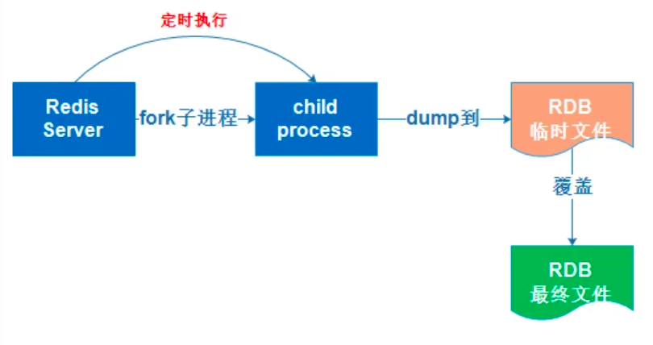

# NoSQL

分类：

- KV键值对
- 文档型数据库（bson） 
  - MongoDB
    - 基于分布式文件存储的数据库，主要处理大量的文档
- 列存储数据库
  - HBase
  - 分布式文件系统
- 图关系数据库


> 放的是关系，例如：朋友圈社交网络，广告推荐


## Redis

​	远程字段服务，是一个开源的使用ANSI C语言编写、支持网络、可基于内存亦可持久化的日志型、Key-Value数据库，并提供多种语言的API。可以用作**数据库、缓存、消息中间件**

>   Redis能干嘛？

1. 内存存储、持久化（rdb【Relational Database】关系型数据库、aof【Append Only File持久化】）

   > Aof：将Redis执行的每次写命令记录到单独的日志文件中（有点像MySQL的binlog）；当Redis重启时再次执行AOF文件中的命令来恢复数据。

2. 效率高，可以用于高速缓存
3. 发布定阅系统
4. 地图信息分析
5. 计时器、计数器

> 特性

1. 多样的数据类型
2. 持久化
3. 集群
4. 事务

   redis的基本命令(不区分大小写，但是元素名和命名区分大小写)

- Redis-server：启动redis服务

- Redis-cli：启动redis客户端 -p:指定端口

- keys *：查找所有的key值

- Ps -ef |grep redis：查找所有的redis进程

> ps：查看进程
>
> -ef：
>
> - -e：显示所有进程
> - -f：全格式

- |：管道命令：指两个命令同时执行
- grep：查找
- dbsize查看当前数据库的数据量
- flushdb：清空当前数据库，flushall：清空全部
- select 0 切换数据库
- exists：是否存在某个key。exists keyName
- move：从某个数据库中移除某个key    move keyName 1:从第一个数据库中移除keyName的数据
- expire：设置数据过期时间。 expire keyName 10:设置keyName数据10秒过期。 常用于单点登录设置过期时间
- ttl：查看当前key的剩余时间。ttl keyName
- type：查看当前key的数据类型   type keyName  

### 基础知识

- 默认有16个数据库，默认使用第一个  索引是第0个
- select 切换数据库 select 7
- 每个数据库可以存储不同的数据

>  redis是单线程的
>
> - 速度很快，基于内存操作，CPU不是redis的瓶颈，redis的瓶颈在于机器的内存和网络带宽

> 为什么单线程还这么快？
>
> - 误区1:高性能的服务器一定是多线程的
> - 误区2:多线程（上下文切换会消耗CPU时间）一定比单线程高
>
> 核心：redis将所有的数据放在内存中，单线程效率就是最高的，对于内存来说，没有多线程的上下文切换效率就是最高的，多次读写都是在一个CPU中执行，在内存环境中，这就是最佳方案

#### Redis的Key操作

```bash
#支持模式匹配key
keys *

#判断key是否存在
exists key 

#查看key是什么类型
type key

#删除指定key
del key

#非阻塞的删除key，仅将key从key space元数据中删除，后续异步删除
unlink key

#给指定key设置过期时间，单位：s
expire key 10

#查看还有多久过期，-1表示永不过期，-2表示已过期
ttl key
```


### 数据类型

#### 五大基础类型

##### String

简介

> ​	String是redis最基本的类型，一个key对应一个value。
>
> ​	String类型是**二进制安全**的，意味着Redis的String可以包含任何数据，比如图片或者序列化的对象。
>
> ​	一个Redis字符串value最多可以是512M。’

- append keyName “xxx”：在key为keyName的字符串后面添加“xxx”。若当前keyName不存在，则相当于set keyName ”xxx“。

- strlen keyname：获取当前字符串的长度

- Incr keyName:当前keyName的值+1。

- decr keyName:当前keyName的值-1。

- Incrby keyName:当前keyName的值增加指定的数量。 incrby views 10

- decrby keyName:当前keyName的值减少指定的数量。 decrby views 10

- 获取指定范围内的字符串：GETRANGE，例如：GETRANGE key 0 3：获取索 引从0到3的字符串

  > 小使用：GETRANGE key 0 -1:获取当前字符串，和get key 效果一样

- 从指定坐标开始替换字符串：SETRANGE k1 1 666：将k1的值从1开始替换为666，后面的字符串保持不变

```bash
127.0.0.1:6379> set k1 abcdefg
OK
127.0.0.1:6379> get k1
"abcdefg"
127.0.0.1:6379> SETRANGE k1 1 666
(integer) 7
127.0.0.1:6379> get k1
"a666efg"
127.0.0.1:6379> 
```

- 设置过期时间的set：setex key time value

- 不存在再设置（分布式锁中常用）:setnx key value

- 批量设置：mset k1 v1 k2 v2

- 批量获取：mget k1 k2

- 不存在时批量设置：msetnx k1 v1 k2 v2

  > 上述语句是一个原子性操作，一旦有某个key存在，则所有的key-value都不会设置成功,要么一起成功，要么一起失败

- 设置一个对象：
  - 如：user 1 {name:zhangsan,age:18}
  - mset user:1:name zhangsan user:1:age 18
  - 上述的key是一个巧妙的设计 user:{id}:{filed}
- 先获取旧值再设置新值：getset

``` bash
127.0.0.1:6379> getset db redis#先获取旧值，没有旧值则返回空
(nil)
127.0.0.1:6379> getset db MongoDB#先获取旧值redis，再设置新值MongoDB
"redis"
127.0.0.1:6379> get db
"MongoDB"
```

> String底层数据类型：
>
> ​	简单动态字符串（SImple Dynamic String），内部结构类似于Java的ArrayList，采用预分配冗余空间的方式来减少内存的频繁分配。
>
> 
>
> 如上图所示，内部为当前字符串实际分配的空间capacity一般要高于实际字符串的长度len，当字符串小于1M时，扩容都是加倍现有的空间，如果超过1M，扩容时一次只会多扩容1M的空间，字符串最大长度为512M。

##### List

在redis中，List可以作为栈、队列、阻塞队列等

所有的List命令都是以l开头的

> 允许有重复的值

- Lrange key start stop:通过区间获取具体的值

- Lpush：在列表头部插入单个或多个值

```bash
127.0.0.1:6379> LPUSH list one two three four#插入四个值，依次插入到列表头部
(integer) 4
127.0.0.1:6379> LRANGE list 0 -1
1) "four"
2) "three"
3) "two"
4) "one"
127.0.0.1:6379> LPUSH list five
(integer) 5
127.0.0.1:6379> LRANGE list 0 -1
1) "five"
2) "four"
3) "three"
4) "two"
5) "one"
```

- Rpush：在列表尾部插入单个或多个值

``` bash
127.0.0.1:6379> RPUSH list right
(integer) 6
127.0.0.1:6379> LRANGE list 0 -1
1) "five"
2) "four"
3) "three"
4) "two"
5) "one"
6) "right"
```

- Lpop：移除最左边的键值对
- Rpop：移除最右边的键值对
- Lindex：获取指定下标的值 
- Lrem：移除list中指定个数的值

``` bash
127.0.0.1:6379> LRANGE list 0 -1
1) "four"
2) "three"
3) "two"
4) "one"
5) "right"
6) "right"
7) "right"
127.0.0.1:6379> LREM list 3 right#移除list集合中指定个数的value，精确匹配
(integer) 3
127.0.0.1:6379> LRANGE list 0 -1
1) "four"
2) "three"
3) "two"
4) "one"
```

- Ltrim：截取List中指定索引区间

``` bash
127.0.0.1:6379> LRANGE list 0 -1
1) "four"
2) "three"
3) "two"
4) "one"
127.0.0.1:6379> LTRIM list 1 3#通过下标截取元素，list被改变
OK
127.0.0.1:6379> LRANGE list 0 -1
1) "three"
2) "two"
3) "one"
```

- 将某List的末尾元素移除并将该元素添加到另一个list的头部:RPOPLPUSH list otherlist

```bash
127.0.0.1:6379> LRANGE list 0 -1
1) "three"
2) "two"
3) "one"
127.0.0.1:6379> RPOPLPUSH list otherlist#将list的末尾元素移除并将该元素添加到otherlist的头部,若otherlist不存在则创建otherlist
"one"
127.0.0.1:6379> LRANGE otherlist 0 -1
1) "one"
127.0.0.1:6379> LRANGE list 0 -1
1) "three"
2) "two"
```

- 替换指定key的value，更新操作：lset

``` bash
127.0.0.1:6379> LRANGE list 0 -1
(empty array)
127.0.0.1:6379> LSET list 0 v1
(error) ERR no such key#list中为空，没有该索引下标，替换失败出现异常
127.0.0.1:6379> LPUSH list v1 v2#添加v1 v2 到list中
(integer) 2
127.0.0.1:6379> LSET list 0 value1
OK
127.0.0.1:6379> LRANGE list 0 -1#替换之后的结果
1) "value1"
2) "v1"
```

- 在指定value之前或之后插入元素:linsert

````bash
127.0.0.1:6379> LRANGE list 0 -1
1) "v5"
2) "v4"
3) "v3"
4) "v2"
5) "v1"
127.0.0.1:6379> LINSERT list before v5 insert
(integer) 6
127.0.0.1:6379> LRANGE list 0 -1
1) "insert"
2) "v5"
3) "v4"
4) "v3"
5) "v2"
6) "v1"
127.0.0.1:6379> LINSERT list after v5 afterinsert
(integer) 7
127.0.0.1:6379> LRANGE list 0 -1
1) "insert"
2) "v5"
3) "afterinsert"
4) "v4"
5) "v3"
6) "v2"
7) "v1"
````

> 小结：
>
> - 实际上是一个链表，before node after，left right都可以插入值
> - 若key不存在（即该列表不存在）就创建新的列表
> - 若key存在，则新增值value
> - 若移除了所有value，空链表，也代表不存在
> - 在两边插入或者改动值，效率最高，中间相对来说效率低一点
> - 可以做消息队列（Lpush Rpop），栈（Lpush Lpop）

###### List的数据结构

> ziplist	
>
> ​	在列表元素较少的情况下会使用一块连续的内存存储，结构是ziplist，即压缩列表。它讲所有的元素紧挨着一起存储，分配的是一块连续的内存。数据量较多时会变为quicklist。
>
> quicklist
>
> ​	
>
> ​	Redis将链表和ziplist结合起来组成了quicklist。即将多个ziplist使用双向链表连接起来使用，这样既满足了快速插入删除性能，又不会出现太大的空间冗余。

##### Set

​	值不可重复，无序，命令都是以S开头。

​	Redis中的Set是string类型的无序集合，底层是一个Value为null的hash表，因此，添加、删除和查找的时间复杂度都是O(1)。

###### 基本命令

- 添加：sadd
- 查看所有set元素：smember
- 判断某个值是否在集合中：sismenber

``` bash
SADD set hello world yang#添加 三个元素
(integer) 3
127.0.0.1:6379> SMEMBERS set #查看所有元素
1) "yang"
2) "world"
3) "hello"
127.0.0.1:6379> SISMEMBER set yang#判断某个值是否在集合中
(integer) 1  
```

- 获取集合中元素的个数：SCARD

``` bash
127.0.0.1:6379> SCARD set
(integer) 3
```

- 移除集合中某个元素：srem

```bash
127.0.0.1:6379> SCARD set#集合中原本有三个元素
(integer) 3
127.0.0.1:6379> SREM set hello#移除元素hello
(integer) 1
127.0.0.1:6379> SMEMBERS set#移除后的结果
1) "yang"
2) "world"
```

- 随机抽取元素中的个数:SRANDMEMBER

``` bash
127.0.0.1:6379> SRANDMEMBER set 2#随机从set中抽取两个个元素
1) "world"
2) "qiang"
127.0.0.1:6379> SRANDMEMBER set 1#随机从set中抽取一个元素
1) "qiang"
```

- 删除随机的key:SPOP，因为无序，所以pop一个出去就是随机删除 

```bash
127.0.0.1:6379> SPOP set#随机移除一个key
"fang"
127.0.0.1:6379> SPOP set 2
1) "qiang"
2) "ning"
127.0.0.1:6379> SMEMBERS set
1) "world"
2) "liang"
3) "yang"
4) "guo"
```

- 移动指定的元素到另一个集合中:smove

``` bash
127.0.0.1:6379> SMEMBERS set
1) "world"
2) "liang"
3) "yang"
4) "guo"
127.0.0.1:6379> SMOVE set newSet world
(integer) 1
127.0.0.1:6379> SMEMBERS newSet
1) "world"
127.0.0.1:6379> SMEMBERS set
1) "liang"
2) "yang"
3) "guo"
```

- 并集:sunion

```bash
#在两个集合中添加数据
127.0.0.1:6379> SADD set a b c d
(integer) 4
127.0.0.1:6379> SADD otherset c d e f g
(integer) 5
127.0.0.1:6379> SUNION set otherset
 1) "b"
 2) "liang"
 3) "yang"
 4) "guo"
 5) "c"
 6) "a"
 7) "e"
 8) "g"
 9) "f"
10) "d"
```

- 交集（B站、微博的共同关注）:sinter

```bash
127.0.0.1:6379> SINTER set otherset#取两个集合的交集
1) "d"
2) "c"
```


- 差集：sdiff

```bash

127.0.0.1:6379> SDIFF set otherset#取两个集合的差集
1) "liang"
2) "b"
3) "a"
4) "yang"
5) "guo"
```

##### Hash

Map:是key-value，redis中的Hash则是key-map，即一个key可以存一个map，map里又可以存多个key-value，本质和String没有区别，只是value换成了多个键值对映射

- 设置一个hash：HSET hashname field1 value1...
- 获取一个指定hash中的key的value：HGET hash field
- 批量获取hash中指定多个key的value：HMGET hash field1 field2
- 获取hash中所有key的value：HGETALL hash

```bash
127.0.0.1:6379> HSET hash1 1 v1 2 v2 3 v3#设置一个hash，vlaue内有三个键值对映射
(integer) 3
127.0.0.1:6379> HGET hash1 1 #获取hash中一个指定的key的value
"v1"
127.0.0.1:6379> HMGET hash1 1 2 3#批量获取hash中的key的value
1) "v1"
2) "v2"
3) "v3"
127.0.0.1:6379> HGETALL hash1#获取hash中所有的字段值，包括key和value
1) "1"
2) "v1"
3) "2"
4) "v2"
5) "3"
6) "v3"
```

- 指定key删除hash中的键值对映射：HDEL hash1 1

``` bash
127.0.0.1:6379> HDEL hash1 1
(integer) 1
127.0.0.1:6379> HGETALL hash1
1) "2"
2) "v2"
3) "3"
4) "v3"
```

- 查看hash的长度（一个键值对长度为1）

```bash
127.0.0.1:6379> HGETALL hash1
1) "2"
2) "v2"
3) "3"
4) "v3"
127.0.0.1:6379> HLEN hash1#查看hash的长度
(integer) 2
```

- 判断hash中是否存在指定key：Hsetnx,若不存在则创建，存在则返回0

```bash
127.0.0.1:6379> HSETNX hash1 4 v4 #不存在，创建
(integer) 1
127.0.0.1:6379> HGETALL hash1
1) "2"
2) "v2"
3) "3"
4) "v3"
5) "1"
6) "2"
7) "4"
8) "v4"
127.0.0.1:6379> HSETNX hash1 1 2#存在，返回0
(integer) 0
```

- 指定hash中指定key增加指定的增量（指定的增量可以为负）：Hincrby key field increment（若增加的value不是integer，则报错，若key不存在，则创建key，value为指定的增量）

``` bash
127.0.0.1:6379> HINCRBY hash1 1 2
(integer) 2
127.0.0.1:6379> HGETALL hash1
1) "2"
2) "v2"
3) "3"
4) "v3"
5) "1"
6) "2"
127.0.0.1:6379> HINCRBY hash1 2 2
(error) ERR hash value is not an integer
```

hash可以用来存储经常变更的对象信息，如：user对象的name，age

```bash
127.0.0.1:6379> HSET user:1 name zhangsan age 18
(integer) 2
127.0.0.1:6379> HSET user:2 name lisi age 90
(integer) 2
127.0.0.1:6379> HGETALL user:1
1) "name"
2) "zhangsan"
3) "age"
4) "18"
```

##### Zset(有序集合)

> Zset是Redis提供的一个非常特别的数据结构，一方面等价于Java的数据结构Map<String,Double>，可以给每一个元素value赋值一个权重score，另一方面又类似于TreeSet，内部的元素会按照权重score进行排序，可以得到每个元素的名次，还可以通过score的范围来获取元素。
>
> zset底层使用了两个数据结构：
>
> 1. hash，hash的作用就是关联元素value和权重score，保障元素value的唯一性，可以通过元素value找到对应的score。
> 2. 跳跃表，跳跃表的目的在于给元素value排序，根据score的范围获取元素。

- 添加：zadd

```bash
127.0.0.1:6379> ZADD zset 1 one#添加单个
(integer) 1
127.0.0.1:6379> ZADD zset 2 two
(integer) 1
127.0.0.1:6379> ZADD zset 3 three
(integer) 1
127.0.0.1:6379> ZRANGE zset 0 -1
1) "one"
2) "two"
3) "three"
127.0.0.1:6379> ZADD zset 4 four 5 five #添加多个
(integer) 2
127.0.0.1:6379> ZRANGE zset 0 -1 #范围查询
1) "one"
2) "two"
3) "three"
4) "four"
5) "five"
```

- 排序

```bash
127.0.0.1:6379> ZRANGE salary 0 -1	#范围查询
1) "yang"
2) "he"
3) "xiao"
127.0.0.1:6379> ZRANGEBYSCORE salary -inf +inf #从负无穷到正无穷排序
1) "yang"
2) "he"
3) "xiao"
127.0.0.1:6379> ZREVRANGE salary 0 -1 #降序排列
1) "xiao"
2) "he"
3) "yang"
127.0.0.1:6379> ZREVRANGE salary 0 -1 #withscores降序排列并带上score
1) "xiao"
2) "9800"
3) "he"
4) "9800"
5) "yang"
6) "2599"
127.0.0.1:6379> ZRANGEBYSCORE salary -inf +inf withscores#从负无穷到正无穷排序并带上分数
1) "yang"
2) "2599"
3) "he"
4) "6000"
5) "xiao"
6) "9800"
```

- 移除指定key的元素:zrem key member
- 获取有序集合中的个数：zcard

```bash
127.0.0.1:6379> ZREM salary he
(integer) 1
127.0.0.1:6379> ZRANGE salary 0 -1
1) "yang"
2) "xiao"
127.0.0.1:6379> ZCARD salary
(integer) 2
```

- 获取指定区间的元素个数

```bash
127.0.0.1:6379> ZCOUNT salary 0 10000
(integer) 3
```

#### 三种特殊数据类型

##### geospatial（地理位置）

朋友定位？附近的人？打车距离计算？

可以推算地理位置的信息，两地之间的距离，方圆几里的人。

http://www.jsons.cn/lngcode/可查经纬度信息

只有六个命令：


- 添加：GEOADD key longitude(经度) latitude（纬度） member

```bash
127.0.0.1:6379> GEOADD city 110.10092 20.91428 leizhou #添加地理信息
(integer) 1
127.0.0.1:6379> GEOADD city 110.77703 21.44584 wuchuan 110.39822 21.19181 xiashan
(integer) 2
```

- 查询：GEOPOS,可查多个

```bash
127.0.0.1:6379> GEOPOS city leizhou
1) 1) "110.10092228651046753"
   2) "20.91427958072075199"
```

- 计算两个坐标之间的距离：GEODIST key member1 member2 [m|km|ft|mi]
  - 单位
    - ft：英尺
    - mi：英里

```bash
127.0.0.1:6379> GEODIST city leizhou wuchuan km
"91.7199"
```

- 查找指定坐标的指定半径之内所有元素：GEORADIUS key longitude latitude radius m|km|ft|mi [WITHCOORD] [WITHDIST] [WITHHASH] [COUNT count] [ASC|DESC] [STORE key] [STOREDIST key]

```bash
127.0.0.1:6379> GEORADIUS city 110.39822 21.19181 100 km#查询给定坐标100公里以内的City内的元素
1) "leizhou"
2) "xiashan"
3) "wuchuan"
127.0.0.1:6379> GEORADIUS city 110.39822 21.19181 100 km withdist  count 2 desc#查询给定坐标100公里以内的City内的元素并给出元素到中点的距离，并且限定元素数量为2
1) 1) "wuchuan"
   2) "48.3628"
2) 1) "leizhou"
   2) "43.6488"
```

> 属性：
>
> - withcoord：显示元素的定位信息（经纬度）
> - Withdist:显示到坐标的距离，单位和给定的范围单位一致
> - WITHHASH：返回十一位字符的哈希值
> - count：限定数量
> - ASC|DESC：升序：从近到远|降序：从远到近

- 查找地理信息集合中存在的元素指定半径内的其他元素，也可以查出本身:GEORADIUSBYMEMBER

```bash
127.0.0.1:6379> GEORADIUSBYMEMBER city leizhou 98 km withdist count 2
1) 1) "leizhou"
   2) "0.0000"
2) 1) "xiashan"
   2) "43.6485"
```

> GEO的底层就是Zset，可以用Zset的命令来操作GEO
>
> ```bash
> 127.0.0.1:6379> ZRANGE city 0 -1
> 1) "leizhou"
> 2) "xiashan"
> 3) "wuchuan"
> ```
>
> zset所有操作都可以对geo使用

##### hyperloglog

> 基数：集合中不重复元素的个数

Redis hyperloglog 基数统计的算法

有点：占用的内存是固定的，2^64不同元素的计数，只需要12KB内存

0.81%的错误率  

```bash
127.0.0.1:6379> PFADD key1 a b c d e f g h i j#创建第一组元素key1
(integer) 1
127.0.0.1:6379> PFCOUNT key1#统计创建的key1中元素的基数数量
(integer) 10
127.0.0.1:6379> PFCOUNT key1 key2#创建第二组key2
(integer) 10
127.0.0.1:6379> PFADD key2 i j e k l m n o p q r s t u  v  w  x y z 
(integer) 1
127.0.0.1:6379> PFCOUNT key2
(integer) 19
127.0.0.1:6379> PFMERGE key3 key1 key2#将key1和key2合并到key3
OK
127.0.0.1:6379> pfcount key3#统计合并后的基数
(integer) 25
127.0.0.1:6379> PFCOUNT key1 key2#统计多个集合中基数的数量，和上一条命令相比，可以更加灵活
(integer) 25
```


##### bitmaps

> 位存储

位图：统计用户信息：活跃、不活跃，登陆、未登陆，打卡、位打卡，两个状态非黑即白的可以使用Bitmaps

bitmaps：数据结构，操作二进制来记录，类似boolean

例如：保存打卡信息：

```bash
#保存一周的打卡信息
127.0.0.1:6379> SETBIT sign 0 1
(integer) 0
127.0.0.1:6379> SETBIT sign 1 1
(integer) 0
127.0.0.1:6379> SETBIT sign 2 0
(integer) 0
127.0.0.1:6379> SETBIT sign 3 0
(integer) 0
127.0.0.1:6379> SETBIT sign 4 1
(integer) 0
127.0.0.1:6379> SETBIT sign 5 2#设置了2，超出0和1的范围
(error) ERR bit is not an integer or out of range
127.0.0.1:6379> SETBIT sign 5 1
(integer) 0
127.0.0.1:6379> SETBIT sign 6 1
(integer) 0
127.0.0.1:6379> GETBIT sign 3#查看某一天是否打卡
(integer) 0#没有打卡
127.0.0.1:6379> BITCOUNT sign #统计全部的打卡天数
(integer) 5
127.0.0.1:6379> bitcount sign 0 10#指定范围统计打卡天数
(integer) 5

```

### Redis配置文件

1. ##### 单位

```bash
# Note on units: when memory size is needed, it is possible to specify
# it in the usual form of 1k 5GB 4M and so forth:
#
# 1k => 1000 bytes 
# 1kb => 1024 bytes
# 1m => 1000000 bytes
# 1mb => 1024*1024 bytes
# 1g => 1000000000 bytes
# 1gb => 1024*1024*1024 bytes
#
# units are case insensitive so 1GB 1Gb 1gB are all the same.
```

2. ##### 包含

```bash
################################## INCLUDES ###################################

# Include one or more other config files here.  This is useful if you
# have a standard template that goes to all Redis servers but also need
# to customize a few per-server settings.  Include files can include
# other files, so use this wisely.
#
# Notice option "include" won't be rewritten by command "CONFIG REWRITE"
# from admin or Redis Sentinel. Since Redis always uses the last processed
# line as value of a configuration directive, you'd better put includes
# at the beginning of this file to avoid overwriting config change at runtime.
#
# If instead you are interested in using includes to override configuration
# options, it is better to use include as the last line.
#
# include .\path\to\local.conf
# include c:\path\to\other.conf
```

3. ##### 网络

```bash
# By default, if no "bind" configuration directive is specified, Redis listens
# for connections from all the network interfaces available on the server.
# It is possible to listen to just one or multiple selected interfaces using
# the "bind" configuration directive, followed by one or more IP addresses.
#
# Examples:
#
# bind 192.168.1.100 10.0.0.1
# bind 127.0.0.1 ::1
#
# ~~~ WARNING ~~~ If the computer running Redis is directly exposed to the
# internet, binding to all the interfaces is dangerous and will expose the
# instance to everybody on the internet. So by default we uncomment the
# following bind directive, that will force Redis to listen only into
# the IPv4 loopback interface address (this means Redis will be able to
# accept connections only from clients running into the same computer it
# is running).
#
# IF YOU ARE SURE YOU WANT YOUR INSTANCE TO LISTEN TO ALL THE INTERFACES
# JUST COMMENT THE FOLLOWING LINE
#指定ip才可访问Redis实例.可指定多个
bind 127.0.0.1

# ~~~~~~~~~~~~~~~~~~~~~~~~~~~~~~~~~~~~~~~~~~~~~~~~~~~~~~~~~~~~~~~~~~~~~~~~

# Protected mode is a layer of security protection, in order to avoid that
# Redis instances left open on the internet are accessed and exploited.
#
# When protected mode is on and if:
#
# 1) The server is not binding explicitly to a set of addresses using the
#    "bind" directive.
# 2) No password is configured.
#
# The server only accepts connections from clients connecting from the
# IPv4 and IPv6 loopback addresses 127.0.0.1 and ::1, and from Unix domain
# sockets.
#
# By default protected mode is enabled. You should disable it only if
# you are sure you want clients from other hosts to connect to Redis
# even if no authentication is configured, nor a specific set of interfaces
# are explicitly listed using the "bind" directive.
#保护模式
#保护模式开启时，若没有bind指定ip或者没有设置密码，那么只能本地回环访问（localhost）
protected-mode yes

# ~~~~~~~~~~~~~~~~~~~~~~~~~~~~~~~~~~~~~~~~~~~~~~~~~~~~~~~~~~~~~~~~~~~~~~~~

# Accept connections on the specified port, default is 6379 (IANA #815344).
# If port 0 is specified Redis will not listen on a TCP socket.
#指定端口，默认是6370，若端口为0，则Redis不监听TCP连接
port 6379

# ~~~~~~~~~~~~~~~~~~~~~~~~~~~~~~~~~~~~~~~~~~~~~~~~~~~~~~~~~~~~~~~~~~~~~~~

# TCP listen() backlog.
#
# In high requests-per-second environments you need an high backlog in order
# to avoid slow clients connections issues. Note that the Linux kernel
# will silently truncate it to the value of /proc/sys/net/core/somaxconn so
# make sure to raise both the value of somaxconn and tcp_max_syn_backlog
# in order to get the desired effect.

#设置tcp的backlog，backlog是一个连接队列，队列总和=未完成三次握手队列+已完成三次握手队列。
#在高并发环境下需要配置一个高backlog值来避免慢客户端的问题。
#注意Linux内核会将这个值减小到/proc/sys/net/core/somaxconn的值（128），所以需要确认增大/proc/sys/net/core/somaxconn和/proc/sys/net/ipv4/tcp_max_syn_backlog(128)来达到想要的效果
tcp-backlog 511

# ~~~~~~~~~~~~~~~~~~~~~~~~~~~~~~~~~~~~~~~~~~~~~~~~~~~~~~~~~~~~~~~~~~~~~~~

# Close the connection after a client is idle for N seconds (0 to disable)
#超时时间，经过多少秒之后关闭连接，0即永不超时
timeout 0

# ~~~~~~~~~~~~~~~~~~~~~~~~~~~~~~~~~~~~~~~~~~~~~~~~~~~~~~~~~~~~~~~~~~~~~~~

# TCP keepalive.
#
# If non-zero, use SO_KEEPALIVE to send TCP ACKs to clients in absence
# of communication. This is useful for two reasons:
#
# 1) Detect dead peers.
# 2) Take the connection alive from the point of view of network
#    equipment in the middle.
#
# On Linux, the specified value (in seconds) is the period used to send ACKs.
# Note that to close the connection the double of the time is needed.
# On other kernels the period depends on the kernel configuration.
#
# A reasonable value for this option is 300 seconds, which is the new
# Redis default starting with Redis 3.2.1.
tcp-keepalive 300

```


### 事务

- **Redis单条命令保证原子性，但是Redis事务不保证原子性**
- Redis事务没有隔离级别的概念，所有的命令在事务中，没有直接被执行，只有发起执行命令的时候才会执行事务。**Exec**
- 一次性、顺序性、排他性，执行一些列的命令

> Redis事务本质：一组命令的集合，一个事务中所有的命令都会被序列化，在事务执行过程中，会按照顺序执行。

事务流程：

1. 开启事务（MULTI ）
2. 命令入队（）
3. 执行事务（）

```bash
#正常执行事务
127.0.0.1:6379> MULTI#开启事务
OK
127.0.0.1:6379> set k1 v2 #命令入队
QUEUED
127.0.0.1:6379> set k2 v2
QUEUED
127.0.0.1:6379> GET k1
QUEUED
127.0.0.1:6379> set k1 v3#覆盖k1
QUEUED
127.0.0.1:6379> EXEC#执行事务
1) OK
2) OK
3) "v2"
4) OK
127.0.0.1:6379> get k1#redis中事务是顺序执行
"v3"
```

- 主动取消事务：discard

```bash
#主动取消事务
127.0.0.1:6379> MULTI
OK
127.0.0.1:6379> set k1 v1
QUEUED
127.0.0.1:6379> set k4 v4
QUEUED
127.0.0.1:6379> DISCARD
OK
127.0.0.1:6379> get k4#事务被取消，k4为空，以上所有命令都不会被执行
(nil)
```

- 出现错误

  - 编译型异常：命令错误，事务中所有命令都不会被执行

     ```bash
    127.0.0.1:6379> MULTI
    OK
    127.0.0.1:6379> set k1 v1
    QUEUED
    127.0.0.1:6379> set k2 v2 
    QUEUED
    127.0.0.1:6379> GETSET k1#命令使用错误
    (error) ERR wrong number of arguments for 'getset' command
    127.0.0.1:6379> set k3 v3 
    QUEUED
    127.0.0.1:6379> EXEC
    (error) EXECABORT Transaction discarded because of previous errors.#整个事务都不会执行
    127.0.0.1:6379> keys *
    (empty array)
    ```

  - 运行时异常（1/0）：如果事务中存在语法性错误，那么执行命令的时候，其他命令是可以正常执行的，错误命令会抛出异常（因此Redis整个事务中不能保证原子性）

    ```bash
    127.0.0.1:6379> MULTI
    OK
    127.0.0.1:6379> INCR k1
    QUEUED
    127.0.0.1:6379> set k2 v2
    QUEUED
    127.0.0.1:6379> set k3 v3
    QUEUED
    127.0.0.1:6379> EXEC
    1) (error) ERR value is not an integer or out of range#第一条命令执行失败，但是不影响其他命令的执行
    2) OK
    3) OK
    ```

- Redis实现乐观锁
  - 悲观锁：很悲观，认为什么时候操作数据都会被别人或程序修改，因此每次操作之前都会上锁。
  - 乐观锁：认为什么时候操作数据都不会出问题，所以不会上锁，一般是更新数据的时候判断一下在修改过程中有没有人或程序修改过这个数据
    1. 获取version
    2. 更新的时候比较version

> Redis监视测试

```bash
#正常执行成功，没有上锁
127.0.0.1:6379> set money 1000
OK
127.0.0.1:6379> set out 0
OK
127.0.0.1:6379> WATCH money#监视money对象
OK
127.0.0.1:6379> MULTI
OK
127.0.0.1:6379> DECRBY money 100
QUEUED
127.0.0.1:6379> INCRBY out 100
QUEUED
127.0.0.1:6379> EXEC#事务正常执行成功
1) (integer) 900
2) (integer) 100
```


### Redis的持久化方式

redis运行时数据都是放在内存中，若没有持久化，一旦断电则数据就会丢失。redis的持久化配置有两种：RDB（将redis在内存中的数据库记录定时dump到磁盘）和AOF（将redis的操作日志以追加的方式写入文件）

#### RDB

指在指定的时间间隔内将内存中的数据集快照写入磁盘，实际操作就是fork一个子进程，先将数据集写入临时文件，成功后，再替换之前的文件，用二进制压缩。



#### AOF

以日志的形式记录服务器处理的每一个写、删操作，查询不会被记录，以文本的形式记录，打开文件可以看见详细的操作记录。

#### 二者优劣

RDB优势：

1. RDB整个redis数据库只有一个文件，对于文件备份很有优势，一旦发生灾难性故障，可以非常容易的恢复，因为一个单独的文件压缩之后可以很容易的转移到别的存储介质上。
2. 性能最大化。对于redis的服务而言，在开始持久化时，只需要fork一个子进程，然后就交给子进程完成持久化的工作，这样可以极大的避免服务进程执行IO操作了。
3. 相比于AOF，如果数据集很大，RDB的启动效率更高。

RDB劣势：

1. 若想保证数据的高可用，即最大程度的避免数据丢失，那么RDB就不是一个很好的选择，因为系统一旦在持久化之前宕机，那么没来得及写入磁盘的数据都会丢失。
2. 由于RDB是通过fork子进程来协助完成持久化的，若数据集较大时，可能是导致整个服务器停止服务几百毫秒，甚至一秒钟。

AOF的优势：

1. 可以带来更高的数据安全性，即数据持久性。reids中提供了三种同步策略，即**每秒同步**、**每修改同步**、**不同步**。实际上，每秒同步也是异步完成的，其效率也很高，若系统出现宕机现象，丢失的就是这一秒钟之内修改的数据。而每修改同步，可以被视为同步持久化，即每次一旦发生变化就立即记录到磁盘中，这种同步策略效率是最低的。
2. 因为AOF是对日志文件的写入操作采用的是append模式（追加），因此在写入过程中即使出现了宕机现象，也不会破坏日志文件中已经存在的内容，若是本次操作中只写入了一半数据就宕机，下一次redis启动前，redis-check-aof工具可以解决数据一致性问题。
3. 若日志过大，Redis可以自动启用rewrite机制。即Redis以append模式不断的将修改数据写入到老的磁盘文件中，同时还会创建一个新的文件用于记录此期间有哪些命令被执行。因此在进行rewrite切换时可以更好的保证数据安全性。
4. AOF包含一个格式清晰、易于理解的日志文件用于记录所有的修改操作，也可以用该文件完成数据的重建。

AOF的劣势：

1. 对于相同的数据量而言，AOF文件通常要大于RDB文件。RDB在恢复大数据集时的速度比AOF的恢复速度更快。
2. 根据同步策略的不同，AOF在运行效率上往往会慢于RDB。但每秒同步的效率还是比较高的，不同步则和RDB的效率一样高。

**二者选择的标准**：AOF牺牲一点系统的性能来换取更高的数据一致性，RDB写操作时不同步来提高性能，当时间间隔或手动保存时再做备份，不过一般都是二者结合使用。

#### 常用配置

RDB持久化配置：

Redis会将数据集的快照dump到dump.rdb文件中，也可以通过修改Redis配置文件来设置dump快照的频率。

``` bash
#save <seconds> <changes>
save 900 1	#在900秒之后，如果至少有一个key发生变化，则dump内存快照
save 300 10	#在300秒后，如果至少有10个key发生变化，则dump内存快照
save 60 10000	#在60秒后，如果至少有10000个 key发生变化，则dump内存快照
```

AOF持久化配置：

在Redis的配置文件中存在三种同步方式：**每秒同步**、**每修改同步**、**不同步**，配置如下：

```bash
appendfsync always		#每次有数据修改发生时都会写入AOF文件
appendfsync everysec	#每秒钟同步一次，该策略为AOF的缺省配置
appendfsync no				#从不同步，高效但是数据不会被持久化
```

### Redis发布订阅

#### 什么是发布订阅？

Redis发布订阅（pub/sub）是一种消息通信模式，发送者发送消息，订阅者接收消息。

Redis客户端可以订阅任意数量的频道。

```bash
#客户端A订阅频道channel
subscribe channel
```


```bash
#客户端B在频道channel发布信息hello
publish channel "hello"
```


客户端A接收到channel的消息


### redis主从复制

### Redis缓存穿透和雪崩