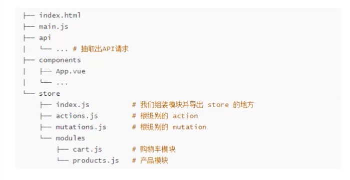
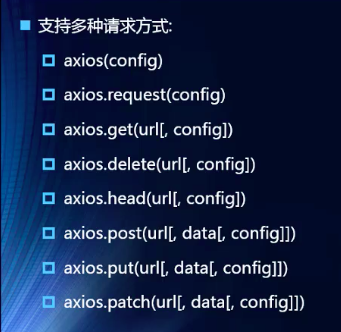

# Vue.js

## Vue实例属性

### el挂载点

选择一个页面元素让vue管理起来，可以通过类选择器、id选择器、元素选择器来指定要管理的元素。

任意元素（除了html标签和body标签）都可以被指定，但是只能指定双标签元素，单标签内部无法嵌套元素，但是由于别的标签可能具有样式，所以推荐将VUE挂载到div元素上。

### data数据对象

可以定义常见的js数据类型：

- 数字
- 字符串
- 对象
- 数组

> 可以使用差值表达式{{ message }}来使用数据对象中的数据

### 生命周期

​	创建Vue对象之后会做一系列操作，主要使用的就是生命周期的回调函数，回调函数也是作为Vue实例属性定义的。

- beforecreate

- created
- beforeMount
- mounted 
- beforeUpdate
- updated
- activated
- deactivated
- beforeDestory
- destroy
- errorCaptured


### 计算属性-computed

​	用于对数据进行处理，定义形式是键值对形式的函数，使用时无需写函数后面的括号

```javascript
var app = new Vue({
  el:"#app",
  data:{
    firstName:'rongbing',
    lastName:'yang'
	},
  computed:{
    fullName:function(){
      return this.firstName+this.lastname;
    }
  }
})
```

```html
<h1>{{fullName}}</h1>
```

计算属性本质上有两个函数get和set，一般set都省略，所以只写一个函数默认是get，以下为完整写法：

```javascript
var app = new Vue({
  el:"#app",
  data:{
    firstName:'rongbing',
    lastName:'yang'
	},
  computed:{
    fullName:{
      get:function(){
        //get
      },
      set:function(){
        //set
      }
    }
  }
})
```


### Vue简单指令

- 内容绑定、事件绑定

  - v-text：作为标签的属性，设置标签的内容，默认写法将这个标签全部替换为指定数据对象内的内容，使用差值表达可以替换指定的内容。
  - v-html：类似于JS的innerHTML，单纯的文本使用起来没有差别，若是有html的结构，则会渲染出来。
  - v-on：
    - 为元素绑定事件
    - 事件名不需要写on
    - 指令可以简写为@
    - 绑定的方法定义在methods属性中
    - 方法内部可以通过this关键字访问定义在data中的数据

- 显示切换

  - v-show：

    - 根据表达值的真假，切换元素的显示或隐藏
    - 原理是**修改元素的display**；实现显示隐藏（操作样式）
    - 指令之后的内容最终会被解析为布尔值
    - 数据改变之后，对应元素的显示状态会同步更新

  - v-if：

    - 根据表达值的真假，切换元素的显示和隐藏状态（操作dom元素）

  - v-bind:

    - 为元素绑定指令

    - 可以简写为 :属性

    - 可以使用三元表达式和对象的方式动态的增删class属性，建议使用对象的方式

      ```html
              
              
      ```

      

- 列表循环、表单元素绑定

  - v-for
    - 根据数据生成列表结构
    - 经常和数组一起使用
    - 语法是(item, index) in 数据
    - item和index可以结合其他指令一起使用
    - 数组长度的更新会同步到页面上，即响应式数据绑定
    - 使用时尽量绑定一个key，在数组插入新值时效率较高。
  - v-on补充：
    - 事件后跟上.修饰符可以对事件进行限制
    - .enter可以限制出发的按键为回车
  - v-model：
    - 便捷的设置和获取表单元素的值
    - 绑定的数据会和表单元素的值
    - 绑定的数据<---->表单元素的值
    - 修饰符
      - v-model.lazy：延迟表单元素数据绑定
      - v-model.number:将表单元素中的数据转换为数字（表单元素默认是string）
      - V-model.trim:去除首尾空格

数组的什么方法会响应式更新？

> - push（...object[])：从末尾添加元素
> - pop：从末尾删除一个元素
> - shift：删除第一个元素
> - unshift（...object[])：在数组开头添加元素
> - splice()


### 网络应用

#### axios

- 导包

```html
<script src="https://unpkg.com/axios/dist/axios.min.js"></script>
```

- get请求

```javascript
axios.get(url?param1=value1&...).then(function(response){},function(err){})
```

- post请求

```javascript
axios.get(url,{key:value,key2:value2}).then(function(response){},function(err){})
```

> 两个测试接口：
>
> - 随机笑话接口： **GET** https://autumnfish.cn/api/joke/li
>   - 参数num：获取笑话条数
> - 用户注册接口：**POST** https://autumnfish.cn/api/user/reg
>   - 参数username：用户名

> 官网：https://github.com/axios/axios

要点：

- axios回调函数中this已经改变，无法访问到data中数据（this指向它的调用者）
- 把this赋值给其他对象起来，回调函数中用其他对象即可


#### 组件开发基础

vue组件就是一个个vue实例，使用component函数来创建一个组件。

```javascript
//第一个参数是组件名称，第二个就是以对象的形式描述一个vue实例组件
Vue.component('name',{
  props: ['title']
  data:function(){
    return{
      count:0
    }
  },
  template:'<div><button @click="clickfun"> you click me {{ count }}times </button><slot></slot></div>',
    methods:{
      clickfun:function(){
        this.count++;
        //使用$emit(functionName,param)可以在函数体中调用另一个函数
        this.$emit('clicknow',this.count);
      }
    }
})
```

组件中的data必须是函数形式

主页面中组件的调用使用html标签的形式，标签名称就是组件名称

```html
<name></name>
```

> 组件中的template只渲染一个标签（根结点），因此若组件模板内有多个标签，必须使用div作为根结点包裹才会完整渲染

- 可以使用props选项给组件添加属性
- $emit(functionName,param)可以将组件的函数传递给组件的调用者，可以触发传入名称的函数，在入口主页面组件标签中调用该函数，主页面Vue实例中声明该函数
- 在组件模板中插入slot插槽标签，即可在主页面中组件标签内部插入任意html标签

#### 组件局部注册

在Vue根实例中，在components属性中以对象形式注册组件即为局部注册。

```javascript
var app = new Vue({
  el: "#app",
  components:{
    test : {
      template:'<h1>hello</h1>'
    }
  }
})
```

- 注册后的组件具有父子关系

> 为了避免组件之间数据的冲突，所以组件的data必须是函数返回一个新的数据对象

#### 父子组件之间的通信

- 通过自定义组件属性props向子组件传递数据

  - 子组件定义了props之后，父组件在子组件标签内通过属性形式用v-bind形式将数据绑定上去，子组件即可使用该数据。

    ```html
    <body>
      <div id="app">
        <cpn :cmoive="moive"></cpn>
      </div>
      <template id="cpn-t">
        <div>
          <ul><li v-for="item in cmoive">{{item}}</li></ul>
        </div>
      </template>
    </body>
    ```

    ```javascript
    const Feature = Vue.component('cpn',{
      template: "#cpn-t",
      data() {
        return {
        };
      },
      props:["cmoive","cmessage"]//数组形式的属性
    });
    
    var app = new Vue({
      el:"#app",
      component:{
        Feature
      },
      data:{
        moive:["海王","海贼王","海尔兄弟"]
      }
    })
    ```

  - props支持的类型：

    - String
    - Number
    - Boolean
    - Array
    - Object
    - Date
    - Function
    - Symbol

    ```javascript
    //用对象形式定义props
    props:{
      message:{
        	type:String,//类型限制
          default:'default'//默认值
        	required:true//是否必须传值
      }
    }
    ```

    

- 通过自定义事件$emit向父组件发送消息

  - 子组件触发函数之后调用this.$emit('evenName',param)发射一个函数，父组件中在子组件标签内用v-on来监听子组件发送的evenName这个函数即可接收子组件的传值。

- 可以使用watch来监听data的改变，函数形式，与data中的值一一绑定（名称一致），形式如下：

```javascript
data(){
  return {
    number:this.number
  },
  watch:{
    number(newValue,oldValue){
      console.log(newValue+oldValue);
      //监听值的改变触发函数事件
    }
  }
}
```

#### 父子组件的访问方式

- $children或$refs
  - 是一个对象数组，可以访问到当前vue实例注册的子组件
  - 使用refs获取子组件，子组件标签内必须有ref属性，当前实例的refs数组内才会有子组件对象
- $parent
  - 访问父组件
- $root
  - 直接访问根组件

#### 插槽slot

组件化插槽目的

- 为了封装的组件更具有扩展性
- 让使用者可以决定组件内部的一些内容如何展示

如何封装插槽？

- 抽取共性，保留不同

插槽的基本使用：

- slot可以设置默认标签

- ```html
  <slot> </slot>
  ```

- 如果插槽中有多个元素，则一起替换插槽

具名插槽的使用：

- 使用插槽的名称来替换指定的插槽

```html
<component>
  <div slot="middle">
  	<button>
      按钮
    </button>
  </div>
</component>


<template>
	<div>
    <slot name="middle"></slot>
  </div>
</template>
```

#### ES6新增模块化相关关键字

- export：导出

  - ```javascript
    //1.直接导出变量和函数
    export{
    	flag,sum
    }
    
    //2.定义式直接导出
    export var number = 111;
    
    
    //3.导出函数/类
    export function sum(n1,n2){
      return n1*n2;
    }
    ```

    

- inport：导入

  - ```javascript
    import {flag,sum} from  "./main.js"
    ```

#### webpack

​	npm run 执行脚本的好处：在中断中执行webpack打包使用的是全局的webpack，npm run 执行脚本会优先在本地找webpack执行，可以避免因为版本不同出现问题 


##### loader

​	执行webpack指令打包js代码，除了js之外的代码（如.css、.vue文件）webpack不会自动打包，因此要扩展对应的loader

使用过程

1. npm安装要使用的loader
2. webpack.config.js中的modules关键字下配置

> webpack的官网可以学习loader的用法

以下为webpack.config.js示例

```javascript
const path = require('path')

module.exports={
    entry: './src/main.js',
    output: {
        path:path.resolve(__dirname,'dist'),
        filename:'bundle.js'
    },
    module:{
        rules: [
            {
              test: /\.css$/i,
              //cssloader负责加载css文件，styleloader负责将样式添加到DOM中，运行加载器时读取顺序是从右到左
              use: ["style-loader", "css-loader"],
            },
            {
                test:/\.(png|jpg|gif|jpeg)$/i,
                use:[
                    {
                        loader:'url-loader',
                        options:{
                            //当文件小于limit的字节数时，会讲图片转化为base64字符串直接嵌入页面
                            //若大于则使用file-loader加载器进行加载
                            limit:8192,        
                            //配置文件打包后路径和名称结构             
                            name:'img/[name].[hash:8].[ext]'
                        },
                    },
                ],
            },
          ],
    },
};
```

#### webpack使用Vue

​	安装vue：npm install vue

​	要使用vue运行时环境和编译器则需要在webpack.config.js进行别名配置，使用完整环境需要以下配置，否则不会即时编译模板

```javascript
//与上述配置的entry、output、module等配置同级
resolve:{
  alias: {
    'vue$': 'vue/dist/vue.esm.js'
  }
}
```

###### el和template的关系

编译之后，会将template的内容挂载到el上，具体表现就是template替换el


### Vue-cli

​	command-line-interface:命令行界面，可以快速搭建vue的开发环境和webpack配置


### ES6中的箭头函数

​	也是一种定义函数的方式。

​	定义函数的方式有：

```js
const a = function(){
  
}

//对象字面量中定义函数
const a = {
  b:function(){
    
  },
  c(){
    
	}
}

//箭头函数
const c = (参数列表) => {
  
}
//若参数列表中只有一个参数，则()可以省略
const power = num => {
  return num * num;
}
//若函数体代码块中只有一行代码，也可以省略代码块的括号
//最简写法
h => h(a)
```

#### 何时使用箭头函数？

​	一般要将一个函数作为参数传递给另一个函数时才会使用箭头函数，一般的函数不使用箭头函数（代码可读性不好）

​	箭头函数中this引用的时最近作用域对象。

### Vue-router

​	修改url浏览器页面不刷新：路由监听url的改变在客户端渲染新页面

- location.hash = 'foo'
- history.pushState(data,title,?url),传入数据对象、标题和url可改变url，history就是一个栈，记录了url的改变，总是显示栈顶的元素，可以使用history.back()回退到之前的历史状态
- history.replaceState(data,title,?url)直接替换，不可回退
- history.go(-1)
- history.forword(1)

##### 使用

1. 导入路由

```javascript
import Router from 'vue-router'
```

2. 安装插件

```javascript
Vue.use(Router)
```

3. 创建路由对象并导出

```javascript
export default new Router({
  routes: [
    {
      path: '',
      redirect: '/home' 
    },
    {
      path: '/home',
      component: Home
    },
    {
      path: '/about',
      component: About
    }
  ],
  mode: 'history'	//设置url模式为history
})
```

4. 在main.js中注册路由对象

```javascript
new Vue({
  el: '#app',
  router,
  components: { App },
  template: '<App/>',
  data:function(){
    return {
      message: '23333444'
    }
  }
})
```

5. 在app.vue入口组件中使用标签<router-link>和<router-view>

```html
<template>
  <div id="app">
    <router-link to="/home">首页</router-link>
    <router-link to="/about">关于</router-link>
    <router-view></router-view>
  </div>
</template>
```

##### router-link属性补充

- tag=“a”：渲染之后的元素类型，默认是a超链接标签

- replace：默认url跳转是使用history.pushState()，使用该标签可以设置url跳转使用history.replaceState()，即无法通过返回上一层页面
- active-class：设置路由标签活跃时（被点击之后）属性名，默认为router-link-active，但是一个一个router-link标签的设置属性太麻烦，可以在路由配置index.js中配置link-active-class属性可以统一的给router-link标签设置活跃时class

#### 通过函数事件代码修改路由

​	使用Vue对象内置的$router来修改路由

```javascript
this.$router.push('/home')
this.$router.replace('/home')
```

#### 动态路由

1. 先配置路由，例如要实现/user/userId需求

```javascript
routes:[
  {
    path: '/user/:userId',
    component: User
  }
]
```

2. router-link标签中使用v-bind绑定实例数据即可

```html
<router-link :to="'/user/'+userID">我的</router-link>
```

3. 还可以通过代码拿到当前活跃的路由$route，通过该对象可以拿到当前动态路由中传入的值

```javascript
computed:{
  userId:function(){
    return this.$route.params.userId
  }
}
```

> ​	上述代码修改路由**$router**和路由获取值的**$route**不同
>
> **$router**是创建的全局路由对象，**$route**是当前活跃的路由

#### 路由懒加载

​	所有的业务js全部打包到一起就会让单个文件变得非常大，网络请求的时间可能延长，将不同的组件分割成不同的js文件，根据请求路由的不同加载不同的js文件，可以提高用户载入页面时的响应速度

懒加载写法：

```javascript
//路由懒加载
const Home = () => import ('../components/Home')
const About = () => import ('../components/About')
const User = () => import ('../components/User')

Vue.use(Router)

export default new Router({
  routes: [
    {
      //默认路由
      path: '',
      redirect: '/home' 
    },
    {
      path: '/home',
      component: Home
    },
    {
      path: '/about',
      component: About
    },
    {
      path: '/user/:userId',
      component: User
    }
  ],
  mode: 'history'
})

```

#### 嵌套路由

​	实现嵌套路由的步骤

1. 创建对应的子组件，并且在路由映射中配置对应的子路由:用childred属性套娃子路由
2. 在组件内部使用<**router-view**>标签

具体实现：

```javascript
const HomeNews = () => import ('../components/HomeNews')
const HomeMessage = () => import ('../components/HomeMessage')


{
  path: '/home',
    component: Home,
      //配置子路由
      children: [
        {
          //子路由默认路由
          path: '',
          redirect: 'news',
        },
        {
          //子路径前不加/
          path: 'news',
          component: HomeNews
        },
        {
          path: 'message',
          component: HomeMessage
        }
      ]
}
```

Home.vue中template：

```html
<template>
  <div>
    <h1>首页</h1>
    <router-link to = "/home/news">新闻</router-link>
    <router-link to = "/home/message">消息</router-link>
    <router-view></router-view>
  </div>
</template>
```

#### 参数传递

- 方式：主要有两种，params和query
  - params的类型
    - 配置路由格式：/router/：id
    - 传递方式：在path后面跟上对应的值
    - 传递后形成的路径：/router/123
  - query的类型
    - 配置路由格式：/router 即默认配置
    - 传递方式：对象中使用query的key作为传递方式
    - 传递后形成的路径：/router?name=123
  - 传递到组件之后获取方式：{{$route.query.name}}

- 通过按钮点击触发函数形式来跳转路由传值

```javascript
userClick(){
  this.$router.push({
    path: '/user',
    query: { 
      userId : 'yang'
    }
  });
}
```

#### 导航守卫

在路由跳转之前执行某一特定的操作，在全局路由配置index.js中使用一个函数router.brforeEach(to,from,next)，以每次跳转改变页面title为例：

```js
//先在每个路由对象中配置元数据meta
{
  path: '/about',
  component: About,
    meta:{
      title: '关于'
    },
}
//调用前置钩子函数brforeEach在跳转之前进行操作，相当于重写了vue内部的方法（默认调用next）
router.brforeEach(to,from,next){
  //从from跳到to
  document.title = to.mate.title//title在每个路由对象配置，to就是要跳转的下一个对象
  //必须执行next(),next是跳转操作，若不执行则无法跳转
  next()
}
//若是调用后置钩子afterEach则不需要主动调用next()，也没有next参数
```

> 上述导航守卫是全局守卫，关于组件守卫等查看官方文档

#### keep-alive

​	使被包涵的组件保留状态，避免被重新渲染。

keep-alive包含的组件离开时不会被销毁，因此生命周期中的created钩子函数也不会被触发

```html
<keep-alive exclued=“User”>
 <!--视图匹配到的所有组件都会被缓存,除了exclued属性中表明的组件name--> 
	<router-view></router-view>
</keep-alive>
```

### promise

​	javascript中一种异步编程范式。

```js
//写法1:promise构造器，参数是一个函数，这个函数体内进行异步操作，同时这个函数也有两个参数resolve和reject，异步操作完成之后，调用resolve会触发promise的then执行then函数体内操作，调用reject会触发promise的catch函数体内操作
new Promise(function(resolve,reject){
  setTimeout(function() {
    resolve()//触发then内函数
    reject() //触发catch内函数
  }, 1000);
}).then(function(){
	//处理成功逻辑
}).catch(function(){
	//处理失败逻辑
})

//写法2:也可以在then中传入两个函数，调用reslove时会回调第一个函数，reject会回调第二个函数
new Promise(function(resolve,reject){
  setTimeout(function() {
    resolve()//触发then内函数
    reject() //触发catch内函数
  }, 1000);
}).then(function(){
	//处理成功逻辑
},function(){
	//处理失败逻辑
})

//可以看出写法一是一种链式调用，避免了一个异步操作之中嵌套了另一个异步操作
```

#### promise的三种状态

​	异步之后会有三种状态

- pending：等待状态，此时网络请求或者定时函数没到时间执行
- fulfill：满足状态，当主动回调resolve时处于该状态，并且会回调then()
- reject：拒绝状态，当主动回调reject时处于该状态，会回调catch()


### Vuex

​	专为Vue应用程序开发的一个状态管理模式

- 采用集中式存储管理：多个组件共享的变量全部存储在一个对象里
- 这个对象放在顶层的Vue实例中，其他组件可以使用，并且这个对象的内容还是响应式的
- 全局单例模式

##### 什么状态才放到Vuex里面呢？

​	需要在多个界面之间共享的数据，如登陆之后头像、名称、token等

1. 基本使用

​	安装：npm install vex --save

​	配置：store文件夹下index.js中导入Vue和Vuex，使用Vuex插件并创建Vuex对象，可传入对象有：state、mutations、actions等，导出对象，并在main.js中引用注册store即可，获取全局状态值：$store.state.properties,通过mutations修改状态：this.$store.commit(mutation函数名，payload)

```js
import Vue from 'vue'
import Vuex from 'vuex'

Vue.use(Vuex);

const store = new Vuex.Store({
    state:{
        counter: 0
    },
    mutations: {
        //函数
        increament(state){
            state.counter++;
        },
        decreament(state){
            state.counter--;
        }
    }
})
export default store
```

2. 修改状态尽量通过actions和mutations，Vue的开发插件可以监听到全局状态的变化并提供调试帮助

#### Vuex核心概念

- State：保存状态（属性和值）
  - 单一状态树全局只用一个store
- Getter：类似计算属性，获取state之前需要进行数据处理就可以使用Getter计算完成之后再使用，全局
- Mutations：状态改变的主要途径，可被监听
- Actions：主要做异步操作，完成之后再调用mutations函数修改状态，
- Module：划分模块

#### Getters详解

```js
getters:{
  over(state){
    //对state中数据进行处理再返回
    return state.students.filter(s => {
      return s.age >= 20
    })
  },
  
  overAge(state){
    //接受参数之后对state中数据进行处理
    return function(age){
      return state.students.filter(s => s.age > age);
    }
  }
}
```

```html
<h1>{{$store.getters.over}}</h1>
<h1>{{$store.getters.overage(40)}}</h1>	//可传参
```

#### mutations使用

​	官方指定唯一更新state的合法渠道，提交mutation。

​	主要包括两部分：

- 时间类型（type）
- 回调函数，第一个参数是state

定义mutation事件：

```js
mutations: {
  //函数
  increament(state){
    state.counter++;
  },
    decreament(state){
      state.counter--;
    }
},
```

调用mutation事件：

```js
add(){
  this.$store.commit('increament');
},
decrease(){
  this.$store.commit('decreament',payload);
}

//需要传值时，使用payload进行传递，多个值使用对象
```

##### mutation响应式的前提

- 状态已经被定义初始化，才会分配监视器，才会响应式的发生变化 
- 若需要动态的给state中对象添加新的属性
  - 使用Vue.set(obj,k,v)
  - 用新对象替换旧对象

> mutations中的函数尽量是同步的，异步操作放到Actions中


#### Actions

​	使用mutation是为了合法的修改state，若是异步修改state就要通过action来调用mutation（action本质是将异步操作改成同步，然后再调用mutation，相当于多了一步），在异步操作调用action成功之后还要回调函数就再包一层promise即可

```js
//上代码！

//普通函数，分发给actions
addAsynchronized(){
  this.$store.dispatch('updateInfo',payload);
}


//actions中，处理普通函数分发的事件，然后提交给mutation来处理
actions:{
  //计时器模拟异步操作
  updateInfo(context){
    setTimeout(() => {
      // 此处分发第一个参数是mutation中的一个事件名称,commit调用mutation
      console.log('进入异步操作')
      context.commit("updateInfo")
    }, 1000);
  }
}


//mutations中真正修改state的操作
updateInfo(state){
  state.info.message = 'hello , this is yang'
}


//上面这么绕只是为了修改state时可以被插件监听到
```

#### module

​	store的套娃，可以定义多个对象，每个对象中又可以定义state、getters、mutations等


#### vue大概的项目目录组织



### 网络请求模块的封装

#### axios

​	特点：

- 在浏览器中发送XMLHttpRequest请求
- 在node.js中发送http请求
- 支持promiseAPI
- 拦截请求和响应
- 转换请求和响应数据

##### axios基本使用

​	支持多种请求方式：



```js
//基础GET请求
axios({
  url: '',
  mathod:'',
  params: {
    key: value//会凭借url
  }
}).then(res => {
  console.log(res);
})


//axios发送并发网络请求
axios.all([
 	axios({
    url: ''
  }),
  axios({
    url: ''
  })
]).then(response => {
  console.log(response);
})
//或者使用axios的分离数组api
axios.all([
 	axios({
    url: ''
  }),
  axios({
    url: ''
  })
]).then(axios.spread((res1,res2) => {
  console.log(res1);
  console.log(res2);
}))
```

#### axios全局配置

抽取axios请求中一些重复的配置

```js
//例如
axios.defaults.baseURL = 'localhost:8080'
axios.defaults.headers.post['Content-Type'] = 'application/json'
```

##### 常用配置项

- 请求地址：url: ''
- 请求类型：method: 'post'
- 请求根路径：baseURL: ''
- 请求前的数据处理：transformRequest:[function(data){}]
- 请求后的数据处理：transformResponse:[function(data){}]
- 自定义的请求头：headers:{'x-Requested-With':'XMLhttpRequest'}
- URL查询对象：params: {id: 2}
- 查询对象序列化函数：paramsSerializer: function(params){}
- request body：data:{key: 'value'}
- 超时设置：timeout: 1000
- 跨域是否带token：withCredentials: false
- 自定义请求处理：adapter: function(resolve, reject,config){}
- 身份验证信息：auth:{uname: '', pwd: ''}
- 响应的数据格式：json/blob/document/arraybuffer/text/stream
  - responseType:'json'

#### axios的实例和模块封装

```js
import axios from 'axios'
axios.defaults.baseURL = 'localhost:8080'
//此时导入的是默认的axios实例，defaults配置的是该默认实例的属性

```

