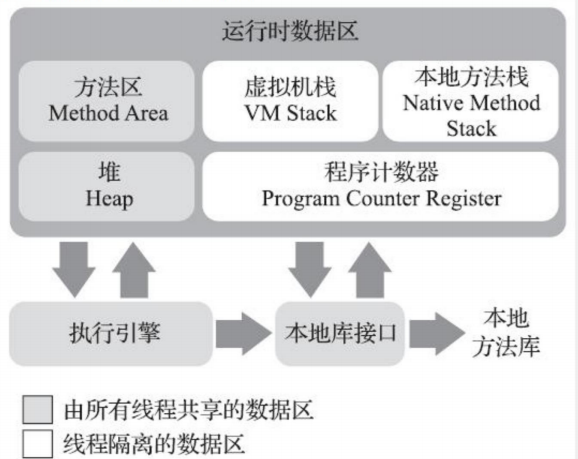
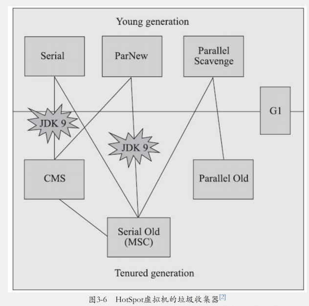
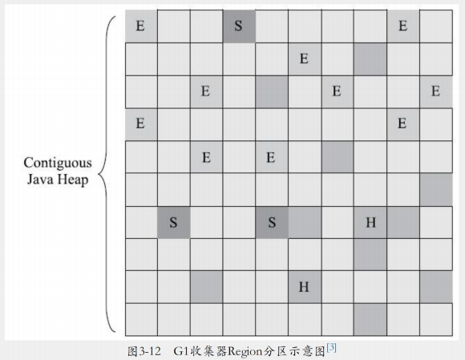
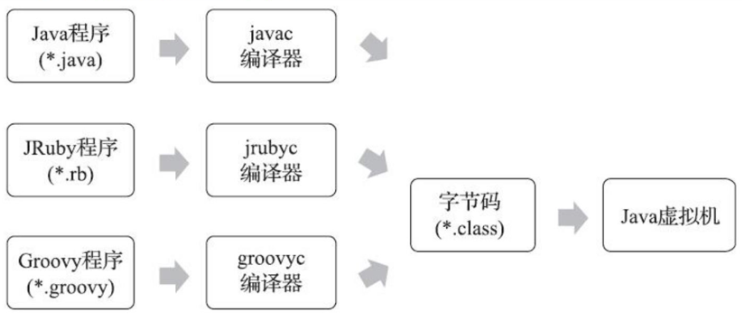
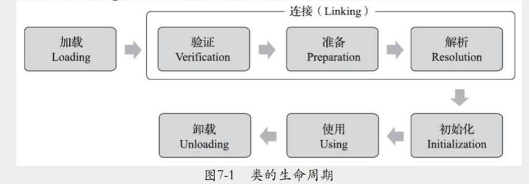

# 深入理解Java虚拟机

## Java内存区域与内存溢出异常

### 运行时数据区域

​	java虚拟机在执行java程序的过程中会把它所管理的内存划分为若干个不同的数据区域。这些区域有各自的用途以及创建和销毁的时间。



#### 程序计数器

​	程序计数器(Program Counter Register)是一块较小的内存空间，它可以看做是当前现成所执行的字节码的行号指示器。在java虚拟机的概念模型里，字节码解释器工作时就是通过改变这个计数器的值来选取下一条要执行的字节码指令，它是程序控制流的指示器，分支、循环、跳转、异常处理、线程恢复等基础功能都需要依赖这个计数器来完成。

​	由于java虚拟机的多线程是通过线程轮流切换、分配处理器执行时间的方式来实现的，在任何一个确定的时刻，一个处理器(对于多核处理器而言就是一个核心)都只会执行一条线程中的指令。因此，为了线程切换之后能恢复到正确的执行位置，每条线程都需要有一个独立的程序计数器，各个线程之间计数器互不影响，独立存储。这类内存区域被称为“线程私有”的内存。

​	如果线程正在执行的是一个java方法，这个计数器记录的就是正在执行的虚拟机字节码指令的地址；如果正在执行的是本地(native)方法，这个计数器的值应为空(Undefined)。此内存区域是唯一一个在《java虚拟机规范》中没有规定任何OutOfMemoryError情况的区域。

#### Java虚拟机栈

​	Java虚拟机栈(Java Virtual Machine Stack)也是线程私有的，它的生命周期与线程相同。虚拟机描述的是java方法执行的线程内存模型：每个方法被执行的时候，java虚拟机都会同步创建一个栈帧(Stack Frame)用于存储局部变量表、操作数栈、动态连接、方法出口等信息。每一个方法被调用到执行完毕的过程，就对应着一个栈帧在虚拟机栈中从入栈到出栈的过程。

##### 局部变量表

​	局部变量表存放可编译期可知的各种java虚拟机基本数据类型(boolean、byte、char、short、int、float、long、double)、对象引用(reference类型，它并不等同于对象本身，可能是一个指向对象起始地址的一个引用指针，也可能是一个代表对象的句柄或者其他与此对象相关的位置)和returnAddress类型(指向了一条字节码指令的地址)。

​	这些数据类型在局部变量表中的存储空间以局部变量槽(Slot)来表示，其中64位长度的long和double类型的数据会占用两个变量槽，其余的数据类型只占用一个。局部变量表所需内存空间在编译期间完成分配，当进入一个方法时，这个方法需要在栈帧中占用多大的局部变量空间是完全确定的，在方法运行期间不会改变局部变量表的大小(这里的大小表示局部变量槽的数量)。 

​	在《java虚拟机规范》中，对这个内存区域规定了两种异常情况：如果线程请求的栈深度大于虚拟机所允许的深度，将抛出StackOverflow异常；如果java虚拟机栈容量可以动态扩展(HotSpot虚拟机的栈容量是不可以扩展的)，当栈扩展时无法申请到足够的内存会抛出OutOfMemoryError异常。

#### 本地方法栈

​	本地方法栈(Native Method Stacks)与虚拟机栈所发挥的作用是非常相似的，区别只是虚拟机栈为虚拟机执行Java方法服务，而本地方法栈则是为虚拟机中使用到的本地(native)方法服务。

​	《Java虚拟机规范》中对本地方法栈中方法使用的语言、使用方式和数据结构并没有强制规定，因此具体的虚拟机可以根据需要自由的去实现它，甚至有的虚拟机(如HotSpot)虚拟机直接把本地方法栈和虚拟机栈合二为一。本地方法栈也会抛出StackOverflowError和OutOfMemoryError异常。

#### Java堆

​	对于Java应用程序来说，堆(Heap)是虚拟机管理内存中最大的一块。Java堆是被所有线程共享的一块内存区域，在虚拟机启动时创建。此内存区域的唯一目的就是存放对象实例，java中几乎所有的对象都分配在堆上。

​	Java堆是垃圾收集器管理的内存区域。

- 从回收内存的角度看。

  ​	因为现代垃圾收集器大部分都是基于分代收集理论设计的，所以Java堆中经常会看到”新生代“、“老年代”、“永久代”等名词，  这些区域名词仅仅是一部分垃圾收集器的共同特性或者说设计风格而已，并不是某个java虚拟机具体实现的固有内存布局，以主流的HotSpot虚拟机为例，它内部的垃圾收集器全部都基于“经典分代”来设计，需要新生代、老年代收集器搭配才能工作，在这种背景下，上面的说法才不会产生太大的歧义，但是现在HotSpot虚拟机也出现了不采用分代设计的新垃圾收集器。因此分代说法也不能太绝对。

- 从内存分配的角度看。

  ​	所有线程共享的Java堆中可以划分出多个线程私有的分配缓冲区(Thread Local Allocation Buffer)，以提升对象分配时的效率。

> 无论从什么角度如何划分，都不会改变Java堆中存储内容的共性，无论哪个区域，存储的都只能是对象的实例，将Java堆细分的目的只是为了更好的回收内存，或者更快的分配内存。

​	根据《java虚拟机规范》的规定，Java堆可以位于物理上不连续的内存空间，但在逻辑上应该是连续的，但对于大型对象（如数组对象等），多数虚拟机处于实现简单、存储高效的考虑，可能会要求联系的存储空间。

​	Java堆可以被实现为固定大小或者可扩展的，当前主流虚拟机的堆都是可扩展的（通过参数-Xmx和-Xms设定），如果在Java堆中没有内存完成实例分配，而且堆也无法申请足够的空间进行扩展时，Java虚拟机将会抛出OutOfMemoryError异常，

#### 方法区

​	方法区(Method Area)与java堆一样，是各个线程共享的内存区域，它用于存储已被虚拟机加载的类型信息、常量、静态变量、即时编译器编译后的代码缓存等数据，在JDK8之后，方法区主要在本地内存（native memory）中实现。

​	垃圾收集在这个区域很少出现，主要是针对常量池的回收和对类型的卸载，根据《Java虚拟机规范》，如果方法区无法满足新的内存分配需求时，将会抛出OutOfMemoryError异常。

#### 运行时常量池

​	运行时常量池（Runtime Constant Pool）是方法区的一部分。Class文件中出了有类的版本、字段、方法、接口等描述信息之外，还有一项信息是常量池表（Constant Pool Table），用于存放编译期生成的各种字面量与符号引用，这部分内容将在类加载后存放到方法区的运行时常量池中

​	java虚拟机对于Class文件的每一部分的格式都有严格规定，如每一个字节用于存储那种数据都必须符合规范上的要求才会被虚拟机认可、加载和执行，但对于运行时常量池，《Java虚拟机规范》没有做任何细节要求，一般来说，除了保存Class文件中描述的符号引用之外，还会把由符号引用翻译出来的直接饮用也存储到运行时常量池中。

​	运行时常量池相对于Class文件常量池的另外一个重要特征就是具备动态性，java并不要求常量只能在编译期产生，运行期间也可以将新的常量放入常量池中，这种特性被开发人员利用的比较多的是String类的intern()方法。

​	但产量吃无法申请到内存时会抛出OutOfMemoryError异常。

#### 直接内存

​	直接内存（Direct Memory）并不是虚拟机运行时数据区的一部分，也不是《Java虚拟机规范》中定义的内存区域，但是这部分内存也被频繁的使用，而且也可能导致OutOfMemoryError异常的出现，因此一起写。

​	在JDK1.4中新加入了NIO（New Input/Output）类，引入了一种基于通道（Channel）与缓冲区（Buffer）的I/O方式，它可以使用Native函数库直接分配堆外内存，然后通过一个存储在Java堆中的DirectByteBuffer对象作为这块内存的引用进行操作。这样能在一些场景中提高性能，因为避免了在Java堆和Native堆中来回复制数据。

​	当然，本机直接内存的分配不会受到Java堆大小的限制，但是，既然是内存，肯定不能超过本机总内存大小以及处理器寻址空间的限制，一般在根据实际内存去配置虚拟机参数时，会忽略掉直接内存，使得各个内存区域总和大于物理内存限制（包括物理和操作系统级的限制），从而导致动态扩展时出现OutOfMemoryError异常。

#### 对象的创建

​	语言层面上，对象的创建仅仅只是一个new关键字（复制、反序列化除外），但在java虚拟机中有较为繁琐的步骤。

​	当java虚拟机遇到一条字节码new指令时，首先检查这个指令的参数是否能在常量池中定位到一个类的符号引用，并且检查这个符号引用代表的泪是否已被加载、解析和初始化过，如果没有则必须先执行相应的类加载过程。

​	类加载检查通过后，虚拟机将为新生对象分配内存。对象所需的内存大小在类加载完成之后就已经确定，为对象分配空间的任务实际上相当于把一块确定大小的内存块从Java堆中划分出来。假设Java堆中内存是绝对规整的，所有使用过的内存放在一边，未使用的内存放在另一边，中间放一个指针作为分界点，那么分配内存的操作就是就是分界点指针向未分配空间移动一段与对象大小等同的距离，这种分配方式成为“指针碰撞”（Bump The Pointer）。但如果Java堆中的内存并不是规整的，虚拟机就必须维护一个列表，上面记录那些内存块是可用的，在分配的使用找到一块足够的内存块分配给对象实例，并更新表上的记录，这种方式称为空闲列表（Free List）。选择哪种分配方式由Java堆是否规整，而Java堆是否规整又取决于所采用的垃圾收集器是否带有空间压缩整理（Compact）决定。因此，当使用 Serial、ParNew等带压缩整理过程的收集器时，系统采用的分配算法是指针碰撞，而当使用CMS这种基于清除（Sweep）算法的收集器时，理论上只能采用较为复杂的空闲列表来分配内存。

​	划分空间给对象实例时，因为java中对象的创建是非常频繁的行为，因此也会出现并发问题。解决该问题有两种方式：

1. 对分配内存空间的动作进行同步处理，虚拟机是采用CAS和失败重试的方式保证更新操作的原子性
2. 每个线程在Java堆总预先分配一小块内存，成为本地线程分配缓冲（Thread Local Allocation Buffer），哪个线程要分配内存，就在哪个线程的本地线程分配缓冲中分配，只有缓冲区用完了，分配新的缓冲区时才要进行同步锁定。虚拟机是否使用TLAB，可以通过-XX：+/-UseTLAB参数来设定。

​	内存分配完成之后，虚拟机必须将分配到的内存空间（不包括对象头）都初始化为零值，如果使用了TLAB，这个操作也可以提前至TLAB分配时顺便进行。这步操作保证了对象的实例字段在Java代码中不初始化就可以直接使用，使程序能够访问到这些字段的数据类型所对应的零值。

​	接下来，虚拟机还要对对象进行必要的设置，如：

- 这个对象是哪个类的实例
- 如何才能找到类的元数据信息
- 对象的哈希码
- 对象的GC分代年龄信息

​	这些信息存放在对象头（Object Header）中，根据当前虚拟机运行状态的不同，如是否启用偏向锁等，对象头会有不同的设置方法。

​	上述的工作完成之后，虚拟机中的对象才创建完后，但是从java程序角度来看，构造器还没有执行，因此还不算一个对象创建完成。

#### 对象的内存布局

​	在HotSpot虚拟机中，对象在堆内存中的存储布局可以分为三个部分，对象头、实例数据和对齐空间。

##### 对象头

​	对象头中包含两类信息。

1. Mark Word：用于存储对象自身的运行时数据，如哈希码、GC分代年龄、锁状态标记位、线程持有的锁，偏向线程id，偏向时间戳等。
2. 类型指针：即对象指向它的类型的指针，java虚拟机通过这个指针来确定该对象是哪个类的实例。

> 并不是所有的虚拟机实现都必须在对象数据上保留类型指针，也就是说，查找对象的元数据信息并不一定要经过对象本身，此外，如果对象是一个Java数组，那在对象头中必须还有一块用于记录数组长度的数据。

##### 实例数据

​	实例数据部分是对象真正存储的有效信息，即在程序代码里所定义的各种类型的字段内容，无论是从父类继承下来还是在子类中定义的字段都必须记录起来。这部分的存储顺序会受到虚拟机分配策略参数（-XX：FieldsAllocationStyle参数）和字段在java源码中定义的顺序影响。HotSpot虚拟机默认的分配顺序为long/doubles、ints、shorts/chars、bytes/booleans、opps（Ordinary Object Pointer），从以上默认的分配策略中可以看到，相同宽度的字段总是被分配到一起存放，在满足这个前提条件下，在父类中定义的变量会出现在子类之前。若HotSpot虚拟机的+XX：CompactFields参数值为true（默认就是true）那子类中较窄的变量也允许插入父类变量的空隙中以节约出一点点空间。

#### 对齐填充

​	对齐填充不是必然存在的，仅仅起着占位符的作用。由于HotSpot虚拟机的自动内存管理系统要求对象起始地址必须是8字节的整数倍，即任何对象的大小都是8字节的整数倍。因为对象头已经被设计为8字节的整数倍了，那么实例数据部分不对齐的话，就需要对齐填充来补全。

#### 对象的访问定位

​	创建对象之后，Java程序会通过栈上的reference数据来操作堆上的具体对象。reference数据在《Java虚拟机规范》中规定它是一个只想具体对象的作用，对于具体的实现没有定义，所以对象的访问方式也是由虚拟机实现而定的。主流的访问方式有句柄和直接指针两种：

1. 句柄，在Java堆中可能会划分出一块内存作为句柄池，reference中存储的就是对象的句柄地址，而句柄中包含了对象实例数据与类型数据各自具体的地址信息。
2. 直接指针，reference中存储的直接就是对象的地址，若只是访问对象本身，则无需多一次间接访问的开销。

​	这两种对象访问方式各有优劣，使用句柄的最大好处是reference中存储的是稳定句柄地址，在对象被移动（垃圾收集时移动对象很正常）时只会改变句柄中的实例数据指针，而reference本身不需要被修改。

​	使用直接指针的最大好处就是速度更快，节省了一次指针定位的时间开销，Hotspot主要使用直接指针进行对象访问。


## 垃圾收集器与内存分配策略

### 概述

​	线程私有的内存空间会随着线程的销毁而自动回收，但java堆和方法区则有很大的不确定性：一个接口的多个实现类需要的内存可能不一样，只有处于运行期间，才能知道程序究竟会创建那些对象，创建多少个对象，这部分内存的分配和回收是动态的。垃圾收集器所关注的也正是这部分内存该如何管理。

​	垃圾收集器在回收之前第一件要做的事就是确定哪些对象还活着，哪些对象已经死去（没有其他任何引用途径的对象，即不可能会被使用的对象）了。

#### 判定对象存活

##### 引用计数算法

​	在对象中添加一个引用计数器，每当有一个地方引用它时，计数器加1，引用失效时，计数器减1，计数器为0就说明该对象没有被引用。

​	讲道理，这个算法原理简单、判定效率也很高，但是java主流的虚拟机里都没有使用这个算法进行内存管理，因为这个算法需要考虑很多例外情况，如循环引用等，容易发生内存泄漏。

##### 可达性分析算法

​	是当前主流语言的内存管理算法。基本思路就是通过一系列称为”GC Roots“的根对象作为起始节点集，从这些节点开始，根据引用关系向下搜索，搜索过程所走过的路径称为引用链”Reference Chain“， 如果某个对象到GC Roots之间没有任何引用链相连接，则证明此对象是不可能再被使用的，即可回收。

> 在java中，固定可以作为GC Roots的对象包括以下集中:
>
> 1. 在虚拟机栈（栈帧中的本地变量表）中引用的对象，如各个线程被调用的方法堆栈中使用到的参数、局部变量、临时变量等等。
> 2. 在方法区中静态属性引用的变量，如Java类的引用类型静态变量。
> 3. 在方法区中常量引用的对象，如字符串常量池里的引用。
> 4. 本地方法栈中JNI（Native方法）引用的对象。
> 5. java虚拟机内部的引用，如基本数据类型对象的Class对象，一些常驻的异常对象（NullPointerException、OutOfMemoryError）等，还有系统类加载器。
> 6. 所有被同步锁持有的对象。
> 7. 反应java虚拟机内部情况的JMXBean、JVMTI中注册的回调、本地代码缓存等。

​	除了这些固定的GC Roots集合之外，根据用户所选用的垃圾收集器以及当前回收的内存区域不同，还可以有其他对象”临时性“地加入，共同构成完成的GC Roots集合。

##### 引用类型

​	在JDK1.2之前，引用还是很传统的，只有已被引用和未被引用两种状态，在描述有点用但是必要时刻可以回收的对象时，这两种状态就不够用了，因此在JDK1.2之后java对引用的概念进行的扩充，将引用分为四种：强引用、软引用、弱引用和虚引用。

1. 强引用：最传统的引用定义，指在程序中普遍存在的引用赋值，无论任何情况下，只要强引用存在，垃圾收集器就永远不会回收掉被引用的对象。
2. 软引用：用于描述一些非必须对象，只被软引用关联着的对象，在系统将要发生内存溢出异常之前，会把这些对象列入回收范围之内进行第二次回收，若这次回收还是没有足够的内存，才会抛出内存溢出异常。在JDK1.2之后提供了SoftReference类来实现软引用。
3. 弱引用：也是描述一些非必须对象，但是强度比软引用更弱一些，被弱引用关联的对象只能生存到下一次垃圾回收为止。当垃圾收集器开始工作时，无论当前内存是否足够，都会回收掉只被弱引用关联的对象。在JDK1.2之后提供了WeakReference类来实现弱引用。
4. 虚引用：也成为”幽灵引用“，是最弱的一种引用关系。一个对象是否有虚引用的存在，完全不会影响它的生存时间，也无法通过虚引用来获取一个对象实例。为对象设置虚引用的唯一目的只是为了能在这个对象被收集器回收时收到一个系统通知。在JDK1.2之后提供了PhantomReference类来实现虚引用。

##### 回收对象

​	即使在可达性分算法中判定为不可达的对象，也不一定会被回收，在回收对象的最后一步，还是进行两次筛选标记过程：如果对象在完成可达性分析之后发现没有与GC Roots相连接的引用链，则对该对象进行第一次标记，随后进行一次筛选，判断该对象是否有必要执行finalize()方法。若对象没有覆盖finalize方法，或者finalize方法已经被虚拟机调用过，那么这两种情况下都没有必要执行finalize方法。

​	若这个对象被判断有必要执行finalize方法，那么该对象就会被放置在一个名为F-Queue的队列中，并在稍后由一条低调度优先级的Finalizer现成去执行它们的finalize方法。这里的”执行“是指虚拟机会触发这个方法开始运行，但并不承诺一定会等待它运行结束。这样做的原因是，若该对象的finalize方法执行缓慢或者是死循环，将可能导致F-Queue队列中其他对象永久处于等待状态，甚至导致整个内存回收子系统的崩溃。finalize方法是对象逃脱被回收命运的最后一次机会，稍后收集器将对F-Queue中的对象进行第二次小规模的标记，如果对象在finalize方法中成功的与引用链上的任何一个对象建立了关联，那么该对象就自救成功；若这个时候还没有自救成功，则该对象将被被回收。

##### 回收方法区

​	《Java虚拟机规范》中提到过可以不要求虚拟机在方法区实现垃圾收集，方法区的垃圾收集性价比太低，在Java堆中，尤其是新生代中，对常规应用进行一次垃圾收集通常可以回收70%-99%的内存空间，相比之下，方法区的回收判定条件过于苛刻。

​	方法区的垃圾回收主要包括两部分内容：废弃常量和不再使用的类型。回收废弃常量与回收Java堆中的对象非常类似，如：假设一个字符串”java“进入了常量池，但是当前系统没有任何一个地方引用到这个字面量，若这时发生垃圾回收，且虚拟机认为有必要的话，这个”java“常量就会被系统清理出常量池。常量池中其他类（接口）、方法、字段的符号引用也与此类似。

> 判断一个常量是否废弃还是比较简单，但判断一个类型是否废弃就比较苛刻，需要同时满足下面三个条件：
>
> - 该类所有的实例都已被回收，即Java堆中不存在该类以及该类派生的子类实例。
> - 加载该类的类加载器已被回收，这个条件除非是经过精心设计的可替换类加载器的场景，如OSGi、JSP的重加载等，否则通常是很难达成的。
> - 该类对应的java.lang.Class对象没有在任何地方被引用，无法在任何地方通过反射访问该类的方法。

​	Java虚拟机被允许对满足上述三个条件的类型进行回收，但仅仅是被允许，而不是和对象一样没有引用了就必须回收。关于是否要对类型进行回收，Hotspot虚拟机提供了-Xnoclassgc参数进行控制。

​	在大量使用反射、动态代理、CGLib等字节码框架，动态生成JSP一级OSGi这类拼单自定义类加载器的场景中，通常需要虚拟机具备类型卸载的能力以保证不会对方法区内存造成太大的压力。

### 垃圾收集算法

​	从如何判定对象消亡的角度来看，垃圾收集算法可以划分为**引用计数式垃圾收集(Reference Counting GC)**和**追踪式垃圾收集(Tracing GC)**。主流的虚拟机采用的都是追踪式垃圾收集算法。

#### 分代收集理论

​	分代收集理论是一套符合大多数程序运行实际情况的经验发额，它建立在两个分代假说之上：

- 弱分代假说：绝大多数对象都是朝生夕灭的
- 强分代假说：熬过越多次垃圾回收的对象就越难消亡。

​	这两个假说奠定了常用垃圾收集器的一致的设计原则：收集器应该将Java堆划分出不同的而区域，然后将回收对象根据年龄（熬过垃圾回收的次数）分配到不同的区域存储。兼顾了垃圾收集的时间开销和内存的空间有效利用。

​	Java堆中划分出不同区域之后，垃圾收集器才可以每次只回收其中某一个或某部分内存区域，因此才有了**Minor GC**、**Major GC**、**FUll GC**这些回收类型的划分；才能针对不同区域设计不同的垃圾回收算法，如：**标记-复制算法、标记-清除算法、标记整理算法**，这些算法都出自于分代收集理论。

#### 标记清除算法

​	标记清除算法是最早也是最基础的垃圾收集算法。算法分为**标记和清除**两个阶段：首先标记处所有要回收的对象，在标记完成后统一回收标记的对象。

​	但标记清除算法有两个主要缺点：

- 执行效率不稳定：若Java堆中包含要大量回收的对象，就必须进行大量标记和清除动作。
- 内存空间碎片化：标记清除之后会产生大量的不连续内存空间，导致需要为大对象分配空间时无法找到足够的连续内存。

​	后续的垃圾收集算法基本都是已标记清除算法为基础，针对缺点进行改进而来的。

#### 标记复制算法

​	简称为复制算法。主要针对新生代对象进行回收，较为主流的做法是：把新生代氛围一块较大的Eden区和两块较小的Survivor空间，每次分配内存只用Eden区和一块Survivor。发生垃圾收集时就将Eden区和Survivor区中存活的对象复制到另一块Survivor区 ，然后直接清理掉Eden区和已用过的Survivor区。Hotspot虚拟机默认的Eden区和Survivor区的大小是8：1，即新生代中可用内存空间为整个新生代空间的90%，还有10% 的空间是被浪费了的，因此这样每次垃圾回收都会回收90%的空间，当然，还有例外的情况即10%的Survivor空间无法容纳当前存活的对象，这种情况下就会依赖其他的内存区域（如老年代）进行分配担保（Handle Promotion）。

#### 标记整理算法

​	在标记复制算法中，若存活的对象过多，则需要进行较多的复制操作，效率较低，因此不适用于老年代的对象特征。

​	标记整理算法的标记过程仍然与标记复制算法一样，但后续步骤不是直接对可回收对象进行清除，而是让所有存活着的对象都向内存空间的一端移动，然后清理掉边界以外的内存空间。

​	移动并更新所有对老年对象的引用这种操作是极为负重并且需要暂停用户的应用程序才行（stop the world），会影响用户程序，但若像标记复制算法那样完全不考虑移动和整理存活对象的话，堆中存活对象导致的内存碎片就会对新创建对象的内存空间分配操作造成较大影响。还有一种折中的方案，即虚拟机平时使用标记清楚算法，暂时容忍内存空间碎片，等到内存空间碎片影响了对象分配时再用一次标记整理算法来获得规整的内存空间。基于标记清楚算法的CMS收集器面临空间碎片过多时就是采用这种解决方案。

> 标记清除算法也需要暂停用户程序，但相对来说时间较短。

### 经典垃圾收集器



​	上图展示了其中用于不同分代的收集器，若两个收集器质检存在连线说明这两个收集器可以搭配使用。

#### Serial收集器

​	Serial收集器是最基础、历史最悠久的收集器，顾名思义单线程串行化收集器，这个串行化指的是这个收集器在工作时会暂停其他所有工作线程直到它收集结束。虽然这个收集器会触发时停，但它仍然是Hotspot虚拟机在客户端模式下的默认新生代收集器，因为这个收集器简单高效，对于内存资源受限的环境，它是所有收集器里额外内存消耗最小的；在单核处理器或者处理器核心数较少的环境下，由于没有线程交互的开销，专心做垃圾收集自然可以获得最高的单线程收集效率。在客户桌面或者微服务应用中，分配给虚拟机管理的内存一般不会特别大，垃圾收集的时停基本都在一百毫秒以内，这个时间对于用户的体验来说完全可以接受，因此在客户端模式下是一个很好的收集器选择。

#### ParNew收集器

​	实质上是Serial收集器的多线程并行版本，除了同时使用多条线程进行垃圾收集之外，其余的行为与Serial收集器一模一样，没有太多的创新之处，但它却是不少运行在服务端模式下Hotspot虚拟机中首选的新生代垃圾收集器，而且还有另一个原因：除了Serial收集器之外，只有ParNew收集器可以与CMS收集器配合工作。

​	在JDK5发布时，Hotspot推出了一款在强交互应用中几乎可以成为具有划时代意义的垃圾收集器——CMS收集器。这款收集器是真正意义上支持并发的收集器，它首次实现了让垃圾收集线程与用户线程（基本上）同时工作。ParNew是激活CMS收集器后的默认新生代收集器。

#### Parallel Scavenge收集器

​	Parallel Scavenge收集器也是一款新生代收集器，同样是基于标记复制算法的并行收集器。

​	它与CMS等收集器不同之处在于：CMS等收集器是尽可能地缩短垃圾收集时暂停用户线程的停顿时间，而Parallel Scavenge收集器的目标是达到一个可控制的吞吐量（ThroughPut）。所谓吞吐量是指处理器用于运行用户代码的时间与处理器消耗总时间的比值：
$$
吞吐量 = 运行用户代码时间/CPU总运行时间
$$
​	停顿时间越短就越适合与用户交互或保证服务质量的程序，提升用户体验。而高吞吐量则可以最高效率的利用处理器资源，尽快完成程序的运算任务，主要适合在后台运算而不需太多交互的任务。

​	Parallel Scavenge收集器提供两个参数用于精确控制吞吐量，分别是最大垃圾收集停顿时间的-XX：MaxGCPauseMillis参数以及直接设置吞吐量大小的-XX：GCTimeRatio参数。

​	-XX：MaxGCPauseMillis参数允许是一个大于0的毫秒数，收集器尽力保证垃圾收集不超过这个值。垃圾收集停顿时间缩短是以牺牲吞吐量和新生代空间为代价换取的。-XX：GCTimeRatio参数的值应当是0~100的整数，即垃圾收集时间占总时间的比率，相当于吞吐量的倒数。如将此参数设置为19.那允许的最大垃圾收集时间占比为总时间的5%（即1/(1+19))，默认值为99，即允许对哒1%的垃圾收集时间。

​	Parallel Scavenge收集器也被称为**吞吐量优先收集器**。还有一个参数-XX：+UseAdaptiveSizePolicy，是一个开关参数，当这个参数被激活知乎，就不需要人工指定新生代的大小（-Xmn）、Eden与Survivor区的比例（-XX：SurvivorRatio）、晋升老年代对象大小（-XX：PretenureSizeThreshold）等细节参数了，虚拟机会根据当前系统的运行情况收集性能监控信息、动态调整这些餐胡以提供最合适的停顿时间或者最大的吞吐量。这种调节方法成为垃圾收集的自适应调节策略。这也是Parallel Scavenge收集器与上述两个收集器的不同之处。

#### Serial Old收集器

​	Serial Old收集器是Serial收集器的老年版本，同样是一个单线程收集器，使用标记整理算法。这个收集器的意义也是供客户端模式下的Hotspot虚拟机使用。如果在服务端模式下，它可能有两种用途：

1. 在JDK5以及之前版本中与Parallel Scavenge收集器搭配之用
2. 作为CMS收集器发生失败时的后备预案，在并发手机发生Concurrent Mode Failure时使用。

#### Parallel Old收集器

​	是Parallel Scavenge收集器的老年代版本，支持多线程并发收集，基于标记整理算法实现，这个收集器直到jdk6才提供。

#### CMS收集器

​	CMS（Concurrent Mark Sweep）收集器是一种以获得最短回收停顿时间目标的收集器。适合用于互联网网站或者基于浏览器B/s系统的服务端上，这类应用通常比较关注服务的响应速度，系统系统停顿时间尽可能短以带给用户良好的体验。

​	CMS收集器基于标记清除算法，它的运作步骤分为以下四个步骤：

- 初始标记（CMS initial mark）：初始标记仅仅只是标记一下GC Roots能直接关联到的对象，速度很快。
- 并发标记（CMS Concurrent mark）：并发标记阶段就是从GC Roots的直接关联对象开始遍历整个对象图的过程，这个过程耗时较长，但是不需要停顿用户线程，可以与垃圾收集线程一起并发执行。
- 重新标记（CMS remark）：重新标记阶段是为了修生并发标记期间，因用户程序继续运行而导致标记发生变动的那一部分对象的标记记录，这个阶段的时停会比初始标记长一点
- 并发清除（CMS concurrent sweep）：清理删除掉标记阶段判断已经死亡的对象，由于不需要移动存活对象，所以这个阶段也是可以与用户线程并行执行的。

​	其中初始标记、重新标记这两个步骤仍然需要时停。由于在整个过程中耗时最长的并发标记和并发清除过程中，垃圾收集线程可以和用户线程一起工作，所以总体上来说CMS的内存回收过程是与用户线程一起执行的。但CMS还有以下三个明显的缺点：

1. ​	CMS对处理器资源非常敏感，它会占用一部分处理器资源而导致应用程序变慢，降低总吞吐量。CMS默认启动的回收线城市（处理器核心数+3）/4，即处理器核心数在4个以上，并发回收线程只占用不超过25%的处理器资源。但是若处理器核心数少于4个则CMS对用户程序可能造成较大的影响：若应用程序处理器负载本身就很高，但还是要分出一半的资源来进行垃圾回收，就可能导致用户程序的执行速度忽快忽慢。
2. ​	CMS无法处理浮动垃圾（Floating Garbage），有可能会出现**Concurrent Mode Failure**失败而导致另一次Full GC的产生。在CMS的并发标记和并发清除阶段，用户线程还是在继续运行的，程序运行就可能会产生新的垃圾对象，这部分垃圾对象只能等到下一次并发和重新标记才能被回收。这部分垃圾就称为**浮动垃圾**。而且同样由于垃圾收集阶段用户程序还在运行，因此要预留一部分内存空间给用户程序使用。在JDK5的默认设置下，CMS收集器当老年代空间占用超过68%时就会被激活，这是一个偏保守的设置，老年代对象的增长速度不那么快的情况下可以适当提高参数-XX：CMSinitiatingOccu-pancyFraction的值来提高CMS的触发百分比，降低内存回收频率，获得更好的性能。到了JDK6时，CMS的启动阈值达到了92%。这又会导致另一个问题：预留的内存空间不足以提供用户程序使用时，就会出现一次并发失败（Concurrent Mode Failure），这是虚拟机要启动后备方案：冻结用户线程的执行，临时启用Serial Old收集器来重新收集老年代的垃圾对象，但这会导致停顿时间变长，因此CMS的激活阈值要根据实际情况来设置。
3. ​	CMS基于标记清除算法，所以会产生大量的不连续空间碎片，在分配大对象的时候若无法满足则需要进行碎片整理，但停顿时间又会变长。

#### Garbage First收集器

​	Garbage First收集器（简称G1），是一款主要面向服务端的垃圾收集器。在G1收集器之前的所有收集器包括CMS在内，垃圾收集的目标范围要么是整个新生代、老年代甚至直接是整个Java堆，而G1不同，它可以面向对内存任何部分来组成回收集（Collection Set）进行回收，衡量标准不再是它属于哪个分代，而是那块内存垃圾最多，回收价值最高，这就是G1收集器的Mixed GC模式。

​	G1开创的基于Region的堆内存布局是它能够实现这个目标的关键。虽然G1也是基于分代设计的，但其堆内存的布局与其他收集器有非常明显的差异：G1不再坚持固定大小以及固定数量的分代区域划分，而是把连续的Java堆划分为多个大小相等的独立空间（Region），每一个Region根据需要，扮演各种不同类型的分代空间，收集器能够根据不同类型的Region空间采用不同的策略来处理，这样无论是新生对象还是存过了一段时间的对象或者熬过多次垃圾收集的老对象都能够得到良好的收集效果。

​	Region中海油一类特殊的Humongous区域，专门用于存储大对象。G1认为只要大小超过Region的一半容量即可判定为大对象。每个Region的大小可以通过参数-XX：G1HeapRegionSize设定，取值范围为1MB~32MB，且应为2的N次幂。而对于那些超过了整个Region容量的超级大对象，将会被存放在N个连续的Humongous之中，G1的大多数行为都把Humongous Region作为老年代的一部分来看待。

​	虽然G1仍然保留新生代和老年代的概念，但新生代和老年代不再是固定的，而是一系列区域（不需要连续）的动态集合。G1收集器之所以能建立可预测的停顿时间模型，是因为它将Region作为单次回收的最小单元，即每次回收的空间都是Region的整数倍，这样可以有计划的避免在整个Java堆中进行全区域的垃圾收集。更具体的思路是让G1收集器跟踪每个Region中垃圾堆积的价值大小，然后在后台维护一个优先级列表，每次格局用户设定允许的收集停顿时间（使用参数-XX：MaxGCRegionMillis指定，默认200ms），优先处理回收价值最大的那些Region，这就是Garbage First名称的由来。这种使用Region划分内存空间，以及具有优先级的区域回收方式，保证了G1收集器在有限的时间内获取尽可能高的收集效率。



​	G1收集器的运作过程大致可以分为以下四个步骤：

- 初始标记（Initial Marking）：仅仅是标记一下GC Roots能直接关联到的对象，并且修改TAMS指针的值，让下一阶段用户线程并发运行时，能正确的在可用的Region中分配对象。这个阶段需要暂停线程，但是耗时很短，而且是借用Minor GC的时候同步完成的，所以G1收集器在这个阶段实际上并没有额外的停顿。
- 并发标记（Concurrent Marking）：从GC Roots开始对堆中对象进行可达性分析，递归扫描整个堆里的对象图，找出要回收的对象，这阶段耗时很长，但可与用户线程并发执行。当对象图扫描完成之后，还要重新处理SATB记录下的在并发时有引用变动的对象。
- 最终标记（Final Marking）：对用户线程做一个短暂的时停，用于处理并发阶段结束后仍留下来的最后那少量的SATB记录。
- 筛选回收（Live Data Counting and Evacuation）：负责更新Region的统计数据，对各个Region的回收价值和成本进行排序，根据用户所期望的停顿时间来制定回收计划，可以自由的选择Region构成回收集，然后把决定回收的那部分Region中存活的对象复制到空的Region中，再清理掉整个旧Region的全部空间。这里的操作涉及存活对象的移动，必须暂停用户线程，由多条收集器线程并行完成。

​		显然，可以由用户指定期望停顿的时间是G1收集器的一个很强大的功能。设置不同的期望时间，可是的G1在不同应用场景中取得吞吐量和延迟之间的最佳平衡。不过这里的”期望停顿时间“必须是符合实际的，G1默认停顿时间是200ms，若把停顿时间设置的太短，如20ms，那就可能导致每次选出来的回收集很小，收集器收集的速度赶不上分配器分配的速度，最终导致堆内存占满引发Full GC反而降低性能，所以通常把期望停顿时间设置在200ms上下是比较合理的。

​	从G1开始，最先进的垃圾收集器的设计导向都不约而同的变为追求能够应付应用的内存分配速率（Allocation Rate），而不追求一次把整个Java堆全部清理干净。这样，应用在分配，同时收集器在收集，只要收集的速度跟得上分配器分配的速度，那一切就可以运作的很完美。这种设计思路是从G1开始兴起的，所以说G1是收集器技术发展的一个里程碑。

#### 低延迟垃圾收集器


### 类文件结构

##### 概述

​	实现语言无关性的基础是虚拟机和字节码存储格式。java虚拟机不与任何程序语言绑定，它之与.class二进制文件格式所关联，Class文件中包含了Java虚拟机指令集、符号表以及若干其他辅助信息。基于安全方面的考虑，《Java虚拟机规范》中要求在Class文件中必须应用许多强制性的语法和结构化约束、但图领完备的字节码格式，保证了任意一门功能性语言都可以表示为一个能被java虚拟机所接受的有效的Class文件。作为一个通用的、与机器无关的执行平台，任何其他语言的实现者都可以将java虚拟机作为其他语言的运行基础，以Class文件作为他们产品的交付媒介，虚拟机不关心Class文件的来源是什么语言，它与程序语言之间的关系如下如所示：



​	java语言中的各种语法、关键字、常量变量和运算符号的语义最终都会由多条字节码指令组合来表达，这决定了字节码指令所能提供的语言描述能力必须必java语言本身更加强大才行。因此有一些JAVA语言本身无法有效支持的语言特性并不代表在字节码中也无法有效表达出来，这为其他程序语言实现一些有别于java的特性提供了发挥空间。

#### Class类文件的结构

​	尽管发展了几十年，但Class文件格式几乎没有发生任何改变，修改也只是在原有基础上新增和扩充内容。

> 任何一个Class文件都对应着唯一的一个类或者接口的定义信息，但是返回来说，类或接口并不一定都得定义在文件里（如类或者接口也可以动态生成，直接送入类加载器中）

​	Class文件是一组以8个字节为基础单位的二进制流，各个数据项目严格按照顺序紧凑的排列在文件中，中间没有添加任何分隔符，这使得整个Class文件中存储的内容几乎全部都是程序运行的必要数据，没有空隙存在。当遇到需要占用8个字节以上空间的数据项时，则会按照高位在前的方式分割成若干个8个字节进行存储。

​	根据《Java虚拟机规范》的规定，Class文件格式采用一种类似于C语言结构体的伪结构来存储数据，这种伪结构中只有两种数据类型：”无符号数“和”表“。

- 无符号数属于基本的数据类型，以u1、u2、u4、u8来分别代表1个字节、2个字节、4个字节和8个字节的无符号数，无符号数可以用来描述数字，索引引用、数量值或者按照UTF-8编码构成字符串值。
- 表是由多个无符号数或者其他表作为数据项构成的符合数据类型，为了便于区分，所有表的命名都习惯性地用”_info“结尾。表用于描述有层次关系的复合结构的数据，整个Class文件本质上也可以视作是一张表，这张表由下表所示的数据项按严格顺序排列构成。

| 类型           | 名称                | 数量                    |
| -------------- | ------------------- | ----------------------- |
| u4             | magic               | 1                       |
| u2             | minor_version       | 1                       |
| u2             | major_version       | 1                       |
| u2             | constant_pool_count | 1                       |
| cp_info        | constant_pool       | constant_pool_count - 1 |
| u2             | access_flags        | 1                       |
| u2             | this_class          | 1                       |
| u2             | super_class         | 1                       |
| u2             | interface_count     | 1                       |
| u2             | interfaces          | interfaces_count        |
| u2             | fields_count        | 1                       |
| field_info     | fields              | fields_count            |
| u2             | methods_count       | 1                       |
| method_info    | methods             | methods_count           |
| u2             | attributes_count    | 1                       |
| attribute_info | attributes          | attributes_count        |

​	无论是无符号数还是表，当需要描述同一类型但数量不定的多个数据时，经常会使用一个前置的容量计数器加若干个连续的数据项的形式，这时候称这一系列连续的某一类型的数据为某一类型的”集合“。

​	Class的结构不像XML等描述语言，由于它没有任何的分隔符号，所以上述表中的数据项，无论是顺序还是数量，甚至于数据存储的字节序（Byte Ordering，Class文件中字节序为Big-Endian[1]）这样的细节，都是严格限定的，哪个字节代表什么含义，长度是多少，先后顺序如何，全都不允许改变。

> [1] 这种顺序称为”Big-Endian“，具体顺序是指按高位字节在地址最低位，最低字节在地址最高位来存储数据。

#### 魔数与Class文件的版本

​	每个Class文件的头四个字节被称为魔数（Magic Number），它的唯一作用就是确定这个文件是否为一个能被虚拟机接受的Class文件。

​	紧接着魔数的4个字节存储的是Class文件的版本号：第5、6字节是次版本号（Minor Version），第7、8字节是主版本号（Major Version）。每个JDK版本都有对应的版本号，高版本JDK向下兼容版本号。

#### 常量池

​	紧接着主次版本号之后是常量池入口，常量池可以比喻成Class文件里的资源仓库，它是Class文件结构中与其他项目关联最多的数据，通常也是占用Class文件空间最大的数据项目之一。

​	常量池中主要存放两大类常量：字面量（Literal）和符号引用（Symbolic References）。字面量比较接近java语言层面的常量概念，如文本字符串、被声明为final的常量值等。而符号引用则属于编译原理方面的概念，主要包括以下几类常量：

- 被模块导出或者开放的包（Package）
- 类和接口的全限定名（Fully Qualified Name)
- 字段的名称和描述符（Description）
- 方法的名称和描述符
- 方法句柄和方法类型（Method Handle、Method Type、Invoke Dynamic）
- 动态调用点和动态变量（Dynamicall-Computed Call Site、Dynamically-Computed Constant）

​	Java代码在进行javac编译的时候，并不会保存各个方法、字段在内存中的布局信息，只有在虚拟机加载Class文件的时候进行动态连接之后才能真正知道内存的入口地址。当虚拟机做类加载时，将会从常量池获得对应的符号引用，再在类创建时或运行时解析、翻译到具体的内存地址中。

#### 访问标志

​	在常量池结束之后，紧接着的2个字节代表访问标志（Access flags），这个标志用于识别一些类或接口层次的访问信息， 包括：这个Class是类还是接口；是否定义为public类型；是否定义为abstract类型；若是类的话，是否被声明为final；等等，具体标志位和含义见下表：

| 标志名         | 标志值 | 含义                                                         |
| -------------- | ------ | ------------------------------------------------------------ |
| ACC_PUBLIC     | 0x0001 | 是否为public类型                                             |
| ACC_FINAL      | 0x0010 | 是否被声明为final，只有类可设置                              |
| ACC_SUPER      | 0x0020 | JDK1.0.2之后都为真                                           |
| ACC_INTERFACE  | 0x0200 | 标识这是一个接口                                             |
| ACC_ABSTRACT   | 0x0400 | 是否为abstract类型，对于接口或者抽象类来说此标志为真，其他类型值为假 |
| ACC_SYNTHETIC  | 0x1000 | 标识这个类并非由用户代码产生的                               |
| ACC_ANNOTATION | 0x2000 | 标识这是一个注解                                             |
| ACC_ENUM       | 0x4000 | 标识这是一个枚举                                             |
| ACC_MODULE     | 0x8000 | 标识这是一个模块                                             |

> access_flags中一共有16个标记位可以使用，目前只定义了9个，没有使用到的标记位一律为0。

#### 类索引、父类索引与接口索引集合

​	类索引（this_class）和父类索引（super_class）都是一个u2类型的数据，而接口索引集合（interfaces）是一组u2类型的数据集合，Class文件中由这三个项来确定该类型的继承关系。类索引用于确定这个类的全限定名，父类索引用于确定这个类父类的全限定名，因为不允许多继承，因此父类索引只有一个，除了java.lang.Object类之外，所有Java类的父类索引都不为0。接口索引集合描述这个类实现了那些接口，这些被实现的接口按implement关键字（如果这个Class文件表示的是接口，则应当是extends关键字）后的接口顺序从左到右排列在接口索引中。

#### 字段表集合

​	字段表（field_info）用于描述接口或者类中声明的变量。java中的字段（Field）包括类级变量以及实例级变量，但不包括在方法内部声明的局部变量。字段可以包括的修饰符有字段的作用域（public、private、protected修饰符）、是否静态变量（static）、可变性（final），并发可见性（volatile）、可否被序列化（transient修饰符）、字段数据类型（基本类型、对象、数组）、字段名称。

​	上述信息中，字段名称长度和字段类型都无法固定，只能引用常量池中的常量来描述。下表中列出了字段表的最终格式。

| 类型 | 名称              | 数量 | 类型           | 名称             | 数量             |
| ---- | ----------------- | ---- | -------------- | ---------------- | ---------------- |
| u2   | access_flags      | 1    | u2             | attributes_count | 1                |
| u2   | name_index        | 1    | attribute_info | attributes       | attributes_count |
| u2   | description_index | 1    |                |                  |                  |

#### 方法表集合


#### 属性表集合


#### Code属性

​	java程序方法体里面的代码经过javac编译器处理之后，最终变为字节码指令存储在Code属性内。


### 虚拟机类加载机制

​	Java虚拟机把描述类的数据从Class文件加载到内存，并对数据进行校验、转换解析和初始化，最形成可被虚拟机直接使用的java类型，这个过程被称为虚拟机的类加载机制。

#### 类加载的时机

​	一个类型从被加载到虚拟机内存中，到卸载出内存为止，它的整个生命周期将会经理加载（Loading）、验证（Verification）、准备（Preparation）、解析（Resolution）、初始化（Initialization）、使用（Using）和卸载（Unloading）七个阶段，其中验证、准备、解析三个阶段统称为连接（Linking）。这七个阶段的发生顺序如图所示：



​	其中，加载、验证、准备、初始化和卸载这五个阶段的顺序是确定的，类型的加载过程必须按照这种顺序按部就班的进行，而解析阶段则不一定：它在某些情况下可以在初始化阶段之后再开始，这是为了支持JAVA语言的运行时绑定特性（也称动态绑定或晚期绑定）。

​	对于初始化阶段，《Java虚拟机规范》严格规定了有且只有六种情况必须立即对类进行”初始化“（而加载、验证、准备和解析自然在此之前完成）：

1. 遇到new、getstatic、putstatic或invokestatic这四条字节码指令时，如果类型没有进行过初始化、则需要先触发其初始化阶段。能够生成这四条指令的典型java场景有：
   - 使用new关键字实例化对象的时候。
   - 读取或设置一个类型的静态字段（被final修饰、已在编译器把结果放入常量池的静态字段除外）的时候。
   - 调用一个类型的静态方法的时候。
2. 使用java.lang.reflect包的方法对类型进行反射调用的时候，如果类型没有进行过初始化、则需要对其先进行初始化。
3. 当初始化类的时候，如果发现其发父类还没有进行过初始化，则需要先触发其父类的初始化。
4. 当虚拟机启动时，用户需要指定一个要执行的主类，虚拟机会先初始化这个类。
5. 当使用JDK7新加入的动态语言支持时，如果一个人java.lang.invoke.MethodHandle实例最后的解析结果为REF_GetStatic、REF_putStatic、REF_invokeStatic、REF_newInvokeSpecia四种类型的方法句柄对应的类没有进行过初始化，则需要先触发其初始化。
6. 当一个接口中定义了JDK8新加入的默认方法（被default关键字修饰的接口方法）时，如果有这个接口的实现类发生了初始化，那该接口要在其之前被初始化。

​	对于这六种会触发类型进行初始化的场景，《Java虚拟机规范》中使用了一个非常强烈的限定语——“有且仅有”，这六种场景中的行为被称为对一个类型进行主动引用。除此之外，所有引用类型的方式都不会触发初始化，被称为被动引用。

​	下面举三个例子来说明何为被动引用：

示例1：

```java
/**
* 通过子类引用父类的静态字段，不会导致子类初始化
**/
public class SuperClass{
	static{
		System.out.println("SuperClass init!");
	}
	public static int value = 123;
}
public class Subclass extends SuperClass{
	static{
		System.out.pringln("SubClass init!");
	}
	
	public static void main(String[] args){
		//通过子类来引用父类中的静态字段，只会触发父类的初始化而不会触发子类的初始化
		System.out.println(SubClass.value);
	}
}
```

示例2：

```java
public class NoInitialization{
  public static void main(String[] args){
    //仅仅是创建该类型的数据时，不会触发该类的初始化，不会输出SuperClass init
    SuperClass[] sca = new SuperClass{[10];
  }
}

```

> ​	但是这段代码触发了另一个名为”[Lorg.fenisoft.classloading.SuperClass]“类的初始化阶段，对与用户代码来说，这不是一个合法的类型名称，它是一个由虚拟机自动生成的、直接继承与java.lang.Object类的自雷，创建动作由字节码指令newarray触发。
>
> 这个类代表了一个元素类型为Lorg.fenisoft.classloading.SuperClass的一维数组，数组中应有属性和方法（用户可以使用的只有public修饰的方法和clone()方法都实现在这个类里。JAVA语言对数组的访问要比C/C++相对安全，很大程度上是因为这个类包装了数组元素的访问，而C/C++则是直接翻译为指针移动。在JAVA语言中，当检查到发生数组越界时会抛出java.lang.ArrayIndexOutOfBoundsException异常，避免了直接造成非法内存访问。

示例3：

```java
public class ConstClass{
  static {
    System.out.pringtln("ConstClass init!");
  }
  public static final String HELLOWORLD = "hello world";
}
public class NotInitialization{
  public static void main(Stirng[] args){
    System.out.println(ConstClass.HELLOWORLD);
    
    String s = new String("123");
  }
}
```

> 上述代码运行之后，也没有输出ConstClass init!，这是因为虽然在Java源码NotInitialization类中确实引用了ConstClass类的常量，但其实在编译阶段通过常量传播优化，已经将次常量的值“hello world”直接存储在NotInitialization类的常量池中，对ConstClass的HELLOWORLD的引用已经变成NotInitialization类对自身常量池的引用了。也就是说，实际上NotInitialization的class文件之中并没有ConstClass类的符号引用入口，这两个类在编译成Class文件后就已经不存在任何联系了。

​	接口的加载过程与类加载过程稍有不同：接口中不能使用static语句块，但编译器还是会为接口生成"<clinit>()"类的构造器，用于初始化接口中所定义的成员变量。接口与类真正的区别是前面讲述的六种”有且仅有“需要出发初始化场景中的第三种：当一个类初始化时，要求其所有父类都已经初始化过，但接口在初始化时，并不要求其父类全部完成了初始化，只有在珍珍使用到父接口的时候才会初始化（如使用父接口定义的常量）。


### 类加载的过程

​	加载、验证、准备、解析和初始化五个阶段所执行的具体操作。

#### 加载

​	loading阶段是整个类加载（Class Loading）过程中的一个阶段。在加载阶段，java虚拟机需要完成以下三件事情：

1. 通过一个类的全限定名来获取定义此类的二进制字节流
2. 将这个字节流所代表的静态存储结构转化为方法区的运行时结构。
3. 在内存中生成一个代表这个类的java.lang.Class对象，作为方法区这个类的各种数据的访问入口。

> ​	加载阶段结束后，Java虚拟机外部的二进制字节流就按照虚拟机所设定的格式存储在方法区中了，方法区中的数据存储格式完全由虚拟机实现自行定义，《Java虚拟机规范》未规定此区域的具体数据结构。